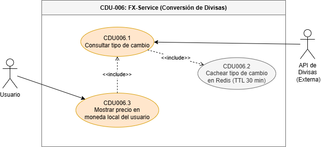

## Diagrama de Casos de Uso de Alto Nivel

## Primera Descomposición

## Casos de Uso Expandidos
#### CDU-001: Autenticación y Gestión de Usuarios

Sus expandidos son:
- CDU001.1: Registro de usuario
- CDU001.2: Inicio de sesión
- CDU001.3: Cerrar sesión
- CDU001.4: Control de intentos y bloqueo temporal
- CDU001.5: Modificación de datos personales
- CDU001.6: Cambio de contraseña
- CDU001.7: Gestión de usuarios (Administrador)
- CDU001.8: Autenticación OAuth

##### Registro de Usuario

| Campo | Detalle |
|-------|---------|
| **Nombre** | Registro de usuario |
| **Código** | CDU001.1 |
| **Actores** | Usuario |
| **Descripción** | Permite que un nuevo usuario cree una cuenta en la plataforma Quetxal TV ingresando sus datos personales y credenciales para acceder al servicio de streaming. |
| **Precondiciones** | El usuario no debe tener una cuenta registrada con el mismo correo electrónico. |
| **Post Condiciones** | - Usuario creado exitosamente y redirigido al inicio de sesión.   - Correo de confirmación enviado al usuario.   - El usuario no es creado si ocurre un error en los datos ingresados. |
| **Flujo Principal** | 1. El usuario selecciona la opción "Registrarse".   2. El sistema muestra el formulario de registro.   3. El usuario ingresa su nombre completo.   4. El usuario ingresa su correo electrónico.   5. El usuario ingresa su contraseña.   6. El usuario confirma su contraseña.   7. El usuario presiona "Crear cuenta".   8. El sistema valida que todos los campos sean correctos.   9. El sistema verifica que el correo electrónico sea único.   10. El sistema cifra la contraseña con bcrypt.   11. El sistema guarda el usuario en la base de datos.   12. El sistema dispara el envío del correo de bienvenida.   13. El sistema redirige al inicio de sesión con mensaje de éxito. |
| **Flujos Alternos** | **FA1: Datos incompletos**   FA1.1 El sistema detecta campos vacíos.   FA1.2 Resalta los campos faltantes en rojo.   FA1.3 Notifica "Todos los campos son obligatorios".   FA1.4 El usuario completa los datos.   FA1.5 Continúa en el paso 8.    **FA2: Correo electrónico ya registrado**   FA2.1 El sistema detecta el correo duplicado.   FA2.2 Notifica "Este correo ya está en uso".   FA2.3 El usuario ingresa un correo diferente.   FA2.4 Continúa en el paso 9.    **FA3: Contraseñas no coinciden**   FA3.1 El sistema detecta que la confirmación no coincide.   FA3.2 Notifica "Las contraseñas no coinciden".   FA3.3 El usuario corrige la confirmación.   FA3.4 Continúa en el paso 8. |
| **Reglas de Negocio** | - El correo electrónico debe ser único en el sistema.   - La contraseña debe tener mínimo 8 caracteres, al menos una mayúscula y un número.   - Las credenciales deben almacenarse de forma segura mediante bcrypt (factor ≥ 12). |
| **Flujo de Excepción** | **FE1: Error del servidor al procesar el registro**   FE1.1 El sistema detecta un error interno.   FE1.2 Notifica al usuario "No se pudo completar el registro. Inténtelo más tarde".   FE1.3 El sistema registra el error en los logs.   FE1.4 Los datos del formulario se conservan para evitar reingreso.    **FE2: Fallo en el servicio de correo**   FE2.1 El usuario se registra exitosamente pero el correo falla.   FE2.2 El sistema notifica que la cuenta fue creada pero el correo no pudo enviarse.   FE2.3 El sistema permite reenviar el correo desde el perfil. |
| **Reglas de Calidad** | - La contraseña debe cifrarse antes de almacenarse.   - El registro no debe exceder 3 segundos.   - El indicador de fuerza de contraseña debe mostrarse en tiempo real. |

---

##### Inicio de Sesión

| Campo | Detalle |
|-------|---------|
| **Nombre** | Inicio de sesión |
| **Código** | CDU001.2 |
| **Actores** | Usuario |
| **Descripción** | Permite que un usuario registrado acceda a la plataforma Quetxal TV mediante sus credenciales, generando un JWT y una Session Cookie segura. |
| **Precondiciones** | El usuario debe tener una cuenta registrada y activa en el sistema. |
| **Post Condiciones** | - Sesión iniciada correctamente con JWT generado y Session Cookie establecida.   - Redireccionamiento al selector de perfiles.   - Registro de auditoría del inicio de sesión. |
| **Flujo Principal** | 1. El usuario selecciona "Iniciar sesión".   2. El sistema muestra el formulario de login.   3. El usuario ingresa su correo electrónico.   4. El usuario ingresa su contraseña.   5. El usuario presiona "Entrar".   6. El sistema verifica las credenciales en la base de datos.   7. El sistema valida que la cuenta esté activa.   8. El sistema genera un JWT con los datos del usuario.   9. El sistema establece una Session Cookie segura (HttpOnly, Secure).   10. El sistema redirige al selector de perfiles. |
| **Flujos Alternos** | **FA1: Credenciales incorrectas**   FA1.1 El sistema detecta que las credenciales no coinciden.   FA1.2 Incrementa el contador de intentos fallidos.   FA1.3 Notifica "Correo o contraseña incorrectos".   FA1.4 El usuario puede reintentar.    **FA2: Inicio de sesión con OAuth**   FA2.1 El usuario selecciona "Continuar con Google".   FA2.2 El sistema redirige al proveedor OAuth.   FA2.3 El proveedor autentica al usuario y retorna los datos.   FA2.4 El sistema genera JWT y Session Cookie.   FA2.5 Continúa en el paso 10. |
| **Reglas de Negocio** | - Máximo 5 intentos fallidos antes del bloqueo temporal.   - El JWT tiene vigencia de 1 hora.   - La Session Cookie debe ser HttpOnly y Secure. |
| **Flujo de Excepción** | **FE1: Servicio de autenticación no disponible**   FE1.1 El sistema detecta que el microservicio de auth no responde.   FE1.2 Notifica "El servicio no está disponible. Inténtelo más tarde".   FE1.3 Registra el error en los logs para el equipo técnico. |
| **Reglas de Calidad** | - El proceso de login debe completarse en ≤ 1 segundo.   - Nunca debe indicarse si el error es el correo o la contraseña (mensaje genérico por seguridad).   - Todos los intentos deben registrarse con timestamp e IP. |

---

##### Cerrar Sesión

| Campo | Detalle |
|-------|---------|
| **Nombre** | Cerrar sesión |
| **Código** | CDU001.3 |
| **Actores** | Usuario |
| **Descripción** | Permite al usuario terminar su sesión activa, invalidando el JWT y eliminando la Session Cookie del cliente. |
| **Precondiciones** | El usuario debe tener una sesión activa. |
| **Post Condiciones** | - Session Cookie eliminada del cliente.   - JWT invalidado (añadido a lista de revocación en Redis).   - Usuario redirigido a la pantalla de inicio. |
| **Flujo Principal** | 1. El usuario selecciona "Cerrar sesión".   2. El sistema invalida el JWT actual (blacklist en Redis).   3. El sistema elimina la Session Cookie del navegador.   4. El sistema redirige al usuario a la página de inicio. |
| **Flujos Alternos** | N/A |
| **Reglas de Negocio** | - El token JWT debe ser añadido a la lista negra en Redis hasta su fecha de expiración original.   - La cookie debe eliminarse con el flag de expiración en el pasado. |
| **Flujo de Excepción** | **FE1: Error al invalidar el token**   FE1.1 El sistema no puede escribir en Redis.   FE1.2 Elimina la cookie de todas formas.   FE1.3 Registra el incidente para revisión técnica. |
| **Reglas de Calidad** | - El cierre de sesión debe completarse en ≤ 500 ms.   - No debe quedar ningún dato sensible en el almacenamiento local del cliente. |

---

##### Control de Intentos y Bloqueo Temporal

| Campo | Detalle |
|-------|---------|
| **Nombre** | Control de intentos y bloqueo temporal |
| **Código** | CDU001.4 |
| **Actores** | Usuario (iniciado por CDU001.2 vía <<include>>) |
| **Descripción** | Monitorea los intentos fallidos de inicio de sesión y bloquea temporalmente el acceso a la cuenta tras superar el límite permitido para prevenir ataques de fuerza bruta. |
| **Precondiciones** | El usuario ha fallado al menos 1 intento de inicio de sesión. |
| **Post Condiciones** | - Si el límite es superado: cuenta bloqueada temporalmente, correo de alerta enviado.   - Si no se supera: contador de intentos incrementado. |
| **Flujo Principal** | 1. El sistema detecta un intento fallido de login (incluido desde CDU001.2).   2. El sistema incrementa el contador de intentos fallidos en Redis para la cuenta.   3. El sistema verifica si el contador alcanzó el límite (5 intentos).   4. Si se alcanzó el límite, el sistema bloquea la cuenta por 15 minutos.   5. El sistema notifica al usuario el bloqueo y el tiempo de espera.   6. Al expirar el tiempo, el sistema restablece automáticamente el contador. |
| **Flujos Alternos** | **FA1: Límite no alcanzado**   FA1.1 El contador de intentos es menor a 5.   FA1.2 El sistema muestra cuántos intentos restan.   FA1.3 El usuario puede reintentar. |
| **Reglas de Negocio** | - El límite de intentos es de 5 por cuenta.   - El bloqueo temporal es de 15 minutos.   - El contador se almacena en Redis con TTL de 15 minutos. |
| **Flujo de Excepción** | **FE1: Redis no disponible**   FE1.1 El sistema no puede consultar/escribir el contador.   FE1.2 El sistema permite el acceso con advertencia en los logs (fail-open controlado). |
| **Reglas de Calidad** | - El bloqueo debe activarse en ≤ 100 ms tras el 5.° intento fallido.   - El sistema de conteo debe ser a prueba de condiciones de carrera (operaciones atómicas en Redis). |

---

##### Modificación de Datos Personales

| Campo | Detalle |
|-------|---------|
| **Nombre** | Modificación de datos personales |
| **Código** | CDU001.5 |
| **Actores** | Usuario |
| **Descripción** | Permite al usuario autenticado actualizar su nombre y correo electrónico desde la configuración de su cuenta. |
| **Precondiciones** | El usuario debe tener una sesión activa. |
| **Post Condiciones** | - Datos del usuario actualizados en la base de datos.   - Trigger de auditoría registra el cambio. |
| **Flujo Principal** | 1. El usuario accede a "Configuración de cuenta".   2. El sistema muestra los datos actuales del usuario.   3. El usuario modifica el nombre y/o correo electrónico.   4. El usuario presiona "Guardar cambios".   5. El sistema valida el nuevo correo (unicidad y formato).   6. El sistema actualiza los datos en la base de datos.   7. El sistema muestra confirmación de actualización exitosa. |
| **Flujos Alternos** | **FA1: Correo ya en uso**   FA1.1 El sistema detecta que el nuevo correo ya está registrado.   FA1.2 Notifica "Este correo ya está en uso".   FA1.3 El usuario ingresa otro correo. |
| **Reglas de Negocio** | - El correo nuevo debe ser único en el sistema.   - Los cambios de correo deben disparar el trigger de auditoría. |
| **Flujo de Excepción** | **FE1: Error al guardar**   FE1.1 El sistema detecta un error de base de datos.   FE1.2 Notifica "No se pudieron guardar los cambios. Intente más tarde". |
| **Reglas de Calidad** | - La actualización no debe tardar más de 2 segundos.   - El campo de correo debe validarse en tiempo real (formato). |

---

##### Cambio de Contraseña

| Campo | Detalle |
|-------|---------|
| **Nombre** | Cambio de contraseña |
| **Código** | CDU001.6 |
| **Actores** | Usuario |
| **Descripción** | Permite al usuario autenticado cambiar su contraseña actual ingresando la contraseña antigua y una nueva, garantizando la seguridad de las credenciales. |
| **Precondiciones** | El usuario debe tener una sesión activa. |
| **Post Condiciones** | - Contraseña actualizada y cifrada en la base de datos.   - Trigger de auditoría registra el cambio de credenciales.   - Todas las sesiones activas en otros dispositivos son invalidadas. |
| **Flujo Principal** | 1. El usuario accede a "Cambiar contraseña" desde la configuración.   2. El sistema muestra el formulario de cambio de contraseña.   3. El usuario ingresa su contraseña actual.   4. El usuario ingresa la nueva contraseña.   5. El usuario confirma la nueva contraseña.   6. El sistema valida que la contraseña actual sea correcta.   7. El sistema valida que la nueva contraseña cumpla los requisitos de seguridad.   8. El sistema verifica que la nueva contraseña y su confirmación coincidan.   9. El sistema cifra la nueva contraseña con bcrypt.   10. El sistema actualiza la contraseña en la base de datos.   11. El trigger de auditoría registra automáticamente el cambio.   12. El sistema invalida todas las sesiones activas salvo la actual.   13. El sistema muestra confirmación de éxito. |
| **Flujos Alternos** | **FA1: Contraseña actual incorrecta**   FA1.1 El sistema detecta que la contraseña actual no coincide.   FA1.2 Notifica "La contraseña actual es incorrecta".    **FA2: Nueva contraseña no cumple requisitos**   FA2.1 El sistema detecta que la nueva contraseña es débil.   FA2.2 Notifica los requisitos incumplidos. |
| **Reglas de Negocio** | - La nueva contraseña no puede ser igual a la contraseña actual.   - Mínimo 8 caracteres, una mayúscula y un número.   - El cambio de contraseña dispara automáticamente el trigger de auditoría. |
| **Flujo de Excepción** | **FE1: Error al actualizar**   FE1.1 El sistema no puede guardar la nueva contraseña.   FE1.2 Notifica el error y sugiere intentar más tarde. |
| **Reglas de Calidad** | - La nueva contraseña debe cifrarse con bcrypt antes de guardarse.   - El proceso no debe tardar más de 2 segundos. |

---

##### Gestión de Usuarios (Administrador)

| Campo | Detalle |
|-------|---------|
| **Nombre** | Gestión de usuarios (Administrador) |
| **Código** | CDU001.7 |
| **Actores** | Administrador |
| **Descripción** | Permite al administrador gestionar las cuentas de usuario de la plataforma: listar, buscar, activar, desactivar y eliminar cuentas. |
| **Precondiciones** | El administrador debe tener una sesión activa con rol de administrador. |
| **Post Condiciones** | - Estado del usuario actualizado según la acción ejecutada.   - Trigger de auditoría registra la acción del administrador. |
| **Flujo Principal** | 1. El administrador accede al panel de administración.   2. El sistema muestra la lista de usuarios con su estado actual.   3. El administrador busca/filtra el usuario deseado.   4. El administrador selecciona una acción (activar/desactivar/eliminar).   5. El sistema solicita confirmación de la acción.   6. El administrador confirma.   7. El sistema ejecuta la acción y actualiza el estado.   8. El trigger de auditoría registra la acción.   9. El sistema muestra confirmación de la operación. |
| **Flujos Alternos** | **FA1: Cancelar acción**   FA1.1 El administrador cancela la confirmación.   FA1.2 El sistema no ejecuta ningún cambio. |
| **Reglas de Negocio** | - Un administrador no puede eliminar su propia cuenta desde el panel.   - La eliminación de un usuario elimina también todos sus perfiles y datos asociados (soft delete). |
| **Flujo de Excepción** | **FE1: Error al actualizar estado**   FE1.1 El sistema no puede actualizar el estado del usuario.   FE1.2 Notifica el error al administrador. |
| **Reglas de Calidad** | - La lista de usuarios debe cargar en ≤ 2 segundos.   - Todas las acciones del administrador deben quedar registradas en la auditoría. |

#### CDU-002: Gestión de Perfiles

Sus expandidos son:
- CDU002.1: Crear perfil
- CDU002.2: Editar perfil
- CDU002.3: Eliminar perfil
- CDU002.4: Seleccionar perfil activo

##### Crear Perfil

| Campo | Detalle |
|-------|---------|
| **Nombre** | Crear perfil |
| **Código** | CDU002.1 |
| **Actores** | Usuario |
| **Descripción** | Permite al usuario crear un nuevo perfil dentro de su cuenta para personalizar la experiencia de visualización de forma independiente. |
| **Precondiciones** | El usuario debe tener sesión activa y tener menos de 5 perfiles en su cuenta. |
| **Post Condiciones** | - Perfil creado y asociado a la cuenta del usuario.   - Historial y preferencias inicializados de forma vacía. |
| **Flujo Principal** | 1. El usuario accede a "Gestionar perfiles" desde su cuenta.   2. El sistema muestra los perfiles existentes y la opción "Agregar perfil".   3. El sistema verifica que la cuenta tenga menos de 5 perfiles.   4. El usuario selecciona "Agregar perfil".   5. El sistema muestra el formulario de creación.   6. El usuario ingresa el nombre del perfil y selecciona un avatar.   7. El usuario presiona "Crear".   8. El sistema guarda el nuevo perfil.   9. El sistema muestra el perfil creado en la lista. |
| **Flujos Alternos** | **FA1: Límite de perfiles alcanzado**   FA1.1 La cuenta ya tiene 5 perfiles.   FA1.2 El sistema oculta/deshabilita la opción "Agregar perfil".   FA1.3 Muestra mensaje "Has alcanzado el límite de 5 perfiles". |
| **Reglas de Negocio** | - Máximo 5 perfiles por cuenta.   - El nombre del perfil debe tener entre 1 y 30 caracteres. |
| **Flujo de Excepción** | **FE1: Error al guardar**   FE1.1 El sistema no puede guardar el perfil.   FE1.2 Notifica el error y sugiere reintentar. |
| **Reglas de Calidad** | - La creación debe completarse en ≤ 1 segundo. |

#### CDU-003: Gestión de Planes y Suscripciones

Sus expandidos son:
- CDU003.1: Visualizar planes de suscripción
- CDU003.2: Seleccionar y comprar plan
- CDU003.3: Modificar plan
- CDU003.4: Cancelar suscripción

##### Seleccionar y Comprar Plan

| Campo | Detalle |
|-------|---------|
| **Nombre** | Seleccionar y comprar plan |
| **Código** | CDU003.2 |
| **Actores** | Usuario, Sistema de Pago |
| **Descripción** | Permite al usuario seleccionar un plan de suscripción disponible y completar el proceso de pago para activar su suscripción en la plataforma Quetxal TV. |
| **Precondiciones** | El usuario debe tener sesión activa y no tener una suscripción activa del mismo plan. |
| **Post Condiciones** | - Suscripción activada y asociada a la cuenta del usuario.   - Correo de recibo de compra enviado.   - Registro de la transacción en la base de datos. |
| **Flujo Principal** | 1. El usuario accede a la sección de planes.   2. El sistema muestra los planes (Básico, Estándar, Premium) con precios en la moneda local (FX-Service).   3. El usuario selecciona el plan deseado.   4. El sistema muestra el resumen de la compra.   5. El usuario ingresa los datos de pago.   6. El sistema envía la solicitud de pago al Sistema de Pago (gRPC).   7. El Sistema de Pago procesa y confirma la transacción.   8. El sistema activa la suscripción mediante el procedimiento almacenado de registro de compra.   9. El sistema dispara el envío del correo de recibo.   10. El sistema redirige al usuario con confirmación de suscripción activa. |
| **Flujos Alternos** | **FA1: Pago rechazado**   FA1.1 El Sistema de Pago rechaza la transacción.   FA1.2 El sistema notifica "Pago rechazado. Verifique sus datos".   FA1.3 El usuario puede reintentar con otros datos de pago. |
| **Reglas de Negocio** | - El precio debe mostrarse en la moneda local del usuario (consultado vía FX-Service con caché Redis).   - La activación de la suscripción debe ejecutarse mediante el procedimiento almacenado de registro de compra. |
| **Flujo de Excepción** | **FE1: Sistema de Pago no disponible**   FE1.1 El servicio de pago no responde.   FE1.2 El sistema notifica que el servicio de pago no está disponible.   FE1.3 No se realiza ningún cargo ni activación. |
| **Reglas de Calidad** | - El proceso de pago debe completarse en ≤ 5 segundos.   - Los datos de pago nunca deben almacenarse en el sistema (delegado al Sistema de Pago). |

#### CDU-004: Catálogo, Búsqueda y Detalle de Contenido

Sus expandidos son:
- CDU004.1: Buscar contenido
- CDU004.2: Filtrar contenido
- CDU004.3: Ver detalle de contenido
- CDU004.4: Gestión del catálogo (Administrador)

##### Ver Detalle de Contenido

| Campo | Detalle |
|-------|---------|
| **Nombre** | Ver detalle de contenido |
| **Código** | CDU004.3 |
| **Actores** | Usuario |
| **Descripción** | Permite al usuario ver la ficha técnica completa de una película o serie, incluyendo sinopsis, actores, director, año, duración, género y la calificación de la comunidad. |
| **Precondiciones** | El usuario debe tener sesión activa con un perfil seleccionado. |
| **Post Condiciones** | - Información detallada del contenido mostrada al usuario.   - Calificación de la comunidad calculada y mostrada dinámicamente. |
| **Flujo Principal** | 1. El usuario selecciona un contenido del catálogo.   2. El sistema consulta los datos del contenido mediante la vista de fichas técnicas.   3. El sistema consulta el porcentaje de recomendación mediante la función calculadora.   4. El sistema muestra la ficha técnica completa (sinopsis, actores, director, año, género, duración).   5. El sistema muestra el porcentaje global de recomendación de la comunidad.   6. El sistema verifica si el usuario ya calificó el contenido y muestra su calificación.   7. El usuario puede calificar el contenido (include CDU005). |
| **Flujos Alternos** | **FA1: Contenido no disponible**   FA1.1 El contenido fue eliminado o desactivado.   FA1.2 El sistema muestra mensaje "Este contenido ya no está disponible". |
| **Reglas de Negocio** | - La ficha técnica debe obtenerse mediante la vista de base de datos.   - El porcentaje de recomendación se calcula mediante la función de base de datos. |
| **Flujo de Excepción** | **FE1: Error al cargar contenido**   FE1.1 El microservicio de catálogo no responde.   FE1.2 El sistema muestra un mensaje de error genérico. |
| **Reglas de Calidad** | - La ficha debe cargar en ≤ 2 segundos.   - El porcentaje de recomendación debe ser calculado en tiempo real. |

#### CDU-005: Sistema de Calificaciones

Sus expandidos son:
- CDU005.1: Calificar contenido (pulgar arriba/abajo)
- CDU005.2: Calcular porcentaje global de recomendación

##### Calificar Contenido

| Campo | Detalle |
|-------|---------|
| **Nombre** | Calificar contenido |
| **Código** | CDU005.1 |
| **Actores** | Usuario |
| **Descripción** | Permite al usuario calificar una película o serie mediante el sistema de pulgar arriba/abajo, contribuyendo al porcentaje global de recomendación de la comunidad. |
| **Precondiciones** | El usuario debe tener sesión activa con un perfil seleccionado y haber visto al menos parte del contenido. |
| **Post Condiciones** | - Calificación del usuario registrada o actualizada en la base de datos.   - Porcentaje global de recomendación recalculado y actualizado. |
| **Flujo Principal** | 1. El usuario accede al detalle de un contenido.   2. El sistema muestra las opciones de calificación.   3. El sistema indica si el usuario ya calificó este contenido.   4. El usuario selecciona su calificación.   5. El sistema registra/actualiza la calificación del perfil.   6. El sistema recalcula el porcentaje global mediante la función de base de datos.   7. El sistema muestra el nuevo porcentaje actualizado en la vista. |
| **Flujos Alternos** | **FA1: Usuario cambia su calificación**   FA1.1 El usuario ya tenía una calificación registrada.   FA1.2 El sistema actualiza (no duplica) la calificación.   FA1.3 Recalcula el porcentaje global. |
| **Reglas de Negocio** | - Cada perfil puede tener solo una calificación por contenido.   - El porcentaje global se calcula con la función de base de datos: (pulgares arriba / total de votos) × 100. |
| **Flujo de Excepción** | **FE1: Error al guardar calificación**   FE1.1 El sistema no puede registrar la calificación.   FE1.2 Notifica el error y muestra el porcentaje anterior. |
| **Reglas de Calidad** | - La calificación debe registrarse y el porcentaje actualizarse en ≤ 500 ms.   - El cálculo del porcentaje debe realizarse mediante la función de base de datos (no en capa de aplicación). |

#### CDU-006: FX-Service (Conversión de Divisas)

Sus expandidos son:
- CDU006.1: Consultar tipo de cambio
- CDU006.2: Cachear tipo de cambio en Redis
- CDU006.3: Mostrar precio en moneda local

##### Consultar Tipo de Cambio

| Campo | Detalle |
|-------|---------|
| **Nombre** | Consultar tipo de cambio |
| **Código** | CDU006.1 |
| **Actores** | API de Divisas (Externa) |
| **Descripción** | El FX-Service consulta la tasa de cambio actual desde la API externa de divisas, priorizando el uso del caché Redis antes de realizar llamadas externas. |
| **Precondiciones** | El FX-Service debe estar operativo. La API externa de divisas debe ser accesible. |
| **Post Condiciones** | - Tasa de cambio obtenida y almacenada en Redis con TTL de 30 minutos.   - Tasa de cambio retornada al servicio solicitante. |
| **Flujo Principal** | 1. Un servicio interno solicita la tasa de cambio para una divisa.   2. El FX-Service consulta Redis para verificar si existe el dato en caché.   3. Si existe en caché (cache hit): retorna la tasa almacenada.   4. Si no existe en caché (cache miss): consulta la API externa de divisas.   5. Almacena la tasa obtenida en Redis con TTL de 30 minutos.   6. Retorna la tasa de cambio al servicio solicitante. |
| **Flujos Alternos** | **FA1: Cache hit**   FA1.1 Redis retorna el valor almacenado.   FA1.2 Se omite la llamada a la API externa.   FA1.3 Se retorna la tasa cacheada. |
| **Reglas de Negocio** | - El TTL del caché en Redis debe ser de 30 minutos.   - El hit rate del caché debe ser ≥ 90% en condiciones normales. |
| **Flujo de Excepción** | **FE1: API externa no disponible**   FE1.1 La API de divisas no responde.   FE1.2 El sistema intenta retornar la última tasa válida del caché (aunque esté expirada).   FE1.3 Si no hay ninguna tasa disponible, notifica el error al servicio solicitante. |
| **Reglas de Calidad** | - La consulta a Redis debe completarse en ≤ 10 ms.   - La llamada a la API externa no debe superar los 2 segundos (timeout). |

#### CDU-007: Historial de Reproducción

Sus expandidos son:
- CDU007.1: Registrar progreso de visualización
- CDU007.2: Reanudar contenido desde donde se detuvo
- CDU007.3: Ver historial de reproducción del perfil

##### Registrar Progreso de Visualización

| Campo | Detalle |
|-------|---------|
| **Nombre** | Registrar progreso de visualización |
| **Código** | CDU007.1 |
| **Actores** | Usuario |
| **Descripción** | El sistema registra automáticamente el progreso de reproducción del perfil activo, almacenando el minuto exacto de reproducción para películas y la temporada, capítulo y minuto para series. |
| **Precondiciones** | El usuario debe tener sesión activa con un perfil seleccionado y estar reproduciendo contenido. |
| **Post Condiciones** | - Progreso de visualización actualizado en la base de datos por perfil.   - Para series: temporada, capítulo y minuto almacenados. |
| **Flujo Principal** | 1. El usuario inicia la reproducción de un contenido.   2. El sistema inicia el registro de progreso cada 30 segundos.   3. Para películas: el sistema almacena el minuto actual de reproducción.   4. Para series: el sistema almacena la temporada, capítulo y minuto actual.   5. Al pausar o detener, el sistema realiza un registro final del progreso.   6. El historial del perfil es actualizado con el último registro. |
| **Flujos Alternos** | **FA1: Contenido completado**   FA1.1 El usuario llega al final del contenido.   FA1.2 El sistema marca el contenido como "completado" en el historial.   FA1.3 Limpia el progreso de minuto (ya no hay reanudación). |
| **Reglas de Negocio** | - El progreso es independiente por perfil.   - Para series se almacena: id_temporada, id_capitulo, minuto_exacto.   - El registro de progreso debe realizarse cada 30 segundos durante la reproducción. |
| **Flujo de Excepción** | **FE1: Error al registrar progreso**   FE1.1 El sistema no puede escribir en la base de datos.   FE1.2 El sistema reintenta al siguiente intervalo.   FE1.3 La reproducción no se interrumpe. |
| **Reglas de Calidad** | - El registro de progreso no debe agregar más de 50 ms de latencia a la reproducción.   - Los datos de progreso deben ser consistentes y no perderse ante fallos del servidor. |

#### CDU-008: Sistema de Notificaciones por Correo

Sus expandidos son:
- CDU008.1: Enviar correo de confirmación de registro
- CDU008.2: Enviar recibo de compra
- CDU008.3: Enviar alerta de nuevo contenido

##### Enviar Correo de Confirmación de Registro

| Campo | Detalle |
|-------|---------|
| **Nombre** | Enviar correo de confirmación de registro |
| **Código** | CDU008.1 |
| **Actores** | Servicio de Correo |
| **Descripción** | El sistema de notificaciones envía automáticamente un correo electrónico de bienvenida y confirmación al usuario tras completar su registro exitosamente en la plataforma. |
| **Precondiciones** | El usuario debe haber completado el registro exitosamente (CDU001.1). |
| **Post Condiciones** | - Correo de bienvenida enviado al correo del usuario.   - Registro del envío almacenado en la base de datos. |
| **Flujo Principal** | 1. El microservicio de autenticación notifica al servicio de correo el registro exitoso de un nuevo usuario (vía gRPC).   2. El servicio de correo genera el contenido del correo de bienvenida con los datos del usuario.   3. El servicio de correo envía el mensaje al correo electrónico registrado.   4. El servicio registra el envío exitoso en la base de datos. |
| **Flujos Alternos** | N/A |
| **Reglas de Negocio** | - El correo debe enviarse en los primeros 60 segundos tras el registro.   - El correo debe incluir el nombre del usuario y un enlace de verificación. |
| **Flujo de Excepción** | **FE1: Fallo en el envío del correo**   FE1.1 El proveedor de correo no está disponible.   FE1.2 El sistema registra el fallo y programa un reintento automático.   FE1.3 El sistema permite al usuario reenviar el correo desde su perfil. |
| **Reglas de Calidad** | - El tiempo de envío del correo no debe superar los 60 segundos desde el registro.   - Los correos deben utilizar plantillas HTML responsivas. |