## Diagrama de Casos de Uso de Alto Nivel

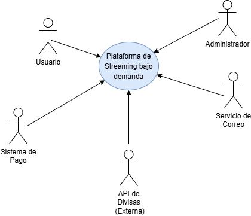

## Primera Descomposición

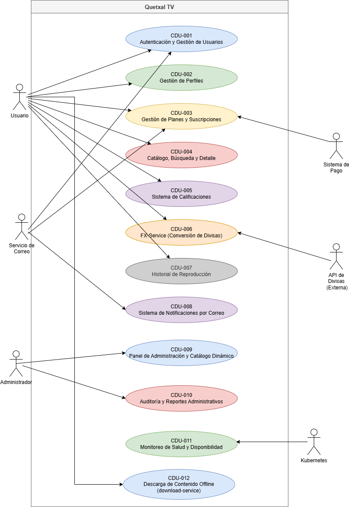

## Casos de Uso Expandidos
#### CDU-001: Autenticación y Gestión de Usuarios

Sus expandidos son:
- CDU001.1: Registro de usuario
- CDU001.2: Inicio de sesión
- CDU001.3: Cerrar sesión
- CDU001.4: Control de intentos y bloqueo temporal
- CDU001.5: Modificación de datos personales
- CDU001.6: Cambio de contraseña
- CDU001.7: Gestión de usuarios (Administrador)
- CDU001.8: Autenticación OAuth

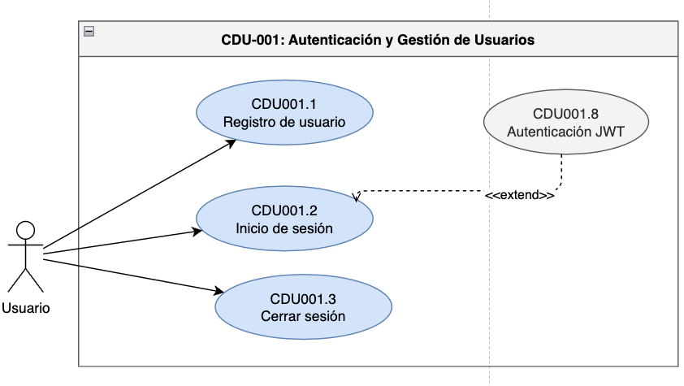

##### Registro de Usuario

| Campo | Detalle |
|-------|---------|
| **Nombre** | Registro de usuario |
| **Código** | CDU001.1 |
| **Actores** | Usuario |
| **Descripción** | Permite que un nuevo usuario cree una cuenta en la plataforma Quetxal TV ingresando sus datos personales y credenciales para acceder al servicio de streaming. |
| **Precondiciones** | El usuario no debe tener una cuenta registrada con el mismo correo electrónico. |
| **Post Condiciones** | - Usuario creado exitosamente y redirigido al inicio de sesión.   - Correo de confirmación enviado al usuario.   - El usuario no es creado si ocurre un error en los datos ingresados. |
| **Flujo Principal** | 1. El usuario selecciona la opción "Registrarse".   2. El sistema muestra el formulario de registro.   3. El usuario ingresa su nombre completo.   4. El usuario ingresa su correo electrónico.   5. El usuario ingresa su contraseña.   6. El usuario confirma su contraseña.   7. El usuario presiona "Crear cuenta".   8. El sistema valida que todos los campos sean correctos.   9. El sistema verifica que el correo electrónico sea único.   10. El sistema cifra la contraseña con bcrypt.   11. El sistema guarda el usuario en la base de datos.   12. El sistema dispara el envío del correo de bienvenida.   13. El sistema redirige al inicio de sesión con mensaje de éxito. |
| **Flujos Alternos** | **FA1: Datos incompletos**   FA1.1 El sistema detecta campos vacíos.   FA1.2 Resalta los campos faltantes en rojo.   FA1.3 Notifica "Todos los campos son obligatorios".   FA1.4 El usuario completa los datos.   FA1.5 Continúa en el paso 8.    **FA2: Correo electrónico ya registrado**   FA2.1 El sistema detecta el correo duplicado.   FA2.2 Notifica "Este correo ya está en uso".   FA2.3 El usuario ingresa un correo diferente.   FA2.4 Continúa en el paso 9.    **FA3: Contraseñas no coinciden**   FA3.1 El sistema detecta que la confirmación no coincide.   FA3.2 Notifica "Las contraseñas no coinciden".   FA3.3 El usuario corrige la confirmación.   FA3.4 Continúa en el paso 8. |
| **Reglas de Negocio** | - El correo electrónico debe ser único en el sistema.   - La contraseña debe tener mínimo 8 caracteres, al menos una mayúscula y un número.   - Las credenciales deben almacenarse de forma segura mediante bcrypt (factor ≥ 12). |
| **Flujo de Excepción** | **FE1: Error del servidor al procesar el registro**   FE1.1 El sistema detecta un error interno.   FE1.2 Notifica al usuario "No se pudo completar el registro. Inténtelo más tarde".   FE1.3 El sistema registra el error en los logs.   FE1.4 Los datos del formulario se conservan para evitar reingreso.    **FE2: Fallo en el servicio de correo**   FE2.1 El usuario se registra exitosamente pero el correo falla.   FE2.2 El sistema notifica que la cuenta fue creada pero el correo no pudo enviarse.   FE2.3 El sistema permite reenviar el correo desde el perfil. |
| **Reglas de Calidad** | - La contraseña debe cifrarse antes de almacenarse.   - El registro no debe exceder 3 segundos.   - El indicador de fuerza de contraseña debe mostrarse en tiempo real. |

---

##### Inicio de Sesión

| Campo | Detalle |
|-------|---------|
| **Nombre** | Inicio de sesión |
| **Código** | CDU001.2 |
| **Actores** | Usuario |
| **Descripción** | Permite que un usuario registrado acceda a la plataforma Quetxal TV mediante sus credenciales, generando un JWT y una Session Cookie segura. |
| **Precondiciones** | El usuario debe tener una cuenta registrada y activa en el sistema. |
| **Post Condiciones** | - Sesión iniciada correctamente con JWT generado y Session Cookie establecida.   - Redireccionamiento al selector de perfiles.   - Registro de auditoría del inicio de sesión. |
| **Flujo Principal** | 1. El usuario selecciona "Iniciar sesión".   2. El sistema muestra el formulario de login.   3. El usuario ingresa su correo electrónico.   4. El usuario ingresa su contraseña.   5. El usuario presiona "Entrar".   6. El sistema verifica las credenciales en la base de datos.   7. El sistema valida que la cuenta esté activa.   8. El sistema genera un JWT con los datos del usuario.   9. El sistema establece una Session Cookie segura (HttpOnly, Secure).   10. El sistema redirige al selector de perfiles. |
| **Flujos Alternos** | **FA1: Credenciales incorrectas**   FA1.1 El sistema detecta que las credenciales no coinciden.   FA1.2 Incrementa el contador de intentos fallidos.   FA1.3 Notifica "Correo o contraseña incorrectos".   FA1.4 El usuario puede reintentar.    **FA2: Inicio de sesión con OAuth**   FA2.1 El usuario selecciona "Continuar con Google".   FA2.2 El sistema redirige al proveedor OAuth.   FA2.3 El proveedor autentica al usuario y retorna los datos.   FA2.4 El sistema genera JWT y Session Cookie.   FA2.5 Continúa en el paso 10. |
| **Reglas de Negocio** | - Máximo 5 intentos fallidos antes del bloqueo temporal.   - El JWT tiene vigencia de 1 hora.   - La Session Cookie debe ser HttpOnly y Secure. |
| **Flujo de Excepción** | **FE1: Servicio de autenticación no disponible**   FE1.1 El sistema detecta que el microservicio de auth no responde.   FE1.2 Notifica "El servicio no está disponible. Inténtelo más tarde".   FE1.3 Registra el error en los logs para el equipo técnico. |
| **Reglas de Calidad** | - El proceso de login debe completarse en ≤ 1 segundo.   - Nunca debe indicarse si el error es el correo o la contraseña (mensaje genérico por seguridad).   - Todos los intentos deben registrarse con timestamp e IP. |

---

##### Cerrar Sesión

| Campo | Detalle |
|-------|---------|
| **Nombre** | Cerrar sesión |
| **Código** | CDU001.3 |
| **Actores** | Usuario |
| **Descripción** | Permite al usuario terminar su sesión activa, invalidando el JWT y eliminando la Session Cookie del cliente. |
| **Precondiciones** | El usuario debe tener una sesión activa. |
| **Post Condiciones** | - Session Cookie eliminada del cliente.   - JWT invalidado (añadido a lista de revocación en Redis).   - Usuario redirigido a la pantalla de inicio. |
| **Flujo Principal** | 1. El usuario selecciona "Cerrar sesión".   2. El sistema invalida el JWT actual (blacklist en Redis).   3. El sistema elimina la Session Cookie del navegador.   4. El sistema redirige al usuario a la página de inicio. |
| **Flujos Alternos** | N/A |
| **Reglas de Negocio** | - El token JWT debe ser añadido a la lista negra en Redis hasta su fecha de expiración original.   - La cookie debe eliminarse con el flag de expiración en el pasado. |
| **Flujo de Excepción** | **FE1: Error al invalidar el token**   FE1.1 El sistema no puede escribir en Redis.   FE1.2 Elimina la cookie de todas formas.   FE1.3 Registra el incidente para revisión técnica. |
| **Reglas de Calidad** | - El cierre de sesión debe completarse en ≤ 500 ms.   - No debe quedar ningún dato sensible en el almacenamiento local del cliente. |

---

#### CDU-002: Gestión de Perfiles

Sus expandidos son:
- CDU002.1: Crear perfil
- CDU002.2: Editar perfil
- CDU002.4: Seleccionar perfil activo

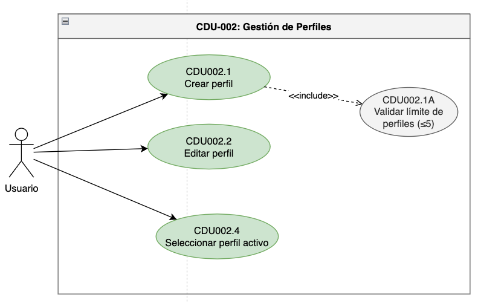

##### Crear Perfil

| Campo | Detalle |
|-------|---------|
| **Nombre** | Crear perfil |
| **Código** | CDU002.1 |
| **Actores** | Usuario |
| **Descripción** | Permite al usuario crear un nuevo perfil dentro de su cuenta para personalizar la experiencia de visualización de forma independiente. |
| **Precondiciones** | El usuario debe tener sesión activa y tener menos de 5 perfiles en su cuenta. |
| **Post Condiciones** | - Perfil creado y asociado a la cuenta del usuario.   - Historial y preferencias inicializados de forma vacía. |
| **Flujo Principal** | 1. El usuario accede a "Gestionar perfiles" desde su cuenta.   2. El sistema muestra los perfiles existentes y la opción "Agregar perfil".   3. El sistema verifica que la cuenta tenga menos de 5 perfiles.   4. El usuario selecciona "Agregar perfil".   5. El sistema muestra el formulario de creación.   6. El usuario ingresa el nombre del perfil y selecciona un avatar.   7. El usuario presiona "Crear".   8. El sistema guarda el nuevo perfil.   9. El sistema muestra el perfil creado en la lista. |
| **Flujos Alternos** | **FA1: Límite de perfiles alcanzado**   FA1.1 La cuenta ya tiene 5 perfiles.   FA1.2 El sistema oculta/deshabilita la opción "Agregar perfil".   FA1.3 Muestra mensaje "Has alcanzado el límite de 5 perfiles". |
| **Reglas de Negocio** | - Máximo 5 perfiles por cuenta.   - El nombre del perfil debe tener entre 1 y 30 caracteres. |
| **Flujo de Excepción** | **FE1: Error al guardar**   FE1.1 El sistema no puede guardar el perfil.   FE1.2 Notifica el error y sugiere reintentar. |
| **Reglas de Calidad** | - La creación debe completarse en ≤ 1 segundo. |

---

### CDU002.2: Editar Perfil

| Campo                  | Detalle                                                                                                                                                                                                                                                                                                                                                                                                                                                                                                                                     |
| ---------------------- | ------------------------------------------------------------------------------------------------------------------------------------------------------------------------------------------------------------------------------------------------------------------------------------------------------------------------------------------------------------------------------------------------------------------------------------------------------------------------------------------------------------------------------------------- |
| **Nombre**             | Editar perfil                                                                                                                                                                                                                                                                                                                                                                                                                                                                                                                               |
| **Código**             | CDU002.2                                                                                                                                                                                                                                                                                                                                                                                                                                                                                                                                    |
| **Actores**            | Usuario                                                                                                                                                                                                                                                                                                                                                                                                                                                                                                                                     |
| **Descripción**        | Permite al usuario modificar la información de un perfil existente para personalizar su experiencia dentro de la plataforma.                                                                                                                                                                                                                                                                                                                                                                                                                |
| **Precondiciones**     | - El usuario debe tener sesión activa.   - Debe existir al menos un perfil asociado a la cuenta.                                                                                                                                                                                                                                                                                                                                                                                                                                         |
| **Post Condiciones**   | - La información del perfil queda actualizada.   - Los cambios se reflejan inmediatamente en la cuenta.                                                                                                                                                                                                                                                                                                                                                                                                                                  |
| **Flujo Principal**    | 1. El usuario accede a "Gestionar perfiles".   2. El sistema muestra los perfiles disponibles.   3. El usuario selecciona la opción "Editar" sobre un perfil.   4. El sistema muestra el formulario con los datos actuales del perfil.   5. El usuario modifica el nombre, avatar u otras preferencias permitidas.   6. El usuario presiona "Guardar cambios".   7. El sistema valida la información ingresada.   8. El sistema actualiza los datos del perfil.   9. El sistema muestra un mensaje de confirmación. |
| **Flujos Alternos**    | **FA1: Cancelación de cambios**   FA1.1 El usuario selecciona "Cancelar".   FA1.2 El sistema descarta los cambios realizados.   FA1.3 Se regresa a la pantalla de gestión de perfiles.                                                                                                                                                                                                                                                                                                                                             |
| **Reglas de Negocio**  | - El nombre del perfil debe tener entre 1 y 30 caracteres.   - Solo el propietario de la cuenta puede editar sus perfiles.                                                                                                                                                                                                                                                                                                                                                                                                               |
| **Flujo de Excepción** | **FE1: Datos inválidos**   FE1.1 El nombre ingresado no cumple las reglas establecidas.   FE1.2 El sistema muestra el mensaje correspondiente y solicita la corrección.    **FE2: Error al actualizar**   FE2.1 Ocurre un error durante el almacenamiento de cambios.   FE2.2 El sistema notifica el error y permite reintentar.                                                                                                                                                                                          |
| **Reglas de Calidad**  | - La actualización debe completarse en ≤ 1 segundo.                                                                                                                                                                                                                                                                                                                                                                                                                                                                                         |

---

### CDU002.4: Seleccionar Perfil Activo

> Este caso de uso ocurre inmediatamente después del inicio de sesión cuando la cuenta posee más de un perfil.

| Campo                  | Detalle                                                                                                                                                                                                                                                                                                                                                                                                                               |
| ---------------------- | ------------------------------------------------------------------------------------------------------------------------------------------------------------------------------------------------------------------------------------------------------------------------------------------------------------------------------------------------------------------------------------------------------------------------------------- |
| **Nombre**             | Seleccionar perfil activo                                                                                                                                                                                                                                                                                                                                                                                                             |
| **Código**             | CDU002.4                                                                                                                                                                                                                                                                                                                                                                                                                              |
| **Actores**            | Usuario                                                                                                                                                                                                                                                                                                                                                                                                                               |
| **Descripción**        | Permite al usuario seleccionar el perfil con el que desea utilizar la plataforma después de autenticarse.                                                                                                                                                                                                                                                                                                                             |
| **Precondiciones**     | - El usuario debe haber iniciado sesión correctamente.   - La cuenta debe poseer al menos un perfil registrado.                                                                                                                                                                                                                                                                                                                    |
| **Post Condiciones**   | - Se establece un perfil activo para la sesión actual.   - La plataforma carga las preferencias, historial y recomendaciones asociadas al perfil seleccionado.                                                                                                                                                                                                                                                                     |
| **Flujo Principal**    | 1. El usuario inicia sesión correctamente.   2. El sistema recupera los perfiles asociados a la cuenta.   3. El sistema muestra la pantalla de selección de perfiles.   4. El usuario selecciona uno de los perfiles disponibles.   5. El sistema establece el perfil como perfil activo.   6. El sistema carga la información personalizada del perfil.   7. El sistema redirige al usuario a la página principal. |
| **Flujos Alternos**    | **FA1: Cuenta con un único perfil**   FA1.1 La cuenta posee solamente un perfil.   FA1.2 El sistema selecciona automáticamente dicho perfil.   FA1.3 El usuario es redirigido directamente a la página principal.                                                                                                                                                                                                            |
| **Reglas de Negocio**  | - Solo puede existir un perfil activo por sesión.   - El perfil activo determina recomendaciones, historial y preferencias visualizadas.                                                                                                                                                                                                                                                                                           |
| **Flujo de Excepción** | **FE1: Perfil no disponible**   FE1.1 El perfil seleccionado ya no existe o no puede cargarse.   FE1.2 El sistema muestra un mensaje de error y solicita seleccionar otro perfil.                                                                                                                                                                                                                                               |
| **Reglas de Calidad**  | - La carga del perfil activo debe completarse en ≤ 2 segundos.                                                                                                                                                                                                                                                                                                                                                                        |

#### CDU-003: Gestión de Planes y Suscripciones

Sus expandidos son:
- CDU003.1: Visualizar planes de suscripción
- CDU003.2: Seleccionar y comprar plan
- CDU003.3: Modificar plan
- CDU003.4: Cancelar suscripción

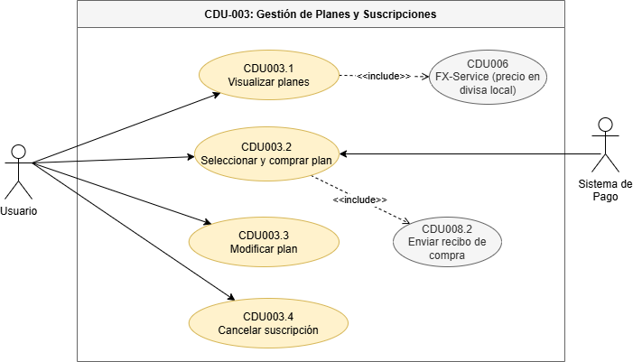

---

## CDU003.1: Visualizar Planes de Suscripción

| Campo                  | Detalle                                                                                                                                                                                                                                                                                                                                                        |
| ---------------------- | -------------------------------------------------------------------------------------------------------------------------------------------------------------------------------------------------------------------------------------------------------------------------------------------------------------------------------------------------------------- |
| **Nombre**             | Visualizar planes de suscripción                                                                                                                                                                                                                                                                                                                               |
| **Código**             | CDU003.1                                                                                                                                                                                                                                                                                                                                                       |
| **Actores**            | Usuario                                                                                                                                                                                                                                                                                                                                                        |
| **Descripción**        | Permite al usuario consultar los planes de suscripción disponibles, sus características y precios antes de tomar una decisión de compra o modificación.                                                                                                                                                                                                        |
| **Precondiciones**     | El usuario debe tener sesión activa.                                                                                                                                                                                                                                                                                                                           |
| **Post Condiciones**   | - Los planes disponibles son mostrados al usuario.   - El usuario puede decidir comprar o modificar su plan.                                                                                                                                                                                                                                                |
| **Flujo Principal**    | 1. El usuario accede a la sección "Planes y Suscripciones".   2. El sistema consulta los planes disponibles.   3. El sistema obtiene los precios en la moneda local mediante FX-Service.   4. El sistema muestra los planes Básico, Estándar y Premium junto con sus beneficios y precios.   5. El usuario visualiza la información de los planes. |
| **Flujos Alternos**    | **FA1: Error al obtener tipo de cambio**   FA1.1 FX-Service no responde.   FA1.2 El sistema utiliza el último valor almacenado en caché.                                                                                                                                                                                                                 |
| **Reglas de Negocio**  | - Los precios deben mostrarse en la moneda local del usuario.   - Los planes deben mostrar sus características y limitaciones.                                                                                                                                                                                                                              |
| **Flujo de Excepción** | **FE1: No existen planes disponibles**   FE1.1 El sistema no encuentra planes activos.   FE1.2 Muestra un mensaje informativo al usuario.                                                                                                                                                                                                                |
| **Reglas de Calidad**  | - La información debe cargarse en ≤ 2 segundos.                                                                                                                                                                                                                                                                                                                |

---

## CDU003.2: Seleccionar y Comprar Plan

| Campo                  | Detalle                                                                                                                                                                                                                                                                                                                                                                                                                                                                                                                          |
| ---------------------- | -------------------------------------------------------------------------------------------------------------------------------------------------------------------------------------------------------------------------------------------------------------------------------------------------------------------------------------------------------------------------------------------------------------------------------------------------------------------------------------------------------------------------------- |
| **Nombre**             | Seleccionar y comprar plan                                                                                                                                                                                                                                                                                                                                                                                                                                                                                                       |
| **Código**             | CDU003.2                                                                                                                                                                                                                                                                                                                                                                                                                                                                                                                         |
| **Actores**            | Usuario, Sistema de Pago                                                                                                                                                                                                                                                                                                                                                                                                                                                                                                         |
| **Descripción**        | Permite al usuario adquirir una nueva suscripción seleccionando uno de los planes disponibles y completando el proceso de pago.                                                                                                                                                                                                                                                                                                                                                                                                  |
| **Precondiciones**     | El usuario debe tener sesión activa y no poseer una suscripción activa.                                                                                                                                                                                                                                                                                                                                                                                                                                                          |
| **Post Condiciones**   | - Suscripción creada y asociada a la cuenta.   - Transacción registrada.   - Correo de confirmación enviado.                                                                                                                                                                                                                                                                                                                                                                                                               |
| **Flujo Principal**    | 1. El usuario visualiza los planes disponibles.   2. El usuario selecciona el plan deseado.   3. El sistema muestra el resumen de compra.   4. El usuario selecciona un método de pago.   5. El Sistema de Pago procesa la transacción.   6. El sistema registra la compra mediante el procedimiento almacenado correspondiente.   7. El sistema activa la suscripción.   8. El sistema envía el recibo de compra por correo electrónico.   9. El sistema muestra la confirmación de suscripción activa. |
| **Flujos Alternos**    | **FA1: Pago rechazado**   FA1.1 El Sistema de Pago rechaza la transacción.   FA1.2 El sistema informa el rechazo y permite reintentar.                                                                                                                                                                                                                                                                                                                                                                                     |
| **Reglas de Negocio**  | - Solo puede existir una suscripción activa por cuenta.   - La compra debe registrarse mediante procedimiento almacenado.                                                                                                                                                                                                                                                                                                                                                                                                     |
| **Flujo de Excepción** | **FE1: Sistema de Pago no disponible**   FE1.1 El servicio de pago no responde.   FE1.2 El sistema cancela la operación y notifica al usuario.                                                                                                                                                                                                                                                                                                                                                                             |
| **Reglas de Calidad**  | - El proceso debe completarse en ≤ 5 segundos.   - Los datos financieros nunca se almacenan en Quetxal TV.                                                                                                                                                                                                                                                                                                                                                                                                                    |

---

## CDU003.3: Modificar Plan

| Campo                  | Detalle                                                                                                                                                                                                                                                                                                                                                                                                                                                                                             |
| ---------------------- | --------------------------------------------------------------------------------------------------------------------------------------------------------------------------------------------------------------------------------------------------------------------------------------------------------------------------------------------------------------------------------------------------------------------------------------------------------------------------------------------------- |
| **Nombre**             | Modificar plan                                                                                                                                                                                                                                                                                                                                                                                                                                                                                      |
| **Código**             | CDU003.3                                                                                                                                                                                                                                                                                                                                                                                                                                                                                            |
| **Actores**            | Usuario, Sistema de Pago                                                                                                                                                                                                                                                                                                                                                                                                                                                                            |
| **Descripción**        | Permite al usuario cambiar su suscripción actual por otro plan disponible, actualizando los beneficios asociados y realizando los cobros correspondientes cuando aplique.                                                                                                                                                                                                                                                                                                                           |
| **Precondiciones**     | - El usuario debe tener sesión activa.   - Debe existir una suscripción activa.                                                                                                                                                                                                                                                                                                                                                                                                                  |
| **Post Condiciones**   | - La suscripción queda actualizada con el nuevo plan.   - Los beneficios disponibles cambian según el plan seleccionado.                                                                                                                                                                                                                                                                                                                                                                         |
| **Flujo Principal**    | 1. El usuario accede a la sección de suscripción actual.   2. El sistema muestra el plan vigente y las alternativas disponibles.   3. El usuario selecciona un nuevo plan.   4. El sistema calcula la diferencia de precio correspondiente.   5. El sistema muestra el resumen del cambio.   6. Si existe un cobro adicional, el Sistema de Pago procesa la transacción.   7. El sistema actualiza la suscripción.   8. El sistema muestra la confirmación del cambio de plan. |
| **Flujos Alternos**    | **FA1: Cambio a un plan de menor costo**   FA1.1 El usuario selecciona un plan más económico.   FA1.2 El sistema programa el cambio para el siguiente ciclo de facturación.                                                                                                                                                                                                                                                                                                                   |
| **Reglas de Negocio**  | - El cambio de Básico a Estándar o Premium puede generar un cobro inmediato.   - El cambio a un plan inferior se aplica al finalizar el período vigente.                                                                                                                                                                                                                                                                                                                                         |
| **Flujo de Excepción** | **FE1: Error en el cobro adicional**   FE1.1 El Sistema de Pago rechaza el cobro.   FE1.2 La modificación no se realiza.                                                                                                                                                                                                                                                                                                                                                                      |
| **Reglas de Calidad**  | - La actualización debe reflejarse inmediatamente después de la confirmación.                                                                                                                                                                                                                                                                                                                                                                                                                       |

---

## CDU003.4: Cancelar Suscripción

| Campo                  | Detalle                                                                                                                                                                                                                                                                                                                                                                                                                                                                                  |
| ---------------------- | ---------------------------------------------------------------------------------------------------------------------------------------------------------------------------------------------------------------------------------------------------------------------------------------------------------------------------------------------------------------------------------------------------------------------------------------------------------------------------------------- |
| **Nombre**             | Cancelar suscripción                                                                                                                                                                                                                                                                                                                                                                                                                                                                     |
| **Código**             | CDU003.4                                                                                                                                                                                                                                                                                                                                                                                                                                                                                 |
| **Actores**            | Usuario                                                                                                                                                                                                                                                                                                                                                                                                                                                                                  |
| **Descripción**        | Permite al usuario finalizar su suscripción activa para evitar futuras renovaciones automáticas.                                                                                                                                                                                                                                                                                                                                                                                         |
| **Precondiciones**     | - El usuario debe tener sesión activa.   - Debe existir una suscripción activa.                                                                                                                                                                                                                                                                                                                                                                                                       |
| **Post Condiciones**   | - La renovación automática queda deshabilitada.   - La suscripción permanece activa hasta finalizar el período pagado.                                                                                                                                                                                                                                                                                                                                                                |
| **Flujo Principal**    | 1. El usuario accede a la configuración de su suscripción.   2. El sistema muestra la información de la suscripción actual.   3. El usuario selecciona "Cancelar suscripción".   4. El sistema solicita confirmación de la acción.   5. El usuario confirma la cancelación.   6. El sistema deshabilita la renovación automática.   7. El sistema confirma la cancelación al usuario. |
| **Flujos Alternos**    | **FA1: Usuario cancela la operación**   FA1.1 El usuario decide no continuar.   FA1.2 El sistema conserva la suscripción sin cambios.                                                                                                                                                                                                                                                                                                                                              |
| **Reglas de Negocio**  | - No se realizan reembolsos automáticos por períodos ya pagados.   - El acceso continúa hasta la fecha de vencimiento de la suscripción.                                                                                                                                                                                                                                                                                                                                              |
| **Flujo de Excepción** | **FE1: Error al procesar la cancelación**   FE1.1 El sistema no puede actualizar el estado de la suscripción.   FE1.2 Se notifica al usuario y se solicita reintentar.                                                                                                                                                                                                                                                                                                             |
| **Reglas de Calidad**  | - La cancelación debe confirmarse en ≤ 2 segundos.                                                                                                                                                                                                                                                                                                                                                                                                                                       |

#### CDU-004: Catálogo, Búsqueda y Detalle de Contenido

Sus expandidos son:
- CDU004.1: Buscar contenido
- CDU004.2: Filtrar contenido
- CDU004.3: Ver detalle de contenido

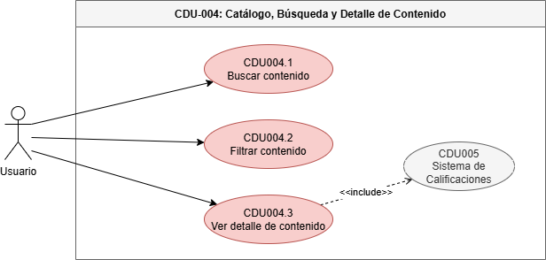

### CDU004.1: Buscar Contenido

| Campo                  | Detalle                                                                                                                                                                                                                                                                                                                                                                                                                             |
| ---------------------- | ----------------------------------------------------------------------------------------------------------------------------------------------------------------------------------------------------------------------------------------------------------------------------------------------------------------------------------------------------------------------------------------------------------------------------------- |
| **Nombre**             | Buscar contenido                                                                                                                                                                                                                                                                                                                                                                                                                    |
| **Código**             | CDU004.1                                                                                                                                                                                                                                                                                                                                                                                                                            |
| **Actores**            | Usuario                                                                                                                                                                                                                                                                                                                                                                                                                             |
| **Descripción**        | Permite al usuario localizar películas o series específicas mediante un cuadro de búsqueda utilizando el nombre del contenido.                                                                                                                                                                                                                                                                                                      |
| **Precondiciones**     | El usuario debe tener sesión activa y un perfil seleccionado.                                                                                                                                                                                                                                                                                                                                                                       |
| **Post Condiciones**   | - Se muestran los contenidos que coinciden con la búsqueda realizada.                                                                                                                                                                                                                                                                                                                                                               |
| **Flujo Principal**    | 1. El usuario accede al catálogo de contenido.   2. El sistema muestra una barra de búsqueda.   3. El usuario ingresa el nombre o parte del nombre del contenido.   4. El sistema envía la consulta al servicio de catálogo.   5. El sistema obtiene los resultados coincidentes.   6. El sistema muestra la lista de contenidos encontrados.   7. El usuario puede seleccionar un contenido para ver su detalle. |
| **Flujos Alternos**    | **FA1: Sin resultados**   FA1.1 No existen coincidencias para la búsqueda.   FA1.2 El sistema muestra el mensaje "No se encontraron resultados".                                                                                                                                                                                                                                                                              |
| **Reglas de Negocio**  | - La búsqueda debe permitir coincidencias parciales.   - Debe incluir películas y series disponibles para el usuario.                                                                                                                                                                                                                                                                                                            |
| **Flujo de Excepción** | **FE1: Error de búsqueda**   FE1.1 El servicio de catálogo no responde.   FE1.2 El sistema muestra un mensaje de error al usuario.                                                                                                                                                                                                                                                                                            |
| **Reglas de Calidad**  | - Los resultados deben mostrarse en ≤ 2 segundos.                                                                                                                                                                                                                                                                                                                                                                                   |

---

### CDU004.2: Filtrar Contenido

| Campo                  | Detalle                                                                                                                                                                                                                                                                                                                                                                                                             |
| ---------------------- | ------------------------------------------------------------------------------------------------------------------------------------------------------------------------------------------------------------------------------------------------------------------------------------------------------------------------------------------------------------------------------------------------------------------- |
| **Nombre**             | Filtrar contenido                                                                                                                                                                                                                                                                                                                                                                                                   |
| **Código**             | CDU004.2                                                                                                                                                                                                                                                                                                                                                                                                            |
| **Actores**            | Usuario                                                                                                                                                                                                                                                                                                                                                                                                             |
| **Descripción**        | Permite al usuario refinar los contenidos mostrados en el catálogo mediante filtros visuales como género, año de lanzamiento, clasificación o tipo de contenido.                                                                                                                                                                                                                                                    |
| **Precondiciones**     | El usuario debe tener sesión activa y un perfil seleccionado.                                                                                                                                                                                                                                                                                                                                                       |
| **Post Condiciones**   | - El catálogo muestra únicamente los contenidos que cumplen con los filtros seleccionados.                                                                                                                                                                                                                                                                                                                          |
| **Flujo Principal**    | 1. El usuario accede al catálogo de contenido.   2. El sistema muestra los filtros disponibles mediante botones y listas desplegables.   3. El usuario selecciona uno o varios filtros (género, año, clasificación, película o serie).   4. El sistema aplica los filtros seleccionados.   5. El sistema actualiza el catálogo mostrando únicamente los contenidos que cumplen los criterios indicados. |
| **Flujos Alternos**    | **FA1: Sin coincidencias**   FA1.1 Ningún contenido cumple los filtros seleccionados.   FA1.2 El sistema muestra el mensaje "No existen contenidos para los filtros seleccionados".                                                                                                                                                                                                                           |
| **Reglas de Negocio**  | - Se pueden combinar múltiples filtros simultáneamente.   - Los filtros deben aplicarse únicamente sobre contenidos disponibles.                                                                                                                                                                                                                                                                                 |
| **Flujo de Excepción** | **FE1: Error al aplicar filtros**   FE1.1 El servicio de catálogo no responde.   FE1.2 El sistema informa el error al usuario.                                                                                                                                                                                                                                                                                |
| **Reglas de Calidad**  | - La actualización del catálogo debe realizarse en ≤ 2 segundos.                                                                                                                                                                                                                                                                                                                                                    |

---

### CDU004.3: Ver Detalle de Contenido

| Campo                  | Detalle                                                                                                                                                                                                                                                                                                                                                                                                                                                                                                                                                                                                                                                                                                                    |
| ---------------------- | -------------------------------------------------------------------------------------------------------------------------------------------------------------------------------------------------------------------------------------------------------------------------------------------------------------------------------------------------------------------------------------------------------------------------------------------------------------------------------------------------------------------------------------------------------------------------------------------------------------------------------------------------------------------------------------------------------------------------- |
| **Nombre**             | Ver detalle de contenido                                                                                                                                                                                                                                                                                                                                                                                                                                                                                                                                                                                                                                                                                                   |
| **Código**             | CDU004.3                                                                                                                                                                                                                                                                                                                                                                                                                                                                                                                                                                                                                                                                                                                   |
| **Actores**            | Usuario                                                                                                                                                                                                                                                                                                                                                                                                                                                                                                                                                                                                                                                                                                                    |
| **Descripción**        | Permite al usuario visualizar la información completa de una película o serie seleccionada, mostrando el póster junto a la ficha técnica y la información de calificaciones.                                                                                                                                                                                                                                                                                                                                                                                                                                                                                                                                               |
| **Precondiciones**     | El usuario debe tener sesión activa con un perfil seleccionado.                                                                                                                                                                                                                                                                                                                                                                                                                                                                                                                                                                                                                                                            |
| **Post Condiciones**   | - Información detallada del contenido mostrada al usuario.   - Calificación de la comunidad calculada y mostrada dinámicamente.                                                                                                                                                                                                                                                                                                                                                                                                                                                                                                                                                                                         |
| **Flujo Principal**    | 1. El usuario selecciona un contenido desde el catálogo o desde los resultados de búsqueda.   2. El sistema consulta los datos del contenido mediante la vista de fichas técnicas.   3. El sistema consulta el porcentaje de recomendación mediante la función calculadora.   4. El sistema muestra el póster del contenido.   5. El sistema muestra junto al póster la ficha técnica completa (sinopsis, actores, director, año, género y duración).   6. El sistema muestra el porcentaje global de recomendación de la comunidad.   7. El sistema verifica si el usuario ya calificó el contenido y muestra su calificación actual.   8. El usuario puede calificar el contenido (include CDU005). |
| **Flujos Alternos**    | **FA1: Contenido no disponible**   FA1.1 El contenido fue eliminado o desactivado.   FA1.2 El sistema muestra el mensaje "Este contenido ya no está disponible".                                                                                                                                                                                                                                                                                                                                                                                                                                                                                                                                                     |
| **Reglas de Negocio**  | - La ficha técnica debe obtenerse mediante la vista de base de datos.   - El porcentaje de recomendación se calcula mediante la función de base de datos.   - El detalle debe mostrar el póster y la información descriptiva del contenido.                                                                                                                                                                                                                                                                                                                                                                                                                                                                          |
| **Flujo de Excepción** | **FE1: Error al cargar contenido**   FE1.1 El microservicio de catálogo no responde.   FE1.2 El sistema muestra un mensaje de error genérico.                                                                                                                                                                                                                                                                                                                                                                                                                                                                                                                                                                        |
| **Reglas de Calidad**  | - La ficha debe cargar en ≤ 2 segundos.   - El porcentaje de recomendación debe ser calculado en tiempo real.                                                                                                                                                                                                                                                                                                                                                                                                                                                                                                                                                                                                           |

#### CDU-005: Sistema de Calificaciones

Sus expandidos son:
- CDU005.1: Calificar contenido (pulgar arriba/abajo)
- CDU005.2: Calcular porcentaje global de recomendación

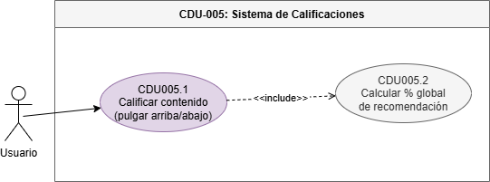

##### Calificar Contenido

| Campo | Detalle |
|-------|---------|
| **Nombre** | Calificar contenido |
| **Código** | CDU005.1 |
| **Actores** | Usuario |
| **Descripción** | Permite al usuario calificar una película o serie mediante el sistema de pulgar arriba/abajo, contribuyendo al porcentaje global de recomendación de la comunidad. |
| **Precondiciones** | El usuario debe tener sesión activa con un perfil seleccionado y haber visto al menos parte del contenido. |
| **Post Condiciones** | - Calificación del usuario registrada o actualizada en la base de datos.   - Porcentaje global de recomendación recalculado y actualizado. |
| **Flujo Principal** | 1. El usuario accede al detalle de un contenido.   2. El sistema muestra las opciones de calificación.   3. El sistema indica si el usuario ya calificó este contenido.   4. El usuario selecciona su calificación.   5. El sistema registra/actualiza la calificación del perfil.   6. El sistema recalcula el porcentaje global mediante la función de base de datos.   7. El sistema muestra el nuevo porcentaje actualizado en la vista. |
| **Flujos Alternos** | **FA1: Usuario cambia su calificación**   FA1.1 El usuario ya tenía una calificación registrada.   FA1.2 El sistema actualiza (no duplica) la calificación.   FA1.3 Recalcula el porcentaje global. |
| **Reglas de Negocio** | - Cada perfil puede tener solo una calificación por contenido.   - El porcentaje global se calcula con la función de base de datos: (pulgares arriba / total de votos) × 100. |
| **Flujo de Excepción** | **FE1: Error al guardar calificación**   FE1.1 El sistema no puede registrar la calificación.   FE1.2 Notifica el error y muestra el porcentaje anterior. |
| **Reglas de Calidad** | - La calificación debe registrarse y el porcentaje actualizarse en ≤ 500 ms.   - El cálculo del porcentaje debe realizarse mediante la función de base de datos (no en capa de aplicación). |

#### CDU-006: FX-Service (Conversión de Divisas)

Sus expandidos son:
- CDU006.1: Consultar tipo de cambio
- CDU006.2: Cachear tipo de cambio en Redis
- CDU006.3: Mostrar precio en moneda local

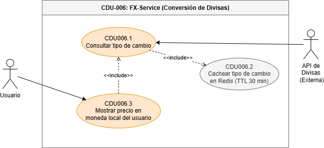

### CDU006.2: Cachear Tipo de Cambio en Redis

| Campo                  | Detalle                                                                                                                                                                                                                                                                                           |
| ---------------------- | ------------------------------------------------------------------------------------------------------------------------------------------------------------------------------------------------------------------------------------------------------------------------------------------------- |
| **Nombre**             | Cachear tipo de cambio en Redis                                                                                                                                                                                                                                                                   |
| **Código**             | CDU006.2                                                                                                                                                                                                                                                                                          |
| **Actores**            | API de Divisas Externa                                                                                                                                                                                                                                                                                        |
| **Descripción**        | Permite almacenar temporalmente las tasas de cambio obtenidas desde la API externa para reutilizarlas en futuras consultas y reducir el tiempo de respuesta.                                                                                                                                      |
| **Precondiciones**     | Redis debe estar operativo y existir una tasa de cambio válida obtenida por el FX-Service.                                                                                                                                                                                                        |
| **Post Condiciones**   | - La tasa de cambio queda almacenada en Redis.   - Se configura un TTL de 30 minutos para la tasa almacenada.                                                                                                                                                                                  |
| **Flujo Principal**    | 1. El FX-Service obtiene una tasa de cambio desde la API externa.   2. El sistema verifica la validez de la tasa recibida.   3. El sistema almacena la tasa de cambio en Redis.   4. El sistema configura un TTL de 30 minutos.   5. La tasa queda disponible para futuras consultas. |
| **Flujos Alternos**    | **FA1: Actualización de tasa existente**   FA1.1 Ya existe una tasa almacenada para la misma divisa.   FA1.2 El sistema reemplaza el valor anterior y reinicia el TTL.                                                                                                                      |
| **Reglas de Negocio**  | - El TTL debe ser de 30 minutos.   - Las tasas almacenadas deben identificarse por código de divisa.                                                                                                                                                                                           |
| **Flujo de Excepción** | **FE1: Redis no disponible**   FE1.1 Redis no responde.   FE1.2 El sistema registra el incidente y continúa operando sin caché.                                                                                                                                                             |
| **Reglas de Calidad**  | - El almacenamiento debe completarse en ≤ 10 ms.                                                                                                                                                                                                                                                  |

---

### CDU006.3: Mostrar Precio en Moneda Local

| Campo                  | Detalle                                                                                                                                                                                                                                                                                                                                                                             |
| ---------------------- | ----------------------------------------------------------------------------------------------------------------------------------------------------------------------------------------------------------------------------------------------------------------------------------------------------------------------------------------------------------------------------------- |
| **Nombre**             | Mostrar precio en moneda local                                                                                                                                                                                                                                                                                                                                                      |
| **Código**             | CDU006.3                                                                                                                                                                                                                                                                                                                                                                            |
| **Actores**            | Usuario                                                                                                                                                                                                                                                                                                                                                                             |
| **Descripción**        | Permite mostrar el precio de los planes de suscripción en la moneda local del usuario dentro de las tarjetas de planes mostradas en la interfaz.                                                                                                                                                                                                                                    |
| **Precondiciones**     | - El usuario debe estar visualizando los planes de suscripción.   - Debe existir una tasa de cambio disponible.                                                                                                                                                                                                                                                                  |
| **Post Condiciones**   | - Los precios de los planes son mostrados en la moneda local del usuario.                                                                                                                                                                                                                                                                                                           |
| **Flujo Principal**    | 1. El usuario accede a la sección de planes y suscripciones.   2. El sistema obtiene la tasa de cambio desde el FX-Service.   3. El sistema convierte el precio base de cada plan a la moneda local correspondiente.   4. El sistema actualiza la información mostrada en las tarjetas de planes.   5. El usuario visualiza los precios convertidos en su moneda local. |
| **Flujos Alternos**    | **FA1: Moneda local igual a moneda base**   FA1.1 La moneda del usuario coincide con la moneda original del plan.   FA1.2 El sistema muestra el precio sin realizar conversión.                                                                                                                                                                                               |
| **Reglas de Negocio**  | - Los precios deben mostrarse utilizando la tasa de cambio más reciente disponible.   - Los valores monetarios deben mostrarse con dos decimales.                                                                                                                                                                                                                                |
| **Flujo de Excepción** | **FE1: No se puede obtener la tasa de cambio**   FE1.1 El FX-Service no retorna una tasa válida.   FE1.2 El sistema muestra el precio original del plan.                                                                                                                                                                                                                      |
| **Reglas de Calidad**  | - La conversión y visualización del precio debe realizarse en ≤ 500 ms.                                                                                                                                                                                                                                                                                                             |

#### CDU-007: Historial de Reproducción

Sus expandidos son:
- CDU007.1: Registrar progreso de visualización
- CDU007.2: Reanudar contenido desde donde se detuvo
- CDU007.3: Ver historial de reproducción del perfil

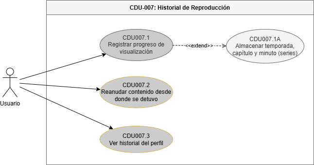

## CDU007.1: Registrar Progreso de Visualización

| Campo                  | Detalle                                                                                                                                                                                                                                                                                                                                                                                                                                         |
| ---------------------- | ----------------------------------------------------------------------------------------------------------------------------------------------------------------------------------------------------------------------------------------------------------------------------------------------------------------------------------------------------------------------------------------------------------------------------------------------- |
| **Nombre**             | Registrar progreso de visualización                                                                                                                                                                                                                                                                                                                                                                                                             |
| **Código**             | CDU007.1                                                                                                                                                                                                                                                                                                                                                                                                                                        |
| **Actores**            | Usuario                                                                                                                                                                                                                                                                                                                                                                                                                                         |
| **Descripción**        | El sistema registra automáticamente el progreso de reproducción del perfil activo, almacenando el minuto exacto de reproducción para películas y la temporada, capítulo y minuto para series.                                                                                                                                                                                                                                                   |
| **Precondiciones**     | El usuario debe tener sesión activa con un perfil seleccionado y estar reproduciendo contenido.                                                                                                                                                                                                                                                                                                                                                 |
| **Post Condiciones**   | - Progreso de visualización actualizado en la base de datos por perfil.   - Para series: temporada, capítulo y minuto almacenados.                                                                                                                                                                                                                                                                                                           |
| **Flujo Principal**    | 1. El usuario inicia la reproducción de un contenido.   2. El sistema inicia el registro de progreso cada 30 segundos.   3. Para películas: el sistema almacena el minuto actual de reproducción.   4. Para series: el sistema almacena la temporada, capítulo y minuto actual.   5. Al pausar o detener, el sistema realiza un registro final del progreso.   6. El historial del perfil es actualizado con el último registro. |
| **Flujos Alternos**    | **FA1: Contenido completado**   FA1.1 El usuario llega al final del contenido.   FA1.2 El sistema marca el contenido como "completado" en el historial.   FA1.3 Limpia el progreso de minuto (ya no hay reanudación).                                                                                                                                                                                                                  |
| **Reglas de Negocio**  | - El progreso es independiente por perfil.   - Para series se almacena: id_temporada, id_capitulo y minuto_exacto.   - El registro de progreso debe realizarse cada 30 segundos durante la reproducción.                                                                                                                                                                                                                                  |
| **Flujo de Excepción** | **FE1: Error al registrar progreso**   FE1.1 El sistema no puede escribir en la base de datos.   FE1.2 El sistema reintenta al siguiente intervalo.   FE1.3 La reproducción no se interrumpe.                                                                                                                                                                                                                                          |
| **Reglas de Calidad**  | - El registro de progreso no debe agregar más de 50 ms de latencia a la reproducción.   - Los datos de progreso deben ser consistentes y no perderse ante fallos del servidor.                                                                                                                                                                                                                                                               |

---

## CDU007.2: Reanudar Contenido Desde Donde se Detuvo

| Campo                  | Detalle                                                                                                                                                                                                                                                                                                                                                                                                                                                                         |
| ---------------------- | ------------------------------------------------------------------------------------------------------------------------------------------------------------------------------------------------------------------------------------------------------------------------------------------------------------------------------------------------------------------------------------------------------------------------------------------------------------------------------- |
| **Nombre**             | Reanudar contenido desde donde se detuvo                                                                                                                                                                                                                                                                                                                                                                                                                                        |
| **Código**             | CDU007.2                                                                                                                                                                                                                                                                                                                                                                                                                                                                        |
| **Actores**            | Usuario                                                                                                                                                                                                                                                                                                                                                                                                                                                                         |
| **Descripción**        | Permite al usuario continuar una película o serie desde el último punto registrado en su historial de reproducción.                                                                                                                                                                                                                                                                                                                                                             |
| **Precondiciones**     | - El usuario debe tener sesión activa con un perfil seleccionado.   - Debe existir un progreso previamente registrado para el contenido.                                                                                                                                                                                                                                                                                                                                     |
| **Post Condiciones**   | - La reproducción inicia desde el último punto guardado.                                                                                                                                                                                                                                                                                                                                                                                                                        |
| **Flujo Principal**    | 1. El usuario selecciona un contenido previamente visto.   2. El sistema consulta el historial del perfil.   3. El sistema recupera el último progreso registrado.   4. Para películas, obtiene el minuto almacenado.   5. Para series, obtiene la temporada, capítulo y minuto almacenados.   6. El sistema muestra la opción "Continuar viendo".   7. El usuario selecciona la opción.   8. El sistema inicia la reproducción desde el punto almacenado. |
| **Flujos Alternos**    | **FA1: Sin progreso registrado**   FA1.1 No existe historial para el contenido.   FA1.2 El sistema inicia la reproducción desde el principio.                                                                                                                                                                                                                                                                                                                             |
| **Reglas de Negocio**  | - La reanudación debe ser específica para cada perfil.   - Los contenidos marcados como completados deben iniciar desde el principio, salvo que el usuario elija reanudarlos manualmente.                                                                                                                                                                                                                                                                                    |
| **Flujo de Excepción** | **FE1: Progreso inconsistente**   FE1.1 El progreso almacenado es inválido o no existe.   FE1.2 El sistema inicia la reproducción desde el inicio del contenido.                                                                                                                                                                                                                                                                                                          |
| **Reglas de Calidad**  | - La recuperación del progreso debe completarse en ≤ 500 ms.                                                                                                                                                                                                                                                                                                                                                                                                                    |

---

## CDU007.3: Ver Historial de Reproducción del Perfil

| Campo                  | Detalle                                                                                                                                                                                                                                                                                                                                                                                                                                                             |
| ---------------------- | ------------------------------------------------------------------------------------------------------------------------------------------------------------------------------------------------------------------------------------------------------------------------------------------------------------------------------------------------------------------------------------------------------------------------------------------------------------------- |
| **Nombre**             | Ver historial de reproducción del perfil                                                                                                                                                                                                                                                                                                                                                                                                                            |
| **Código**             | CDU007.3                                                                                                                                                                                                                                                                                                                                                                                                                                                            |
| **Actores**            | Usuario                                                                                                                                                                                                                                                                                                                                                                                                                                                             |
| **Descripción**        | Permite al usuario visualizar el historial de películas y series reproducidas por el perfil activo, incluyendo el estado de avance de cada contenido.                                                                                                                                                                                                                                                                                                               |
| **Precondiciones**     | El usuario debe tener sesión activa con un perfil seleccionado.                                                                                                                                                                                                                                                                                                                                                                                                     |
| **Post Condiciones**   | - El historial de reproducción es mostrado al usuario.                                                                                                                                                                                                                                                                                                                                                                                                              |
| **Flujo Principal**    | 1. El usuario accede a la sección "Mi historial".   2. El sistema consulta el historial asociado al perfil activo.   3. El sistema obtiene los contenidos reproducidos y su progreso.   4. El sistema muestra la lista de contenidos visualizados.   5. Para cada contenido se muestra información como título, portada, fecha de reproducción y porcentaje de avance.   6. El usuario puede seleccionar un contenido para reanudar su reproducción. |
| **Flujos Alternos**    | **FA1: Historial vacío**   FA1.1 El perfil no posee reproducciones registradas.   FA1.2 El sistema muestra el mensaje "Aún no has visto ningún contenido".                                                                                                                                                                                                                                                                                                    |
| **Reglas de Negocio**  | - El historial es independiente para cada perfil.   - Deben mostrarse tanto contenidos en progreso como contenidos completados.                                                                                                                                                                                                                                                                                                                                  |
| **Flujo de Excepción** | **FE1: Error al consultar historial**   FE1.1 No es posible recuperar la información del historial.   FE1.2 El sistema muestra un mensaje de error y permite reintentar la consulta.                                                                                                                                                                                                                                                                          |
| **Reglas de Calidad**  | - El historial debe cargarse en ≤ 2 segundos.   - La información mostrada debe reflejar el estado más reciente registrado para el perfil.                                                                                                                                                                                                                                                                                                                        |

#### CDU-008: Sistema de Notificaciones por Correo

Sus expandidos son:
- CDU008.1: Enviar correo de confirmación de registro
- CDU008.2: Enviar recibo de compra de suscripción
- CDU008.3: Enviar alerta de nuevo contenido

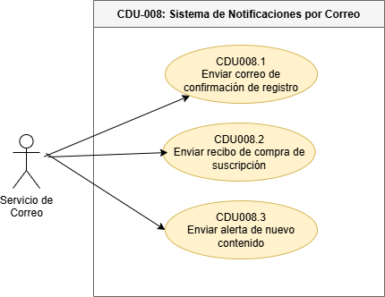

##### CDU008.1: Enviar Correo de Confirmación de Registro

| Campo | Detalle |
|-------|---------|
| **Nombre** | Enviar correo de confirmación de registro |
| **Código** | CDU008.1 |
| **Actores** | Servicio de Correo |
| **Descripción** | El sistema de notificaciones envía automáticamente un correo electrónico de bienvenida o confirmación al usuario después de completar el registro en la plataforma. |
| **Precondiciones** | - El usuario completó correctamente el registro.   - Existe una dirección de correo válida asociada al usuario.   - El servicio de notificaciones tiene configuración SMTP o proveedor de correo disponible. |
| **Post Condiciones** | - El correo de confirmación queda enviado o en cola de reintento.   - El envío queda registrado en la base de datos de notificaciones. |
| **Flujo Principal** | 1. El usuario finaliza el registro.   2. El sistema solicita al servicio de notificaciones enviar el correo de confirmación.   3. El sistema genera el contenido del mensaje usando la plantilla correspondiente.   4. El Servicio de Correo procesa el envío al destinatario.   5. El sistema registra el estado del envío. |
| **Flujos Alternos** | **FA1: Envío en cola**   FA1.1 Si el proveedor de correo tarda en responder, el sistema deja la notificación en estado pendiente.   FA1.2 El sistema programa un reintento automático. |
| **Reglas de Negocio** | - El correo debe enviarse únicamente a direcciones asociadas a usuarios registrados.   - La plantilla debe corresponder al tipo de notificación. |
| **Flujo de Excepción** | **FE1: Falla del proveedor de correo**   FE1.1 El Servicio de Correo no responde o rechaza el envío.   FE1.2 El sistema registra el error.   FE1.3 El envío queda disponible para reintento. |
| **Reglas de Calidad** | - El envío no debe bloquear el flujo principal de registro.   - El estado de la notificación debe ser trazable. |

---

##### CDU008.2: Enviar Recibo de Compra de Suscripción

| Campo | Detalle |
|-------|---------|
| **Nombre** | Enviar recibo de compra de suscripción |
| **Código** | CDU008.2 |
| **Actores** | Servicio de Correo |
| **Descripción** | El sistema envía un recibo digital al usuario después de una compra exitosa de suscripción, dejando constancia del plan adquirido, monto, moneda, fecha y estado de la transacción. |
| **Precondiciones** | - El usuario completó exitosamente la compra o renovación de una suscripción.   - Existe una transacción aprobada asociada a la cuenta.   - El usuario tiene correo registrado. |
| **Post Condiciones** | - El recibo de compra queda enviado al correo del usuario o registrado para reintento.   - El envío queda registrado en la tabla de notificaciones. |
| **Flujo Principal** | 1. El usuario compra una suscripción en el caso de uso CDU003.2.   2. El sistema registra la suscripción y la transacción aprobada.   3. El sistema solicita al módulo de notificaciones generar el recibo.   4. El sistema construye el mensaje con plan, monto, moneda, período y referencia de pago.   5. El Servicio de Correo envía el recibo al usuario.   6. El sistema registra el resultado del envío. |
| **Flujos Alternos** | **FA1: Envío diferido**   FA1.1 Si el proveedor de correo no responde inmediatamente, el sistema deja el recibo en estado pendiente.   FA1.2 El sistema reintenta el envío según la política configurada. |
| **Reglas de Negocio** | - El recibo solo se envía cuando la compra de suscripción fue aprobada.   - El recibo debe contener información suficiente para identificar la transacción.   - No se deben incluir datos sensibles completos del método de pago. |
| **Flujo de Excepción** | **FE1: Error al generar el recibo**   FE1.1 El sistema no puede construir el contenido del recibo.   FE1.2 Registra el error y conserva la transacción aprobada.    **FE2: Error al enviar correo**   FE2.1 El proveedor de correo falla.   FE2.2 El sistema registra el error y programa reintento. |
| **Reglas de Calidad** | - El recibo debe generarse de forma automática después de la compra.   - La falla del correo no debe revertir una suscripción ya aprobada. |

---

##### CDU008.3: Enviar Alerta de Nuevo Contenido

| Campo | Detalle |
|-------|---------|
| **Nombre** | Enviar alerta de nuevo contenido |
| **Código** | CDU008.3 |
| **Actores** | Servicio de Correo |
| **Descripción** | El sistema envía una notificación por correo a los usuarios cuando se publica nuevo contenido relevante dentro del catálogo. |
| **Precondiciones** | - Existe contenido publicado o programado que debe notificarse.   - Los usuarios destinatarios tienen correo válido. |
| **Post Condiciones** | - Se envía o registra para reintento la alerta de nuevo contenido.   - Se conserva evidencia del estado de envío. |
| **Flujo Principal** | 1. El administrador publica o programa nuevo contenido.   2. El sistema identifica a los usuarios destinatarios.   3. El sistema genera la notificación con la información del contenido.   4. El Servicio de Correo envía el mensaje.   5. El sistema registra el estado de cada envío. |
| **Flujos Alternos** | **FA1: Sin destinatarios**   FA1.1 El sistema no encuentra usuarios que deban recibir la alerta.   FA1.2 El proceso finaliza sin generar envíos. |
| **Reglas de Negocio** | - Las alertas deben enviarse únicamente para contenido publicado o programado según reglas del negocio.   - Debe respetarse la configuración de notificaciones del usuario cuando aplique. |
| **Flujo de Excepción** | **FE1: Fallo de proveedor de correo**   FE1.1 El Servicio de Correo rechaza el envío.   FE1.2 El sistema registra el error y programa reintento. |
| **Reglas de Calidad** | - El envío debe ser asíncrono para no bloquear la publicación del contenido. |

---

#### CDU-009: Panel de Administración y Catálogo Dinámico

Sus expandidos son:
- CDU009.1: Crear contenido multimedia
- CDU009.2: Editar metadatos de contenido
- CDU009.3: Eliminar contenido
- CDU009.4: Programar estreno
- CDU009.5: Cargar archivos multimedia a Google Cloud Storage

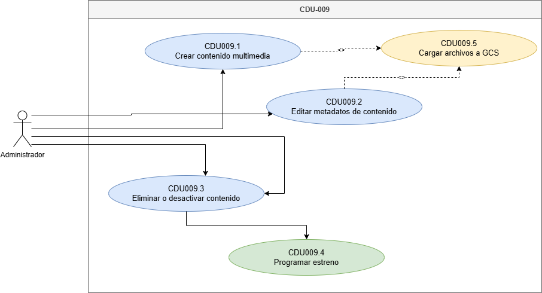

### CDU009.1: Crear Contenido Multimedia

| Campo | Detalle |
|-------|---------|
| **Nombre** | Crear contenido multimedia |
| **Código** | CDU009.1 |
| **Actores** | Administrador |
| **Descripción** | Permite al administrador agregar una nueva película o serie al catálogo de Quetxal TV, registrando metadatos, clasificación, duración, recursos visuales y archivos multimedia asociados. |
| **Precondiciones** | - El administrador debe tener sesión activa.   - El usuario autenticado debe poseer rol de administrador.   - Deben existir categorías o géneros configurados para clasificar el contenido. |
| **Post Condiciones** | - El contenido queda registrado en el catálogo.   - El contenido puede quedar en estado borrador, programado o publicado según la fecha de estreno.   - Los recursos multimedia quedan asociados al contenido. |
| **Flujo Principal** | 1. El administrador ingresa al panel de administración.   2. Selecciona la opción "Agregar contenido".   3. El sistema muestra el formulario de registro.   4. El administrador ingresa título, tipo, sinopsis, año, clasificación, duración y metadatos.   5. El administrador selecciona géneros, reparto y datos técnicos.   6. El sistema valida los datos obligatorios.   7. El administrador adjunta póster, trailer o archivo de video.   8. El sistema carga los archivos pesados en Google Cloud Storage.   9. El sistema guarda las URLs o referencias de los recursos.   10. El sistema registra el nuevo contenido en la base de datos del catálogo.   11. El sistema confirma la creación del contenido. |
| **Flujos Alternos** | **FA1: Guardar como borrador**   FA1.1 El administrador decide no publicar inmediatamente.   FA1.2 El sistema guarda el contenido como borrador.    **FA2: Programar estreno**   FA2.1 El administrador define una fecha futura.   FA2.2 El sistema guarda el contenido como programado. |
| **Reglas de Negocio** | - Solo usuarios administradores pueden crear contenido.   - Todo contenido debe tener título, tipo, sinopsis y clasificación.   - Los archivos de video y portadas deben almacenarse en Google Cloud Storage. |
| **Flujo de Excepción** | **FE1: Error al cargar archivo en GCS**   FE1.1 El almacenamiento de objetos no responde o rechaza el archivo.   FE1.2 El sistema cancela la publicación y conserva los datos ingresados.   FE1.3 El sistema muestra un mensaje para reintentar. |
| **Reglas de Calidad** | - El formulario debe validar campos obligatorios antes de enviar.   - La carga de archivos debe mostrar progreso.   - La creación no debe dejar registros incompletos si falla la carga de recursos. |

---

### CDU009.2: Editar Metadatos de Contenido

| Campo | Detalle |
|-------|---------|
| **Nombre** | Editar metadatos de contenido |
| **Código** | CDU009.2 |
| **Actores** | Administrador |
| **Descripción** | Permite actualizar información de una película o serie existente, incluyendo datos descriptivos, estado de publicación, recursos visuales y clasificación. |
| **Precondiciones** | - El administrador debe tener sesión activa.   - El contenido debe existir en el catálogo. |
| **Post Condiciones** | - Los cambios quedan guardados.   - Se genera registro de auditoría por actualización.   - El catálogo refleja los metadatos actualizados. |
| **Flujo Principal** | 1. El administrador accede al panel de catálogo.   2. Busca o selecciona el contenido a editar.   3. El sistema muestra la información actual.   4. El administrador modifica los campos necesarios.   5. Si adjunta nuevos recursos, el sistema los carga a Google Cloud Storage.   6. El sistema valida los datos.   7. El sistema actualiza el contenido.   8. El trigger de auditoría registra el estado anterior y el estado nuevo.   9. El sistema muestra confirmación. |
| **Flujos Alternos** | **FA1: Cambio de estado de publicación**   FA1.1 El administrador cambia el contenido de borrador a publicado o viceversa.   FA1.2 El sistema actualiza la visibilidad del contenido. |
| **Reglas de Negocio** | - No se permite dejar vacío el título ni el tipo de contenido.   - Toda actualización debe ser auditada. |
| **Flujo de Excepción** | **FE1: Contenido no encontrado**   FE1.1 El contenido fue eliminado o no se encuentra disponible.   FE1.2 El sistema muestra un mensaje de error. |
| **Reglas de Calidad** | - La actualización de metadatos debe completarse en ≤ 2 segundos, excluyendo carga de archivos pesados. |

---

### CDU009.3: Eliminar Contenido

| Campo | Detalle |
|-------|---------|
| **Nombre** | Eliminar contenido |
| **Código** | CDU009.3 |
| **Actores** | Administrador |
| **Descripción** | Permite retirar contenido del catálogo visible para usuarios, conservando trazabilidad de la operación mediante auditoría. |
| **Precondiciones** | - El administrador debe tener sesión activa.   - El contenido debe existir en el catálogo. |
| **Post Condiciones** | - El contenido deja de mostrarse en la cartelera.   - El cambio queda registrado en auditoría. |
| **Flujo Principal** | 1. El administrador selecciona un contenido desde el panel.   2. Selecciona la opción "Eliminar".   3. El sistema solicita confirmación.   4. El administrador confirma la operación.   5. El sistema actualiza el estado o elimina el registro según la política configurada.   6. El trigger de auditoría registra la modificación.   7. El sistema confirma la operación. |
| **Flujos Alternos** | **FA1: Cancelación**   FA1.1 El administrador cancela la operación.   FA1.2 El contenido permanece sin cambios. |
| **Reglas de Negocio** | - Solo administradores pueden eliminar contenido.   - La operación debe conservar trazabilidad.   - El contenido eliminado no debe aparecer al usuario final. |
| **Flujo de Excepción** | **FE1: Error al eliminar contenido**   FE1.1 La base de datos no responde.   FE1.2 El sistema notifica el fallo y no modifica el contenido. |
| **Reglas de Calidad** | - La operación debe ser trazable mediante auditoría. |

---

### CDU009.4: Programar Estreno

| Campo | Detalle |
|-------|---------|
| **Nombre** | Programar estreno |
| **Código** | CDU009.4 |
| **Actores** | Administrador |
| **Descripción** | Permite calendarizar la fecha y hora exacta en que una película o serie será visible para los usuarios en la cartelera. |
| **Precondiciones** | - El contenido debe existir.   - El administrador debe tener permisos de gestión de catálogo. |
| **Post Condiciones** | - El contenido queda programado.   - La publicación se activa cuando se alcanza la fecha configurada. |
| **Flujo Principal** | 1. El administrador abre el detalle administrativo del contenido.   2. Selecciona "Programar estreno".   3. El sistema muestra selector de fecha y hora.   4. El administrador define el momento de publicación.   5. El sistema valida que la fecha sea válida.   6. El sistema guarda la programación.   7. El contenido queda oculto hasta la fecha de estreno. |
| **Flujos Alternos** | **FA1: Publicación inmediata**   FA1.1 El administrador selecciona publicar ahora.   FA1.2 El sistema cambia el estado a publicado. |
| **Reglas de Negocio** | - No se debe mostrar contenido programado antes de la fecha de estreno.   - La fecha programada debe registrarse con zona horaria consistente. |
| **Flujo de Excepción** | **FE1: Fecha inválida**   FE1.1 La fecha ingresada es anterior a la actual.   FE1.2 El sistema solicita una fecha válida. |
| **Reglas de Calidad** | - El cambio de visibilidad debe ser consistente con la hora configurada. |

---

### CDU009.5: Cargar Archivos Multimedia a Google Cloud Storage

| Campo | Detalle |
|-------|---------|
| **Nombre** | Cargar archivos multimedia a Google Cloud Storage |
| **Código** | CDU009.5 |
| **Actores** | Administrador |
| **Descripción** | Permite al administrador cargar archivos pesados como videos, capítulos, trailers e imágenes de portada. El sistema almacena estos recursos en Google Cloud Storage, pero GCS se documenta como infraestructura técnica y no como actor del caso de uso. |
| **Precondiciones** | - El administrador debe estar autenticado.   - Debe existir configuración válida de acceso a GCS mediante variables seguras. |
| **Post Condiciones** | - El archivo queda almacenado en GCS.   - El sistema guarda la referencia o URL del recurso. |
| **Flujo Principal** | 1. El administrador selecciona un archivo multimedia.   2. El sistema valida tipo y tamaño del archivo.   3. El sistema envía el archivo al bucket configurado.   4. El sistema obtiene la URL o referencia del objeto almacenado.   5. El sistema asocia la referencia al contenido. |
| **Flujos Alternos** | **FA1: Reemplazo de archivo**   FA1.1 El administrador sustituye un recurso existente.   FA1.2 El sistema actualiza la referencia del objeto. |
| **Reglas de Negocio** | - Los archivos pesados no deben almacenarse en el sistema de archivos local.   - Las credenciales de GCS no deben estar quemadas en código. |
| **Flujo de Excepción** | **FE1: Archivo inválido**   FE1.1 El archivo supera el tamaño permitido o tiene formato no soportado.   FE1.2 El sistema rechaza la carga y muestra la causa. |
| **Reglas de Calidad** | - La carga debe manejarse de forma asíncrona o con indicador visual.   - El sistema debe evitar duplicados innecesarios. |

---

#### CDU-010: Auditoría y Reportes Administrativos

Sus expandidos son:
- CDU010.1: Registrar auditoría transaccional
- CDU010.2: Consultar log transaccional
- CDU010.3: Descargar reporte CSV
- CDU010.4: Descargar reporte PDF

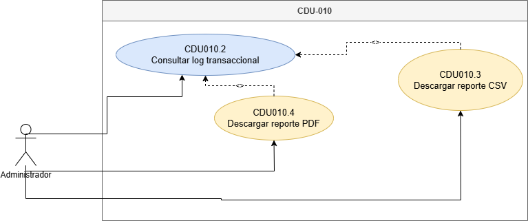

### CDU010.1: Registrar Auditoría Transaccional

| Campo | Detalle |
|-------|---------|
| **Nombre** | Registrar auditoría transaccional |
| **Código** | CDU010.1 |
| **Actores** | Administrador o usuario autenticado que ejecuta una operación auditable |
| **Descripción** | Registra automáticamente operaciones INSERT y UPDATE realizadas sobre tablas relacionales críticas mediante triggers de base de datos. La base de datos y los triggers se consideran mecanismos internos, no actores del caso de uso. |
| **Precondiciones** | - Deben existir triggers configurados en las tablas auditables.   - La operación transaccional debe ser INSERT o UPDATE.   - La operación debe provenir de una acción permitida del sistema. |
| **Post Condiciones** | - Se crea un registro en la tabla de auditoría.   - Se almacena tabla afectada, timestamp, responsable, estado anterior y estado nuevo. |
| **Flujo Principal** | 1. Un usuario o administrador ejecuta una operación sobre una tabla auditable.   2. El sistema procesa la operación.   3. El mecanismo de auditoría se ejecuta automáticamente.   4. El sistema obtiene el estado anterior y el estado nuevo cuando aplica.   5. El sistema registra la operación en la tabla de auditoría. |
| **Flujos Alternos** | **FA1: Inserción nueva**   FA1.1 No existe estado anterior.   FA1.2 El sistema registra únicamente el estado nuevo. |
| **Reglas de Negocio** | - La auditoría debe generarse automáticamente sin depender de que el usuario la solicite manualmente.   - INSERT y UPDATE deben quedar registrados. |
| **Flujo de Excepción** | **FE1: Error en auditoría**   FE1.1 La operación principal se cancela si la transacción no puede completarse de forma consistente. |
| **Reglas de Calidad** | - La auditoría no debe agregar latencia significativa a la operación principal. |

---

### CDU010.2: Consultar Log Transaccional

| Campo | Detalle |
|-------|---------|
| **Nombre** | Consultar log transaccional |
| **Código** | CDU010.2 |
| **Actores** | Administrador |
| **Descripción** | Permite visualizar desde el panel administrativo los registros generados en las tablas de auditoría. |
| **Precondiciones** | - El administrador debe estar autenticado.   - El administrador debe poseer permisos para consultar auditoría. |
| **Post Condiciones** | - El administrador visualiza el log transaccional filtrado u ordenado. |
| **Flujo Principal** | 1. El administrador ingresa al módulo de auditoría.   2. El sistema consulta los registros de auditoría.   3. El sistema muestra tabla afectada, acción, responsable, fecha, estado anterior y estado nuevo.   4. El administrador puede aplicar filtros por tabla, acción o fecha. |
| **Flujos Alternos** | **FA1: Sin registros**   FA1.1 No existen registros para los filtros seleccionados.   FA1.2 El sistema muestra un mensaje informativo. |
| **Reglas de Negocio** | - Solo administradores pueden consultar auditoría.   - El log debe poder filtrarse y ordenarse. |
| **Flujo de Excepción** | **FE1: Servicio de auditoría no disponible**   FE1.1 El sistema no puede obtener los logs.   FE1.2 Se muestra mensaje de error técnico. |
| **Reglas de Calidad** | - La consulta inicial debe cargar en ≤ 3 segundos. |

---

### CDU010.3: Descargar Reporte CSV

| Campo | Detalle |
|-------|---------|
| **Nombre** | Descargar reporte CSV |
| **Código** | CDU010.3 |
| **Actores** | Administrador |
| **Descripción** | Permite exportar los registros de auditoría en formato CSV para análisis tabular. |
| **Precondiciones** | El administrador debe haber consultado el log transaccional. |
| **Post Condiciones** | Se descarga un archivo CSV con los registros filtrados. |
| **Flujo Principal** | 1. El administrador aplica filtros al log.   2. Selecciona "Descargar CSV".   3. El sistema genera el archivo con encabezados y filas ordenadas.   4. El navegador descarga el archivo. |
| **Flujos Alternos** | **FA1: Exportar sin filtros**   FA1.1 El sistema exporta los registros recientes por defecto. |
| **Reglas de Negocio** | - El reporte debe respetar los filtros aplicados.   - El CSV debe incluir encabezados descriptivos. |
| **Flujo de Excepción** | **FE1: Error de generación**   FE1.1 El sistema no puede construir el archivo.   FE1.2 Se notifica al administrador. |
| **Reglas de Calidad** | - El archivo debe generarse en ≤ 5 segundos para volúmenes moderados. |

---

### CDU010.4: Descargar Reporte PDF

| Campo | Detalle |
|-------|---------|
| **Nombre** | Descargar reporte PDF |
| **Código** | CDU010.4 |
| **Actores** | Administrador |
| **Descripción** | Permite exportar el log de auditoría en un reporte PDF ordenado y formateado para revisión administrativa. |
| **Precondiciones** | El administrador debe haber consultado el log transaccional. |
| **Post Condiciones** | Se descarga un PDF con los registros filtrados y metadatos del reporte. |
| **Flujo Principal** | 1. El administrador aplica filtros al log.   2. Selecciona "Descargar PDF".   3. El sistema genera un documento formateado.   4. El sistema incluye fecha, servicio, filtros aplicados y registros.   5. El navegador descarga el archivo. |
| **Flujos Alternos** | **FA1: Reporte sin filtros**   FA1.1 El sistema genera un reporte general reciente. |
| **Reglas de Negocio** | - El PDF debe estar ordenado y ser legible.   - Debe incluir fecha de generación y filtros aplicados. |
| **Flujo de Excepción** | **FE1: Error al generar PDF**   FE1.1 El sistema no logra renderizar el documento.   FE1.2 Notifica al administrador. |
| **Reglas de Calidad** | - El reporte debe conservar formato visual consistente. |

---

#### CDU-011: Monitoreo de Salud y Disponibilidad

Sus expandidos son:
- CDU011.1: Consultar liveness probe
- CDU011.2: Consultar readiness probe
- CDU011.3: Retirar tráfico o reiniciar pod ante fallo

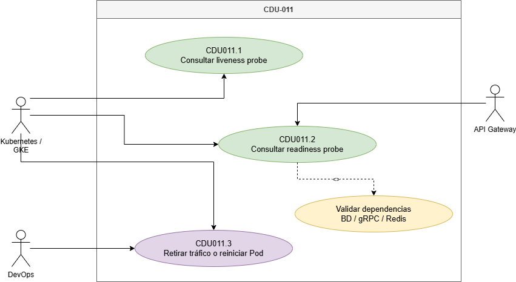

### CDU011.1: Consultar Liveness Probe

| Campo | Detalle |
|-------|---------|
| **Nombre** | Consultar liveness probe |
| **Código** | CDU011.1 |
| **Actores** | Kubernetes / Orquestador |
| **Descripción** | Permite al orquestador verificar que el proceso del contenedor continúa vivo y no se encuentra congelado. |
| **Precondiciones** | - El Pod debe estar desplegado.   - El endpoint de liveness debe estar configurado en el manifiesto del Deployment. |
| **Post Condiciones** | Kubernetes obtiene una respuesta de vitalidad del servicio. |
| **Flujo Principal** | 1. Kubernetes ejecuta la sonda liveness.   2. El sistema recibe la consulta en `/health/live`.   3. El sistema responde que el proceso está vivo.   4. Kubernetes interpreta el resultado y mantiene el contenedor activo. |
| **Flujos Alternos** | **FA1: Respuesta tardía**   FA1.1 La sonda excede el timeout.   FA1.2 Kubernetes registra fallo de liveness. |
| **Reglas de Negocio** | - Liveness no debe validar dependencias externas complejas.   - Debe validar únicamente que el proceso está vivo. |
| **Flujo de Excepción** | **FE1: Fallo persistente**   FE1.1 Kubernetes detecta fallos repetidos.   FE1.2 Reinicia el contenedor. |
| **Reglas de Calidad** | - La respuesta debe ser liviana y rápida. |

---

### CDU011.2: Consultar Readiness Probe

| Campo | Detalle |
|-------|---------|
| **Nombre** | Consultar readiness probe |
| **Código** | CDU011.2 |
| **Actores** | Kubernetes / Orquestador |
| **Descripción** | Permite al orquestador verificar que el servicio terminó de cargar sus conexiones internas y está listo para recibir tráfico real. |
| **Precondiciones** | - El servicio debe estar desplegado.   - El endpoint de readiness debe estar configurado.   - Las dependencias necesarias deben estar disponibles. |
| **Post Condiciones** | Kubernetes determina si el Pod puede recibir tráfico. |
| **Flujo Principal** | 1. Kubernetes consulta `/health/ready`.   2. El sistema valida el estado del microservicio correspondiente.   3. El microservicio verifica sus dependencias internas, como gRPC, Redis o base de datos.   4. El sistema responde `READY` si todo está disponible.   5. Kubernetes permite enviar tráfico al Pod. |
| **Flujos Alternos** | **FA1: Dependencia no disponible**   FA1.1 La base de datos, Redis o conexión gRPC falla.   FA1.2 El endpoint responde `NOT_READY`.   FA1.3 Kubernetes no envía tráfico al Pod. |
| **Reglas de Negocio** | - Readiness debe validar dependencias necesarias para operar.   - Un servicio no listo no debe recibir tráfico. |
| **Flujo de Excepción** | **FE1: Error interno en validación**   FE1.1 El health check produce error inesperado.   FE1.2 El sistema responde estado no disponible. |
| **Reglas de Calidad** | - La validación debe ejecutarse con timeout controlado. |

---

### CDU011.3: Retirar Tráfico o Reiniciar Pod ante Fallo

| Campo | Detalle |
|-------|---------|
| **Nombre** | Retirar tráfico o reiniciar pod ante fallo |
| **Código** | CDU011.3 |
| **Actores** | Kubernetes / Orquestador |
| **Descripción** | Permite que Kubernetes actúe automáticamente cuando un Pod no está listo o cuando su proceso deja de estar vivo. |
| **Precondiciones** | Deben estar configuradas las sondas liveness y readiness en el manifiesto del Deployment. |
| **Post Condiciones** | - El Pod no listo deja de recibir tráfico.   - El Pod con liveness fallido puede ser reiniciado. |
| **Flujo Principal** | 1. Kubernetes ejecuta las sondas periódicamente.   2. Si readiness falla, retira el Pod de los endpoints disponibles.   3. Si liveness falla de forma persistente, reinicia el contenedor.   4. El servicio vuelve a estar disponible cuando las sondas responden correctamente. |
| **Flujos Alternos** | **FA1: Recuperación automática**   FA1.1 La dependencia vuelve a estar disponible.   FA1.2 Readiness responde `READY`.   FA1.3 Kubernetes vuelve a enviar tráfico al Pod. |
| **Reglas de Negocio** | - Readiness controla recepción de tráfico.   - Liveness controla reinicio del contenedor. |
| **Flujo de Excepción** | **FE1: Fallo de despliegue persistente**   FE1.1 El Pod entra en ciclo de error.   FE1.2 El pipeline debe activar rollback automático según la estrategia de despliegue. |
| **Reglas de Calidad** | - La recuperación no debe requerir intervención manual en condiciones esperadas. |

---

#### CDU-012: Descarga de Contenido Offline (download-service)

Sus expandidos son:
- CDU012.1: Solicitar descarga de contenido
- CDU012.2: Validar plan Premium
- CDU012.3: Generar URL firmada en GCS
- CDU012.4: Listar descargas activas
- CDU012.5: Eliminar descarga local
- CDU012.6: Expirar descargas vencidas (30 días)

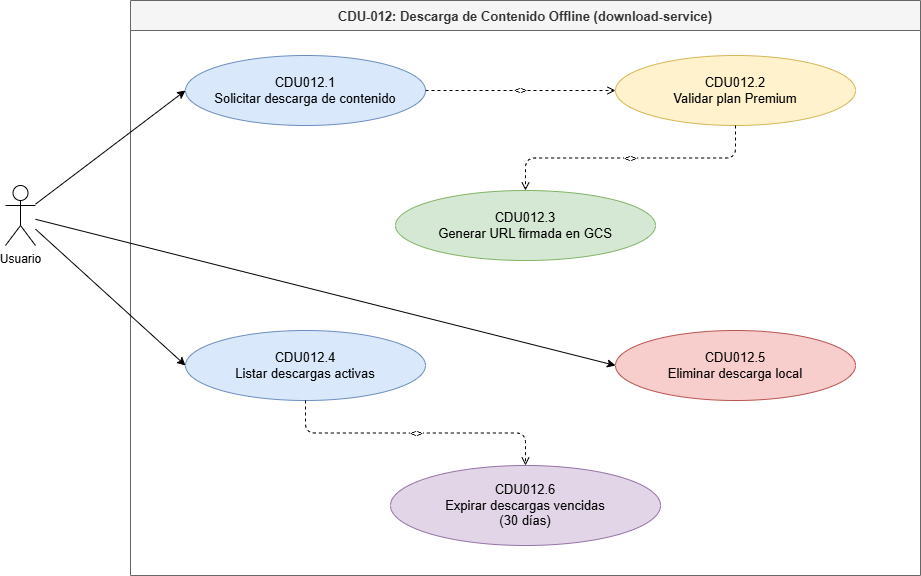

### CDU012.1: Solicitar Descarga de Contenido

| Campo | Detalle |
|-------|---------|
| **Nombre** | Solicitar descarga de contenido |
| **Código** | CDU012.1 |
| **Actores** | Usuario |
| **Descripción** | Permite al usuario solicitar la descarga offline de una película, serie o episodio disponible dentro de Quetxal TV mediante el microservicio `download-service`. Este caso incluye la validación del plan Premium antes de autorizar la generación del recurso descargable. |
| **Precondiciones** | - El usuario debe tener sesión activa.   - El usuario debe tener un perfil seleccionado.   - El contenido debe existir y estar disponible para reproducción.   - El servicio `download-service` debe estar disponible. |
| **Post Condiciones** | - La solicitud de descarga queda registrada.   - Si el usuario cumple las condiciones, se genera un enlace temporal para descargar el contenido.   - Si el usuario no cumple las condiciones, la descarga no se autoriza. |
| **Flujo Principal** | 1. El usuario ingresa al detalle de un contenido disponible.   2. El sistema muestra la opción de descarga offline.   3. El usuario selecciona "Descargar".   4. El sistema envía la solicitud al `download-service`.   5. El `download-service` identifica al usuario, perfil y contenido solicitado.   6. El sistema ejecuta la validación del plan Premium mediante el caso incluido CDU012.2.   7. Si la validación es correcta, el sistema continúa con la generación de URL firmada mediante CDU012.3.   8. El sistema registra la descarga como activa.   9. El sistema retorna al usuario la información necesaria para iniciar la descarga. |
| **Flujos Alternos** | **FA1: Contenido no descargable**   FA1.1 El contenido seleccionado no permite descarga offline.   FA1.2 El sistema oculta o deshabilita la opción de descarga.   FA1.3 El sistema notifica que el contenido solo está disponible para reproducción en línea. |
| **Reglas de Negocio** | - Solo los usuarios con plan Premium pueden descargar contenido offline.   - La descarga debe asociarse al usuario, perfil y contenido solicitado.   - La descarga debe tener una vigencia controlada.   - El contenido descargable debe obtenerse mediante un enlace temporal y no mediante rutas públicas permanentes. |
| **Flujo de Excepción** | **FE1: Error al procesar la solicitud**   FE1.1 El `download-service` no responde o genera un error interno.   FE1.2 El sistema notifica al usuario que la descarga no pudo iniciarse.   FE1.3 El sistema registra el error para trazabilidad técnica. |
| **Reglas de Calidad** | - La solicitud de descarga debe responder en ≤ 2 segundos, excluyendo el tiempo real de transferencia del archivo.   - La operación debe mantener trazabilidad mediante logs.   - La URL generada no debe exponer credenciales ni rutas internas sensibles. |

---

### CDU012.2: Validar Plan Premium

| Campo | Detalle |
|-------|---------|
| **Nombre** | Validar plan Premium |
| **Código** | CDU012.2 |
| **Actores** | Usuario |
| **Descripción** | Permite verificar si el usuario cuenta con una suscripción Premium activa antes de permitir la descarga offline de contenido. Este caso de uso es incluido por CDU012.1. |
| **Precondiciones** | - El usuario debe estar autenticado.   - Debe existir una suscripción asociada a la cuenta del usuario.   - El sistema debe poder consultar el estado de la suscripción. |
| **Post Condiciones** | - Se determina si el usuario está autorizado para descargar contenido.   - Si el plan es Premium y está activo, el flujo continúa hacia CDU012.3.   - Si el plan no cumple, se rechaza la solicitud de descarga. |
| **Flujo Principal** | 1. El `download-service` recibe la solicitud de descarga desde CDU012.1.   2. El sistema consulta la suscripción asociada a la cuenta del usuario.   3. El sistema verifica que la suscripción esté activa.   4. El sistema valida que el tipo de plan sea Premium.   5. El sistema autoriza la descarga offline.   6. El sistema continúa con la generación de URL firmada en CDU012.3. |
| **Flujos Alternos** | **FA1: Usuario con plan no Premium**   FA1.1 El sistema detecta que el usuario tiene plan Básico o Estándar.   FA1.2 El sistema rechaza la descarga offline.   FA1.3 El sistema muestra un mensaje indicando que la funcionalidad requiere plan Premium. |
| **Reglas de Negocio** | - La descarga offline es un beneficio exclusivo del plan Premium.   - La suscripción debe estar activa al momento de solicitar la descarga.   - Una suscripción cancelada o vencida no debe autorizar nuevas descargas. |
| **Flujo de Excepción** | **FE1: No se puede validar la suscripción**   FE1.1 El sistema no logra consultar el estado del plan.   FE1.2 La descarga no se autoriza por seguridad.   FE1.3 El sistema registra el incidente. |
| **Reglas de Calidad** | - La validación debe realizarse antes de generar cualquier URL de descarga.   - La consulta del plan debe ejecutarse con timeout controlado.   - La respuesta debe evitar exponer detalles internos de la suscripción. |

---

### CDU012.3: Generar URL Firmada en GCS

| Campo | Detalle |
|-------|---------|
| **Nombre** | Generar URL firmada en GCS |
| **Código** | CDU012.3 |
| **Actores** | Usuario |
| **Descripción** | Permite generar una URL firmada temporal para que el usuario autorizado pueda descargar el recurso multimedia desde Google Cloud Storage sin exponer credenciales ni hacer público el archivo. Este caso de uso es incluido por CDU012.2. |
| **Precondiciones** | - El usuario debe haber sido autorizado mediante la validación de plan Premium.   - El contenido debe tener un archivo asociado en Google Cloud Storage.   - El sistema debe contar con configuración válida para generar URLs firmadas. |
| **Post Condiciones** | - Se genera una URL firmada temporal.   - La URL queda asociada a una descarga activa.   - El usuario puede iniciar la descarga del contenido dentro del período de vigencia. |
| **Flujo Principal** | 1. El sistema recibe la autorización de descarga desde CDU012.2.   2. El sistema obtiene la referencia del archivo multimedia en Google Cloud Storage.   3. El sistema valida que el archivo exista y esté disponible.   4. El sistema genera una URL firmada con tiempo de expiración.   5. El sistema registra la fecha de creación y expiración de la descarga.   6. El sistema retorna la URL firmada al cliente. |
| **Flujos Alternos** | **FA1: Archivo no disponible**   FA1.1 El archivo asociado al contenido no existe o no está disponible.   FA1.2 El sistema rechaza la descarga.   FA1.3 El usuario recibe un mensaje indicando que el recurso no está disponible temporalmente. |
| **Reglas de Negocio** | - La URL firmada debe ser temporal.   - La URL debe generarse únicamente después de validar el plan Premium.   - El archivo no debe exponerse mediante enlaces públicos permanentes.   - La descarga debe conservar una vigencia máxima definida por la plataforma. |
| **Flujo de Excepción** | **FE1: Error al generar la URL**   FE1.1 El sistema no puede comunicarse con Google Cloud Storage o no puede firmar el recurso.   FE1.2 El sistema cancela la operación de descarga.   FE1.3 El sistema registra el error técnico. |
| **Reglas de Calidad** | - La generación de la URL debe completarse en ≤ 1 segundo bajo condiciones normales.   - La URL firmada debe proteger el acceso directo al archivo.   - El proceso no debe almacenar credenciales sensibles en el cliente. |

---

### CDU012.4: Listar Descargas Activas

| Campo | Detalle |
|-------|---------|
| **Nombre** | Listar descargas activas |
| **Código** | CDU012.4 |
| **Actores** | Usuario |
| **Descripción** | Permite al usuario consultar las descargas offline activas asociadas a su cuenta o perfil, incluyendo contenido descargado, fecha de creación y estado de vigencia. Este caso puede extenderse con CDU012.6 cuando existan descargas vencidas. |
| **Precondiciones** | - El usuario debe tener sesión activa.   - El usuario debe tener un perfil seleccionado.   - Pueden existir descargas activas o vencidas asociadas al perfil. |
| **Post Condiciones** | - El usuario visualiza el listado actualizado de descargas activas.   - Las descargas vencidas pueden ser identificadas y expiradas mediante CDU012.6. |
| **Flujo Principal** | 1. El usuario ingresa a la sección de descargas.   2. El sistema solicita al `download-service` las descargas asociadas al usuario y perfil.   3. El sistema consulta los registros de descarga.   4. El sistema valida el estado y vigencia de cada descarga.   5. Si existen descargas vencidas, se ejecuta el caso extendido CDU012.6.   6. El sistema retorna únicamente las descargas activas o el estado actualizado de las descargas.   7. El usuario visualiza la lista de descargas disponibles. |
| **Flujos Alternos** | **FA1: No existen descargas activas**   FA1.1 El sistema no encuentra descargas vigentes para el perfil.   FA1.2 El sistema muestra el mensaje "No tienes descargas activas". |
| **Reglas de Negocio** | - El usuario solo puede consultar sus propias descargas.   - Las descargas vencidas no deben mostrarse como disponibles.   - El listado debe considerar la vigencia máxima de 30 días. |
| **Flujo de Excepción** | **FE1: Error al consultar descargas**   FE1.1 El `download-service` no responde.   FE1.2 El sistema muestra un mensaje de error y permite reintentar. |
| **Reglas de Calidad** | - El listado debe cargar en ≤ 2 segundos.   - La información mostrada debe reflejar el estado más reciente de las descargas. |

---

### CDU012.5: Eliminar Descarga Local

| Campo | Detalle |
|-------|---------|
| **Nombre** | Eliminar descarga local |
| **Código** | CDU012.5 |
| **Actores** | Usuario |
| **Descripción** | Permite al usuario eliminar una descarga offline previamente registrada, retirándola de su listado de descargas disponibles y liberando el recurso local asociado en el dispositivo cuando aplique. |
| **Precondiciones** | - El usuario debe tener sesión activa.   - Debe existir una descarga asociada al usuario o perfil.   - La descarga debe aparecer en el listado del usuario. |
| **Post Condiciones** | - La descarga queda eliminada o marcada como inactiva.   - El contenido deja de mostrarse como disponible offline.   - El sistema conserva trazabilidad de la operación si aplica. |
| **Flujo Principal** | 1. El usuario ingresa a la sección de descargas.   2. El sistema muestra las descargas disponibles.   3. El usuario selecciona la opción "Eliminar descarga" sobre un contenido.   4. El sistema solicita confirmación.   5. El usuario confirma la eliminación.   6. El sistema marca la descarga como eliminada o inactiva.   7. El sistema actualiza el listado de descargas.   8. El contenido deja de estar disponible como descarga offline para el usuario. |
| **Flujos Alternos** | **FA1: Cancelación de eliminación**   FA1.1 El usuario decide no eliminar la descarga.   FA1.2 El sistema conserva la descarga activa sin cambios. |
| **Reglas de Negocio** | - Un usuario solo puede eliminar descargas asociadas a su propia cuenta o perfil.   - La eliminación no debe borrar el contenido original del catálogo ni de Google Cloud Storage.   - La eliminación afecta únicamente la disponibilidad offline del usuario. |
| **Flujo de Excepción** | **FE1: Error al eliminar descarga**   FE1.1 El sistema no puede actualizar el estado de la descarga.   FE1.2 El sistema informa el error y permite reintentar. |
| **Reglas de Calidad** | - La eliminación debe reflejarse inmediatamente en el listado.   - La operación debe completarse en ≤ 1 segundo bajo condiciones normales. |

---

### CDU012.6: Expirar Descargas Vencidas

| Campo | Detalle |
|-------|---------|
| **Nombre** | Expirar descargas vencidas |
| **Código** | CDU012.6 |
| **Actores** | Usuario |
| **Descripción** | Permite marcar como vencidas las descargas offline que superaron el período permitido de 30 días. Según el diagrama, este comportamiento extiende el listado de descargas activas cuando el sistema detecta descargas vencidas durante la consulta. |
| **Precondiciones** | - Deben existir descargas registradas.   - La fecha de creación o expiración de la descarga debe estar almacenada.   - El usuario consulta su listado de descargas o el sistema valida la vigencia de las descargas. |
| **Post Condiciones** | - Las descargas vencidas quedan marcadas como expiradas.   - Las descargas vencidas dejan de mostrarse como activas.   - El usuario visualiza únicamente descargas vigentes. |
| **Flujo Principal** | 1. El usuario consulta sus descargas activas mediante CDU012.4.   2. El sistema revisa la fecha de creación o expiración de cada descarga.   3. El sistema identifica descargas con más de 30 días de vigencia o con fecha de expiración alcanzada.   4. El sistema marca dichas descargas como vencidas.   5. El sistema actualiza el listado de descargas.   6. El usuario visualiza únicamente las descargas vigentes. |
| **Flujos Alternos** | **FA1: No existen descargas vencidas**   FA1.1 El sistema no encuentra descargas expiradas.   FA1.2 El listado se muestra sin modificaciones. |
| **Reglas de Negocio** | - La vigencia máxima de una descarga offline es de 30 días.   - Una descarga vencida no debe permitir reproducción offline.   - La expiración no elimina el contenido original del catálogo ni del almacenamiento principal. |
| **Flujo de Excepción** | **FE1: Error al actualizar estado de expiración**   FE1.1 El sistema detecta descargas vencidas, pero no puede actualizar su estado.   FE1.2 El sistema registra el error y evita mostrarlas como disponibles si no puede garantizar su vigencia. |
| **Reglas de Calidad** | - La validación de expiración debe ejecutarse sin afectar significativamente el tiempo de carga del listado.   - El usuario no debe acceder a descargas vencidas. |

