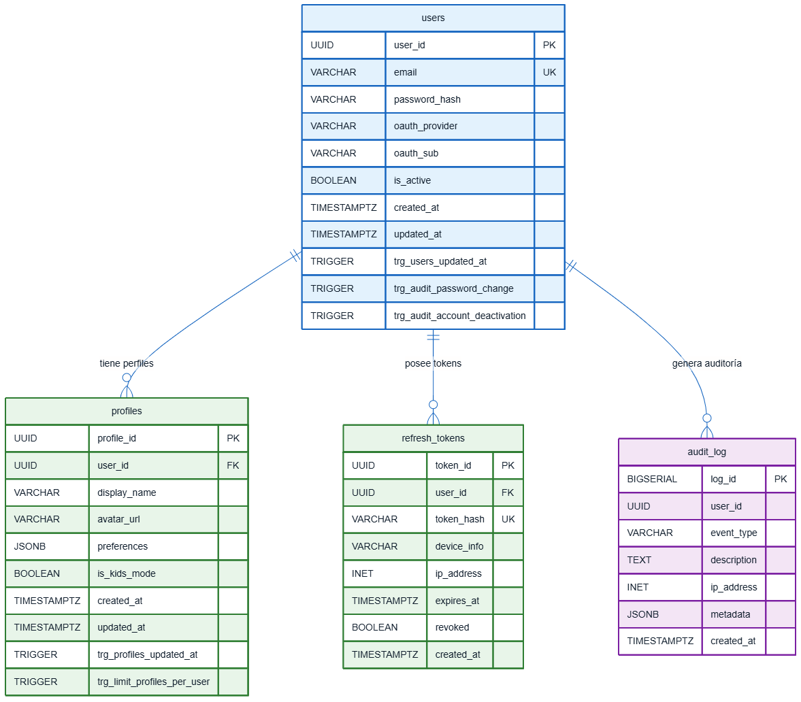
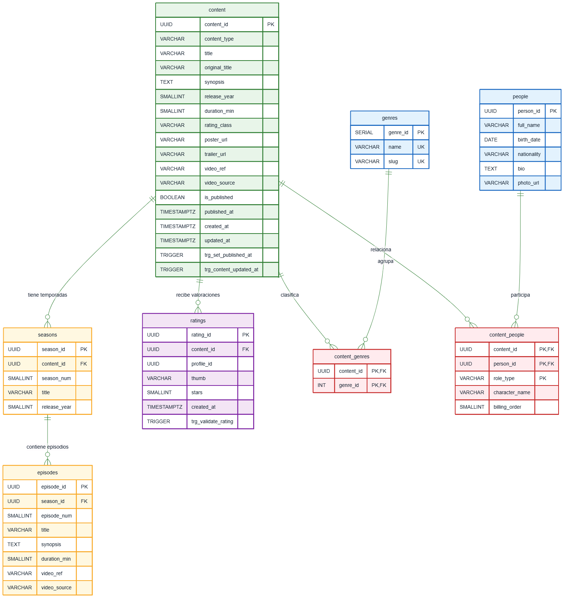
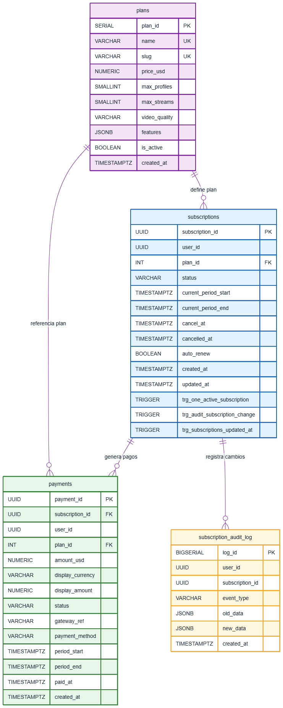
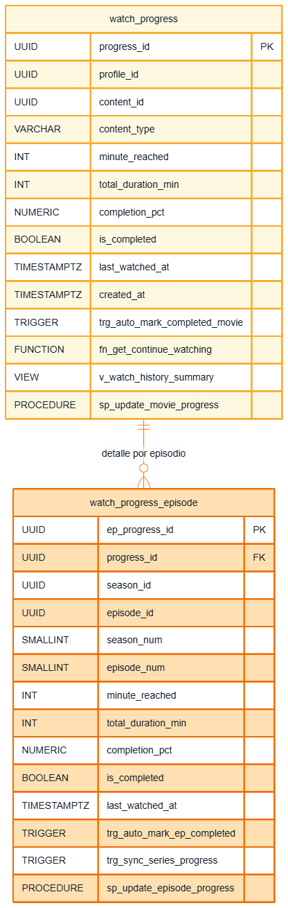
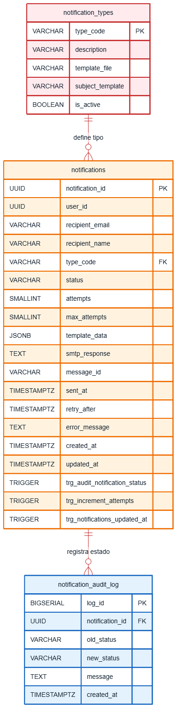

# Documentación de tablas entidad-relación

El proyecto utiliza una arquitectura de microservicios. Por esa razón, cada servicio maneja su propio dominio de datos y no todas las relaciones entre módulos se implementan como llaves foráneas físicas. En varios casos se almacenan IDs externos como `user_id`, `profile_id`, `content_id`, `season_id` o `episode_id` sin FK real, porque dichos identificadores pertenecen a otro microservicio.

Ejemplos:

- `profile_id` en historial proviene del Auth Service.
- `content_id`, `season_id` y `episode_id` en historial provienen del Catalog Service.
- `user_id` en suscripciones y notificaciones proviene del Auth Service.
- La validez de esos IDs se controla desde el API Gateway, JWT o lógica de aplicación.

Esto permite mantener bajo acoplamiento entre microservicios, evitando que una base de datos dependa directamente de las tablas internas de otro servicio.

---

## Resumen de esquemas

| Servicio | Script SQL | Schema | Propósito |
|---|---|---|---|
| Auth Service | `auth.sql` | `auth` | Usuarios, perfiles, refresh tokens y auditoría de seguridad |
| Catalog Service | `catalogo.sql` | `catalogo_DB` / `catalog` | Contenido, géneros, personas, temporadas, episodios y calificaciones |
| Subscription Service | `subscription.sql` | `subscription` | Planes, suscripciones, pagos y auditoría de suscripción |
| History Service | `historial.sql` | `playback` | Progreso de reproducción y continuar viendo |
| Notification Service | `notificacion.sql` | `notification` | Tipos de notificación, cola de notificaciones y auditoría |
| FX Service | `fx.sql` | `fx` | Divisas, tipos de cambio y logs de consulta |

> Observación técnica: En `catalogo.sql` se observa `CREATE SCHEMA catalogo_DB;` pero luego `SET search_path TO catalog;`. Antes de ejecutar en ambiente limpio conviene validar que el nombre del schema sea consistente.

---

# Auth Service

## Propósito del modelo

El Auth Service administra cuentas de usuario, perfiles asociados, sesiones mediante refresh tokens y eventos de auditoría relacionados con seguridad.

## Diagrama ER lógico

> Imagen del modelo entidad-relación del Auth Service. La ruta asume que el archivo `auth.png` se encuentra dentro de la carpeta `imgs` junto a este documento.

## Entidad: `users`

Representa una cuenta registrada en la plataforma.

| Campo | Tipo | Restricciones | Descripción |
|---|---|---|---|
| `user_id` | UUID | PK, default `uuid_generate_v4()` | Identificador único del usuario |
| `email` | VARCHAR(255) | NOT NULL, UNIQUE | Correo del usuario |
| `password_hash` | VARCHAR(255) | NULL | Contraseña hasheada con `pgcrypto` |
| `oauth_provider` | VARCHAR(50) | NULL | Proveedor OAuth, por ejemplo Google o GitHub |
| `oauth_sub` | VARCHAR(255) | NULL | ID único del usuario dentro del proveedor OAuth |
| `is_active` | BOOLEAN | NOT NULL, default TRUE | Indica si la cuenta está activa |
| `created_at` | TIMESTAMPTZ | NOT NULL, default NOW() | Fecha de creación |
| `updated_at` | TIMESTAMPTZ | NOT NULL, default NOW() | Fecha de última actualización |

### Triggers asociados

| Trigger | Evento | Función | Propósito |
|---|---|---|---|
| `trg_audit_password_change` | AFTER UPDATE | `fn_audit_password_change()` | Registra en `audit_log` cuando cambia el hash de contraseña |
| `trg_audit_account_deactivation` | AFTER UPDATE | `fn_audit_account_deactivation()` | Registra en `audit_log` cuando una cuenta pasa a inactiva |
| `trg_users_updated_at` | BEFORE UPDATE | `fn_update_timestamp()` | Actualiza automáticamente `updated_at` |

## Entidad: `profiles`

Representa perfiles de visualización dentro de una cuenta. Un usuario puede tener varios perfiles.

| Campo | Tipo | Restricciones | Descripción |
|---|---|---|---|
| `profile_id` | UUID | PK, default `uuid_generate_v4()` | Identificador del perfil |
| `user_id` | UUID | FK a `users(user_id)`, ON DELETE CASCADE | Usuario dueño del perfil |
| `display_name` | VARCHAR(100) | NOT NULL | Nombre visible del perfil |
| `avatar_url` | VARCHAR(500) | NULL | Avatar o imagen del perfil |
| `preferences` | JSONB | NOT NULL, default `{}` | Preferencias del perfil |
| `is_kids_mode` | BOOLEAN | NOT NULL, default FALSE | Indica si el perfil es infantil |
| `created_at` | TIMESTAMPTZ | NOT NULL, default NOW() | Fecha de creación |
| `updated_at` | TIMESTAMPTZ | NOT NULL, default NOW() | Fecha de última actualización |

### Triggers asociados

| Trigger | Evento | Función | Propósito |
|---|---|---|---|
| `trg_limit_profiles_per_user` | BEFORE INSERT | `fn_limit_profiles_per_user()` | Impide crear más de 5 perfiles por usuario |
| `trg_profiles_updated_at` | BEFORE UPDATE | `fn_update_timestamp()` | Actualiza automáticamente `updated_at` |

##  Entidad: `refresh_tokens`

Almacena tokens de refresco para renovar sesiones.

| Campo | Tipo | Restricciones | Descripción |
|---|---|---|---|
| `token_id` | UUID | PK, default `uuid_generate_v4()` | Identificador del token |
| `user_id` | UUID | FK a `users(user_id)`, ON DELETE CASCADE | Usuario dueño del token |
| `token_hash` | VARCHAR(512) | NOT NULL, UNIQUE | Hash del refresh token |
| `device_info` | VARCHAR(255) | NULL | Información del dispositivo |
| `ip_address` | INET | NULL | Dirección IP asociada |
| `expires_at` | TIMESTAMPTZ | NOT NULL | Fecha de expiración |
| `revoked` | BOOLEAN | NOT NULL, default FALSE | Indica si el token fue revocado |
| `created_at` | TIMESTAMPTZ | NOT NULL, default NOW() | Fecha de creación |

### Triggers asociados

No tiene triggers directos.

##  Entidad: `audit_log`

Tabla de auditoría de eventos de seguridad.

| Campo | Tipo | Restricciones | Descripción |
|---|---|---|---|
| `log_id` | BIGSERIAL | PK | Identificador del log |
| `user_id` | UUID | NULL | Usuario relacionado al evento |
| `event_type` | VARCHAR(100) | NOT NULL | Tipo de evento |
| `description` | TEXT | NULL | Descripción del evento |
| `ip_address` | INET | NULL | IP del evento |
| `metadata` | JSONB | default `{}` | Datos adicionales |
| `created_at` | TIMESTAMPTZ | NOT NULL, default NOW() | Fecha del evento |

### Triggers asociados

No tiene triggers directos, pero es poblada por triggers de la tabla `users` y por procedimientos como `sp_register_user` y `sp_revoke_all_tokens`.

##  Índices principales

| Índice | Tabla | Propósito |
|---|---|---|
| `idx_users_email` | `users` | Búsqueda por correo |
| `idx_users_oauth` | `users` | Búsqueda por proveedor OAuth |
| `idx_profiles_user_id` | `profiles` | Búsqueda de perfiles por usuario |
| `idx_refresh_tokens_user` | `refresh_tokens` | Tokens activos por usuario |
| `idx_refresh_tokens_hash` | `refresh_tokens` | Validación de refresh token |
| `idx_audit_log_user_id` | `audit_log` | Auditoría por usuario |
| `idx_audit_log_created` | `audit_log` | Auditoría ordenada por fecha |

##  Funciones, procedimientos y vistas

| Tipo | Nombre | Descripción |
|---|---|---|
| Función | `fn_count_profiles(p_user_id)` | Cuenta perfiles de un usuario |
| Función | `fn_verify_password(p_email, p_password)` | Verifica contraseña contra hash |
| Función | `fn_update_timestamp()` | Actualiza `updated_at` |
| Función | `fn_limit_profiles_per_user()` | Valida máximo de perfiles |
| Función | `fn_audit_password_change()` | Audita cambios de contraseña |
| Función | `fn_audit_account_deactivation()` | Audita desactivación de cuenta |
| Procedimiento | `sp_register_user(...)` | Registra usuario y perfil inicial en una transacción |
| Procedimiento | `sp_revoke_all_tokens(p_user_id)` | Revoca todos los refresh tokens activos |
| Vista | `v_user_profiles_summary` | Resumen de usuario con perfiles |
| Vista | `v_active_sessions` | Sesiones activas por usuario |

---

#  Catalog Service

##  Propósito del modelo

El Catalog Service administra el catálogo de películas y series, géneros, personas, temporadas, episodios y calificaciones.

##  Diagrama ER lógico

> Imagen del modelo entidad-relación del Catalog Service. La ruta asume que el archivo `catalogo.png` se encuentra dentro de la carpeta `imgs` junto a este documento.

##  Entidad: `genres`

Catálogo de géneros.

| Campo | Tipo | Restricciones | Descripción |
|---|---|---|---|
| `genre_id` | SERIAL | PK | Identificador del género |
| `name` | VARCHAR(100) | NOT NULL, UNIQUE | Nombre del género |
| `slug` | VARCHAR(100) | NOT NULL, UNIQUE | Versión para URL |

### Triggers asociados

No tiene triggers.

##  Entidad: `people`

Representa personas relacionadas con contenido: actores, directores o escritores.

| Campo | Tipo | Restricciones | Descripción |
|---|---|---|---|
| `person_id` | UUID | PK, default `uuid_generate_v4()` | Identificador de persona |
| `full_name` | VARCHAR(255) | NOT NULL | Nombre completo |
| `birth_date` | DATE | NULL | Fecha de nacimiento |
| `nationality` | VARCHAR(100) | NULL | Nacionalidad |
| `bio` | TEXT | NULL | Biografía |
| `photo_url` | VARCHAR(500) | NULL | Foto |

### Triggers asociados

No tiene triggers.

##  Entidad: `content`

Tabla central de películas y series.

| Campo | Tipo | Restricciones | Descripción |
|---|---|---|---|
| `content_id` | UUID | PK, default `uuid_generate_v4()` | Identificador del contenido |
| `content_type` | VARCHAR(10) | CHECK `MOVIE` o `SERIES`, NOT NULL | Tipo de contenido |
| `title` | VARCHAR(500) | NOT NULL | Título |
| `original_title` | VARCHAR(500) | NULL | Título original |
| `synopsis` | TEXT | NULL | Sinopsis |
| `release_year` | SMALLINT | NULL | Año de estreno |
| `duration_min` | SMALLINT | NULL | Duración en minutos, principalmente para películas |
| `rating_class` | VARCHAR(10) | NULL | Clasificación de edad |
| `poster_url` | VARCHAR(500) | NULL | URL del póster |
| `trailer_url` | VARCHAR(500) | NULL | URL de trailer |
| `video_ref` | VARCHAR(500) | NULL | Referencia del video, por ejemplo ID de YouTube |
| `video_source` | VARCHAR(20) | default `youtube` | Fuente del video |
| `is_published` | BOOLEAN | NOT NULL, default FALSE | Indica si está publicado |
| `published_at` | TIMESTAMPTZ | NULL | Fecha de publicación |
| `created_at` | TIMESTAMPTZ | NOT NULL, default NOW() | Fecha de creación |
| `updated_at` | TIMESTAMPTZ | NOT NULL, default NOW() | Fecha de actualización |

### Triggers asociados

| Trigger | Evento | Función | Propósito |
|---|---|---|---|
| `trg_set_published_at` | BEFORE UPDATE | `fn_set_published_at()` | Cuando `is_published` cambia a TRUE, asigna `published_at` |
| `trg_content_updated_at` | BEFORE UPDATE | `fn_update_timestamp()` | Actualiza automáticamente `updated_at` |

##  Entidad: `seasons`

Temporadas de una serie.

| Campo | Tipo | Restricciones | Descripción |
|---|---|---|---|
| `season_id` | UUID | PK, default `uuid_generate_v4()` | Identificador de temporada |
| `content_id` | UUID | FK a `content(content_id)`, ON DELETE CASCADE | Serie a la que pertenece |
| `season_num` | SMALLINT | NOT NULL, CHECK > 0 | Número de temporada |
| `title` | VARCHAR(255) | NULL | Título de la temporada |
| `release_year` | SMALLINT | NULL | Año de estreno |
| `UNIQUE(content_id, season_num)` | - | UNIQUE | Evita temporadas duplicadas por serie |

### Triggers asociados

No tiene triggers.

##  Entidad: `episodes`

Episodios de una temporada.

| Campo | Tipo | Restricciones | Descripción |
|---|---|---|---|
| `episode_id` | UUID | PK, default `uuid_generate_v4()` | Identificador del episodio |
| `season_id` | UUID | FK a `seasons(season_id)`, ON DELETE CASCADE | Temporada a la que pertenece |
| `episode_num` | SMALLINT | NOT NULL, CHECK > 0 | Número de episodio |
| `title` | VARCHAR(500) | NOT NULL | Título del episodio |
| `synopsis` | TEXT | NULL | Sinopsis |
| `duration_min` | SMALLINT | NULL | Duración |
| `video_ref` | VARCHAR(500) | NULL | Referencia de video |
| `video_source` | VARCHAR(20) | default `youtube` | Fuente de video |
| `UNIQUE(season_id, episode_num)` | - | UNIQUE | Evita episodios duplicados por temporada |

### Triggers asociados

No tiene triggers.

##  Entidad: `content_genres`

Tabla intermedia para relación muchos a muchos entre contenido y géneros.

| Campo | Tipo | Restricciones | Descripción |
|---|---|---|---|
| `content_id` | UUID | PK compuesta, FK a `content(content_id)` | Contenido |
| `genre_id` | INT | PK compuesta, FK a `genres(genre_id)` | Género |

### Triggers asociados

No tiene triggers.

##  Entidad: `content_people`

Relación entre contenido y personas.

| Campo | Tipo | Restricciones | Descripción |
|---|---|---|---|
| `content_id` | UUID | PK compuesta, FK a `content(content_id)` | Contenido |
| `person_id` | UUID | PK compuesta, FK a `people(person_id)` | Persona |
| `role_type` | VARCHAR(50) | PK compuesta, NOT NULL | Rol: actor, director, escritor |
| `character_name` | VARCHAR(255) | NULL | Nombre del personaje |
| `billing_order` | SMALLINT | NULL | Orden en créditos |

### Triggers asociados

No tiene triggers.

##  Entidad: `ratings`

Calificaciones de contenido por perfil.

| Campo | Tipo | Restricciones | Descripción |
|---|---|---|---|
| `rating_id` | UUID | PK, default `uuid_generate_v4()` | Identificador de calificación |
| `content_id` | UUID | FK a `content(content_id)`, ON DELETE CASCADE | Contenido calificado |
| `profile_id` | UUID | NOT NULL, ID externo de Auth Service | Perfil que califica |
| `thumb` | VARCHAR(10) | CHECK `UP`, `DOWN` o NULL | Calificación tipo pulgar |
| `stars` | SMALLINT | CHECK entre 1 y 5 | Calificación por estrellas |
| `created_at` | TIMESTAMPTZ | NOT NULL, default NOW() | Fecha de calificación |
| `UNIQUE(content_id, profile_id)` | - | UNIQUE | Un perfil solo califica una vez cada contenido |

### Triggers asociados

| Trigger | Evento | Función | Propósito |
|---|---|---|---|
| `trg_validate_rating` | BEFORE INSERT OR UPDATE | `fn_validate_rating()` | Valida que exista al menos `thumb` o `stars` |

##  Índices principales

| Índice | Tabla | Propósito |
|---|---|---|
| `idx_content_type` | `content` | Filtro por película o serie |
| `idx_content_published` | `content` | Consulta de contenido publicado |
| `idx_content_year` | `content` | Filtro por año |
| `idx_content_search` | `content` | Búsqueda de texto completo |
| `idx_ratings_content` | `ratings` | Ratings por contenido |
| `idx_ratings_profile` | `ratings` | Ratings por perfil |
| `idx_seasons_content` | `seasons` | Temporadas por serie |
| `idx_episodes_season` | `episodes` | Episodios por temporada |

##  Funciones, procedimientos y vistas

| Tipo | Nombre | Descripción |
|---|---|---|
| Función | `fn_recommendation_percentage(p_content_id)` | Calcula porcentaje de recomendaciones positivas |
| Función | `fn_average_stars(p_content_id)` | Calcula promedio de estrellas |
| Función | `fn_search_content(p_query, p_type)` | Búsqueda de contenido por texto y tipo |
| Función | `fn_update_timestamp()` | Actualiza `updated_at` |
| Función | `fn_set_published_at()` | Asigna fecha de publicación automática |
| Función | `fn_validate_rating()` | Valida calificación |
| Procedimiento | `sp_upsert_rating(...)` | Inserta o actualiza rating |
| Vista | `v_catalog_card` | Tarjeta mínima para catálogo |
| Vista | `v_content_detail` | Detalle completo de contenido |
| Vista | `v_series_structure` | Estructura de serie con temporadas y episodios |

---

#  Subscription Service

##  Propósito del modelo

El Subscription Service administra planes, suscripciones activas, pagos e historial de compras.

##  Diagrama ER lógico

> Imagen del modelo entidad-relación del Subscription Service. La ruta asume que el archivo `suscripcion.png` se encuentra dentro de la carpeta `imgs` junto a este documento.

##  Entidad: `plans`

Catálogo de planes de suscripción.

| Campo | Tipo | Restricciones | Descripción |
|---|---|---|---|
| `plan_id` | SERIAL | PK | Identificador del plan |
| `name` | VARCHAR(100) | NOT NULL, UNIQUE | Nombre del plan |
| `slug` | VARCHAR(50) | NOT NULL, UNIQUE | Identificador para URL o lógica |
| `price_usd` | NUMERIC(10,2) | NOT NULL, CHECK >= 0 | Precio base en USD |
| `max_profiles` | SMALLINT | NOT NULL, default 1 | Máximo de perfiles |
| `max_streams` | SMALLINT | NOT NULL, default 1 | Máximo de streams simultáneos |
| `video_quality` | VARCHAR(10) | NOT NULL, default SD | Calidad permitida |
| `features` | JSONB | NOT NULL, default `[]` | Características del plan |
| `is_active` | BOOLEAN | NOT NULL, default TRUE | Indica si el plan está activo |
| `created_at` | TIMESTAMPTZ | NOT NULL, default NOW() | Fecha de creación |

### Triggers asociados

No tiene triggers.

##  Entidad: `subscriptions`

Suscripción actual de un usuario.

| Campo | Tipo | Restricciones | Descripción |
|---|---|---|---|
| `subscription_id` | UUID | PK, default `uuid_generate_v4()` | Identificador de suscripción |
| `user_id` | UUID | NOT NULL, ID externo de Auth Service | Usuario dueño de la suscripción |
| `plan_id` | INT | FK a `plans(plan_id)` | Plan contratado |
| `status` | VARCHAR(20) | CHECK `ACTIVE`, `CANCELLED`, `EXPIRED`, `PAST_DUE` | Estado |
| `current_period_start` | TIMESTAMPTZ | NOT NULL, default NOW() | Inicio del período |
| `current_period_end` | TIMESTAMPTZ | NOT NULL | Fin del período |
| `cancel_at` | TIMESTAMPTZ | NULL | Fecha en que termina tras cancelar |
| `cancelled_at` | TIMESTAMPTZ | NULL | Fecha de cancelación |
| `auto_renew` | BOOLEAN | NOT NULL, default TRUE | Renovación automática |
| `created_at` | TIMESTAMPTZ | NOT NULL, default NOW() | Fecha de creación |
| `updated_at` | TIMESTAMPTZ | NOT NULL, default NOW() | Fecha de actualización |

### Triggers asociados

| Trigger | Evento | Función | Propósito |
|---|---|---|---|
| `trg_one_active_subscription` | BEFORE INSERT | `fn_one_active_subscription()` | Evita más de una suscripción activa por usuario |
| `trg_audit_subscription_change` | AFTER INSERT OR UPDATE | `fn_audit_subscription_change()` | Audita altas, cancelaciones y cambios de plan/estado |
| `trg_subscriptions_updated_at` | BEFORE UPDATE | `fn_update_timestamp()` | Actualiza automáticamente `updated_at` |

##  Entidad: `payments`

Historial de cobros realizados.

| Campo | Tipo | Restricciones | Descripción |
|---|---|---|---|
| `payment_id` | UUID | PK, default `uuid_generate_v4()` | Identificador de pago |
| `subscription_id` | UUID | FK a `subscriptions(subscription_id)` | Suscripción relacionada |
| `user_id` | UUID | NOT NULL, ID externo de Auth Service | Usuario que pagó |
| `plan_id` | INT | FK a `plans(plan_id)` | Plan pagado |
| `amount_usd` | NUMERIC(10,2) | NOT NULL | Monto cobrado en USD |
| `display_currency` | VARCHAR(3) | NULL | Moneda mostrada al usuario |
| `display_amount` | NUMERIC(10,2) | NULL | Monto convertido mostrado |
| `status` | VARCHAR(20) | CHECK `PENDING`, `COMPLETED`, `FAILED`, `REFUNDED` | Estado del pago |
| `gateway_ref` | VARCHAR(255) | NULL | Referencia del proveedor de pago |
| `payment_method` | VARCHAR(50) | NULL | Método de pago |
| `period_start` | TIMESTAMPTZ | NOT NULL | Inicio del período cubierto |
| `period_end` | TIMESTAMPTZ | NOT NULL | Fin del período cubierto |
| `paid_at` | TIMESTAMPTZ | default NOW() | Fecha de pago |
| `created_at` | TIMESTAMPTZ | NOT NULL, default NOW() | Fecha de creación |

### Triggers asociados

No tiene triggers directos.

##  Entidad: `audit_log`

Auditoría de cambios de suscripción.

| Campo | Tipo | Restricciones | Descripción |
|---|---|---|---|
| `log_id` | BIGSERIAL | PK | Identificador del log |
| `user_id` | UUID | NULL | Usuario relacionado |
| `subscription_id` | UUID | NULL | Suscripción relacionada |
| `event_type` | VARCHAR(100) | NOT NULL | Tipo de evento |
| `old_data` | JSONB | NULL | Snapshot anterior |
| `new_data` | JSONB | NULL | Snapshot nuevo |
| `created_at` | TIMESTAMPTZ | NOT NULL, default NOW() | Fecha del evento |

### Triggers asociados

No tiene triggers directos, pero es poblada por `trg_audit_subscription_change`.

##  Índices principales

| Índice | Tabla | Propósito |
|---|---|---|
| `idx_subscriptions_user` | `subscriptions` | Suscripciones por usuario |
| `idx_subscriptions_status` | `subscriptions` | Suscripciones activas |
| `idx_subscriptions_expiry` | `subscriptions` | Vencimientos de suscripciones activas |
| `idx_payments_subscription` | `payments` | Pagos por suscripción |
| `idx_payments_user` | `payments` | Pagos por usuario |
| `idx_payments_status` | `payments` | Pagos por estado |
| `idx_audit_log_user` | `audit_log` | Auditoría por usuario |
| `idx_audit_log_created` | `audit_log` | Auditoría por fecha |

##  Funciones, procedimientos y vistas

| Tipo | Nombre | Descripción |
|---|---|---|
| Función | `fn_get_active_subscription(p_user_id)` | Obtiene suscripción activa |
| Función | `fn_can_access_content(p_user_id)` | Valida si el usuario puede acceder a contenido |
| Función | `fn_has_active_subscription(p_user_id)` | Alias para validar suscripción activa |
| Función | `fn_calculate_local_price(...)` | Calcula precio visible en moneda local |
| Función | `fn_update_timestamp()` | Actualiza `updated_at` |
| Función | `fn_one_active_subscription()` | Valida única suscripción activa |
| Función | `fn_audit_subscription_change()` | Registra cambios de suscripción |
| Función | `fn_process_subscription(...)` | Wrapper transaccional usado por servicio Go |
| Procedimiento | `sp_create_subscription(...)` | Crea suscripción y pago en una transacción |
| Procedimiento | `sp_cancel_subscription(p_user_id)` | Cancela suscripción activa |
| Vista | `v_user_subscription_detail` | Detalle de suscripción para cuenta |
| Vista | `v_payment_history` | Historial de pagos |
| Vista | `v_plans_overview` | Vista de planes |
| Vista | `v_user_subscriptions` | Vista de suscripciones por usuario |

---

#  History Service / Playback

##  Propósito del modelo

El History Service registra el progreso de reproducción por perfil. Permite guardar el minuto alcanzado en películas, temporada/episodio/minuto en series y construir la sección **Continuar viendo**.

##  Diagrama ER lógico

> Imagen del modelo entidad-relación del History Service / Playback. La ruta asume que el archivo `historial.png` se encuentra dentro de la carpeta `imgs` junto a este documento.

##  Entidad: `watch_progress`

Registro central de progreso por perfil y contenido.

| Campo | Tipo | Restricciones | Descripción |
|---|---|---|---|
| `progress_id` | UUID | PK, default `uuid_generate_v4()` | Identificador del progreso |
| `profile_id` | UUID | NOT NULL, ID externo Auth Service | Perfil que reproduce |
| `content_id` | UUID | NOT NULL, ID externo Catalog Service | Película o serie |
| `content_type` | VARCHAR(10) | CHECK `MOVIE`, `SERIES` | Tipo de contenido |
| `minute_reached` | INT | NOT NULL, default 0, CHECK >= 0 | Minuto alcanzado |
| `total_duration_min` | INT | NULL | Duración total |
| `completion_pct` | NUMERIC(5,2) | GENERATED ALWAYS AS STORED | Porcentaje calculado |
| `is_completed` | BOOLEAN | NOT NULL, default FALSE | Indica si se completó |
| `last_watched_at` | TIMESTAMPTZ | NOT NULL, default NOW() | Última visualización |
| `created_at` | TIMESTAMPTZ | NOT NULL, default NOW() | Fecha de creación |
| `UNIQUE(profile_id, content_id)` | - | UNIQUE | Un progreso por perfil y contenido |

### Triggers asociados

| Trigger | Evento | Función | Propósito |
|---|---|---|---|
| `trg_auto_mark_completed_movie` | BEFORE INSERT OR UPDATE | `fn_auto_mark_completed()` | Actualiza `last_watched_at` y marca como completado si se supera el 90% |

## Entidad: `watch_progress_episode`

Detalle de progreso para episodios de series.

| Campo | Tipo | Restricciones | Descripción |
|---|---|---|---|
| `ep_progress_id` | UUID | PK, default `uuid_generate_v4()` | Identificador del progreso de episodio |
| `progress_id` | UUID | FK a `watch_progress(progress_id)`, ON DELETE CASCADE | Progreso padre de la serie |
| `season_id` | UUID | NOT NULL, ID externo Catalog Service | Temporada |
| `episode_id` | UUID | NOT NULL, ID externo Catalog Service | Episodio |
| `season_num` | SMALLINT | NOT NULL | Número de temporada |
| `episode_num` | SMALLINT | NOT NULL | Número de episodio |
| `minute_reached` | INT | NOT NULL, default 0, CHECK >= 0 | Minuto alcanzado en episodio |
| `total_duration_min` | INT | NULL | Duración total del episodio |
| `completion_pct` | NUMERIC(5,2) | GENERATED ALWAYS AS STORED | Porcentaje calculado |
| `is_completed` | BOOLEAN | NOT NULL, default FALSE | Indica si el episodio fue completado |
| `last_watched_at` | TIMESTAMPTZ | NOT NULL, default NOW() | Última visualización |
| `UNIQUE(progress_id, episode_id)` | - | UNIQUE | Un progreso por episodio dentro de la serie |

### Triggers asociados

| Trigger | Evento | Función | Propósito |
|---|---|---|---|
| `trg_auto_mark_ep_completed` | BEFORE INSERT OR UPDATE | `fn_auto_mark_ep_completed()` | Actualiza `last_watched_at` y marca episodio completado si supera 90% |
| `trg_sync_series_progress` | AFTER INSERT OR UPDATE | `fn_sync_series_progress()` | Sincroniza el progreso padre de la serie con el último episodio actualizado |

##  Índices principales

| Índice | Tabla | Propósito |
|---|---|---|
| `idx_watch_progress_profile` | `watch_progress` | Historial reciente por perfil |
| `idx_watch_progress_content` | `watch_progress` | Búsqueda por contenido |
| `idx_watch_progress_incomplete` | `watch_progress` | Índice parcial para continuar viendo |
| `idx_episode_progress_parent` | `watch_progress_episode` | Episodios por progreso padre |
| `idx_episode_progress_episode` | `watch_progress_episode` | Búsqueda por episodio |

##  Funciones, procedimientos y vistas

| Tipo | Nombre | Descripción |
|---|---|---|
| Función | `fn_get_last_episode(p_progress_id)` | Obtiene último episodio visto |
| Función | `fn_get_continue_watching(p_profile_id, p_limit)` | Obtiene contenidos incompletos para continuar viendo |
| Función | `fn_auto_mark_completed()` | Marca película/contenido completado al superar 90% |
| Función | `fn_auto_mark_ep_completed()` | Marca episodio completado al superar 90% |
| Función | `fn_sync_series_progress()` | Sincroniza progreso de serie con episodio |
| Procedimiento | `sp_update_movie_progress(...)` | Upsert de progreso de película |
| Procedimiento | `sp_update_episode_progress(...)` | Upsert de progreso de episodio |
| Vista | `v_watch_history_summary` | Resumen del historial por perfil |

---

#  Notification Service

##  Propósito del modelo

El Notification Service administra tipos de notificación, cola de envíos, reintentos y auditoría de cambios de estado.

##  Diagrama ER lógico

> Imagen del modelo entidad-relación del Notification Service. La ruta asume que el archivo `notificacion.png` se encuentra dentro de la carpeta `imgs` junto a este documento.

##  Entidad: `notification_types`

Catálogo de tipos de notificaciones.

| Campo | Tipo | Restricciones | Descripción |
|---|---|---|---|
| `type_code` | VARCHAR(50) | PK | Código de tipo |
| `description` | VARCHAR(255) | NOT NULL | Descripción |
| `template_file` | VARCHAR(100) | NOT NULL | Archivo de plantilla |
| `subject_template` | VARCHAR(500) | NOT NULL | Asunto con variables |
| `is_active` | BOOLEAN | NOT NULL, default TRUE | Indica si el tipo está activo |

### Triggers asociados

No tiene triggers.

##  Entidad: `notifications`

Registro de notificaciones a enviar o enviadas.

| Campo | Tipo | Restricciones | Descripción |
|---|---|---|---|
| `notification_id` | UUID | PK, default `uuid_generate_v4()` | Identificador |
| `user_id` | UUID | NULL, ID externo Auth Service | Usuario relacionado |
| `recipient_email` | VARCHAR(255) | NOT NULL | Correo destino |
| `recipient_name` | VARCHAR(255) | NULL | Nombre destino |
| `type_code` | VARCHAR(50) | FK a `notification_types(type_code)` | Tipo de notificación |
| `status` | VARCHAR(20) | CHECK `PENDING`, `SENT`, `FAILED`, `RETRYING` | Estado |
| `attempts` | SMALLINT | NOT NULL, default 0 | Intentos realizados |
| `max_attempts` | SMALLINT | NOT NULL, default 3 | Máximo de intentos |
| `template_data` | JSONB | NOT NULL, default `{}` | Datos dinámicos del template |
| `smtp_response` | TEXT | NULL | Respuesta SMTP |
| `message_id` | VARCHAR(255) | NULL | ID del mensaje externo |
| `sent_at` | TIMESTAMPTZ | NULL | Fecha de envío |
| `retry_after` | TIMESTAMPTZ | NULL | Fecha de reintento |
| `error_message` | TEXT | NULL | Error de envío |
| `created_at` | TIMESTAMPTZ | NOT NULL, default NOW() | Fecha de creación |
| `updated_at` | TIMESTAMPTZ | NOT NULL, default NOW() | Fecha de actualización |

### Triggers asociados

| Trigger | Evento | Función | Propósito |
|---|---|---|---|
| `trg_audit_notification_status` | AFTER UPDATE | `fn_audit_notification_status()` | Audita cada cambio de estado |
| `trg_increment_attempts` | BEFORE UPDATE | `fn_increment_attempts()` | Incrementa intentos y calcula reintento con backoff cuando pasa a `RETRYING` |
| `trg_notifications_updated_at` | BEFORE UPDATE | `fn_update_timestamp()` | Actualiza `updated_at` |

##  Entidad: `notification_audit_log`

Historial de estados por notificación.

| Campo | Tipo | Restricciones | Descripción |
|---|---|---|---|
| `log_id` | BIGSERIAL | PK | Identificador |
| `notification_id` | UUID | FK a `notifications(notification_id)`, ON DELETE CASCADE | Notificación |
| `old_status` | VARCHAR(20) | NULL | Estado anterior |
| `new_status` | VARCHAR(20) | NOT NULL | Estado nuevo |
| `message` | TEXT | NULL | Mensaje o detalle |
| `created_at` | TIMESTAMPTZ | NOT NULL, default NOW() | Fecha del cambio |

### Triggers asociados

No tiene triggers directos, pero es poblada por `trg_audit_notification_status`.

##  Índices principales

| Índice | Tabla | Propósito |
|---|---|---|
| `idx_notifications_user` | `notifications` | Consulta por usuario |
| `idx_notifications_status` | `notifications` | Consulta por estado |
| `idx_notifications_pending` | `notifications` | Worker de envíos pendientes |
| `idx_notifications_retry` | `notifications` | Worker de reintentos |
| `idx_audit_log_notif` | `notification_audit_log` | Auditoría por notificación |

##  Funciones, procedimientos y vistas

| Tipo | Nombre | Descripción |
|---|---|---|
| Función | `fn_get_pending_notifications(p_limit)` | Devuelve notificaciones pendientes para el worker |
| Función | `fn_notification_stats(p_days)` | Estadísticas de envío |
| Función | `fn_update_timestamp()` | Actualiza `updated_at` |
| Función | `fn_audit_notification_status()` | Registra cambios de estado |
| Función | `fn_increment_attempts()` | Gestiona reintentos |
| Procedimiento | `sp_queue_notification(...)` | Encola una notificación |
| Procedimiento | `sp_mark_sent(...)` | Marca notificación enviada |
| Procedimiento | `sp_mark_failed(...)` | Marca fallo o reintento |
| Vista | `v_notification_queue` | Cola lista para worker |
| Vista | `v_notification_history` | Historial completo de notificaciones |

---

#  FX Service

## Propósito del modelo

El FX Service administra divisas soportadas, tipos de cambio consultados y logs de peticiones. Redis funciona como caché primaria, mientras PostgreSQL almacena auditoría, fallback e historial.

##  Diagrama ER lógico

> Imagen del modelo entidad-relación del FX Service. Si aún no se cuenta con esta imagen, debe exportarse como `fx.png` y colocarse dentro de la carpeta `imgs` junto a este documento.

##  Entidad: `currencies`

Catálogo de divisas soportadas.

| Campo | Tipo | Restricciones | Descripción |
|---|---|---|---|
| `currency_code` | CHAR(3) | PK | Código ISO de divisa |
| `currency_name` | VARCHAR(100) | NOT NULL | Nombre de la divisa |
| `symbol` | VARCHAR(10) | NOT NULL | Símbolo monetario |
| `country_code` | CHAR(2) | NULL | Código ISO de país |
| `is_active` | BOOLEAN | NOT NULL, default TRUE | Indica si la divisa está activa |
| `decimal_places` | SMALLINT | NOT NULL, default 2 | Decimales utilizados |

### Triggers asociados

No tiene triggers.

##  Entidad: `exchange_rates`

Historial de tipos de cambio consultados.

| Campo | Tipo | Restricciones | Descripción |
|---|---|---|---|
| `rate_id` | BIGSERIAL | PK | Identificador |
| `base_currency` | CHAR(3) | NOT NULL, default USD | Moneda base |
| `target_currency` | CHAR(3) | FK a `currencies(currency_code)` | Moneda destino |
| `rate` | NUMERIC(20,8) | NOT NULL, CHECK > 0 | Tipo de cambio |
| `source_provider` | VARCHAR(100) | NULL | Proveedor externo |
| `valid_at` | TIMESTAMPTZ | NOT NULL | Fecha válida del proveedor |
| `fetched_at` | TIMESTAMPTZ | NOT NULL, default NOW() | Fecha de consulta |

### Triggers asociados

| Trigger | Evento | Función | Propósito |
|---|---|---|---|
| `trg_validate_currency_active` | BEFORE INSERT | `fn_validate_currency_active()` | Impide guardar tipos de cambio para divisas inactivas |
| `trg_cleanup_old_rates` | AFTER INSERT | `fn_cleanup_old_rates()` | Elimina historial mayor a 30 días por divisa |

##  Entidad: `rate_request_log`

Log de peticiones de conversión o consulta.

| Campo | Tipo | Restricciones | Descripción |
|---|---|---|---|
| `log_id` | BIGSERIAL | PK | Identificador |
| `target_currency` | CHAR(3) | NOT NULL | Divisa consultada |
| `cache_hit` | BOOLEAN | NOT NULL, default FALSE | Indica si se respondió desde caché |
| `rate_used` | NUMERIC(20,8) | NULL | Tasa utilizada |
| `requested_by` | VARCHAR(100) | NULL | Servicio solicitante |
| `requested_at` | TIMESTAMPTZ | NOT NULL, default NOW() | Fecha de solicitud |

### Triggers asociados

No tiene triggers.

##  Índices principales

| Índice | Tabla | Propósito |
|---|---|---|
| `idx_exchange_rates_target` | `exchange_rates` | Último tipo de cambio por moneda |
| `idx_exchange_rates_valid` | `exchange_rates` | Consulta por fecha de validez |
| `idx_request_log_currency` | `rate_request_log` | Logs por divisa |
| `idx_request_log_cache` | `rate_request_log` | Métricas de caché |

##  Funciones, procedimientos y vistas

| Tipo | Nombre | Descripción |
|---|---|---|
| Función | `fn_validate_currency_active()` | Valida moneda activa antes de insertar rate |
| Función | `fn_cleanup_old_rates()` | Limpia tipos de cambio antiguos |
| Función | `fn_cache_hit_ratio(p_target_currency, p_hours)` | Calcula porcentaje de cache hits |
| Procedimiento | `sp_save_rate(...)` | Guarda tipo de cambio y registra petición |
| Vista | `v_latest_rates` | Últimas tasas por divisa |
| Vista | `v_cache_performance` | Resumen de rendimiento de caché |

---

#  Relaciones entre microservicios

Debido a la arquitectura de microservicios, las relaciones entre servicios se manejan de forma lógica, no siempre con FK física.

| Relación lógica | Implementación | Motivo |
|---|---|---|
| Auth `users.user_id` → Subscription `subscriptions.user_id` | UUID externo sin FK | Auth y Subscription tienen bases separadas |
| Auth `users.user_id` → Subscription `payments.user_id` | UUID externo sin FK | Historial de pagos por usuario |
| Auth `users.user_id` → Notification `notifications.user_id` | UUID externo sin FK | Notificaciones por usuario |
| Auth `profiles.profile_id` → Catalog `ratings.profile_id` | UUID externo sin FK | Rating pertenece a un perfil |
| Auth `profiles.profile_id` → Playback `watch_progress.profile_id` | UUID externo sin FK | Progreso por perfil |
| Catalog `content.content_id` → Playback `watch_progress.content_id` | UUID externo sin FK | Progreso por película o serie |
| Catalog `episodes.episode_id` → Playback `watch_progress_episode.episode_id` | UUID externo sin FK | Progreso por episodio |
| FX → Subscription | gRPC / lógica de aplicación | Conversión de precios en tiempo real |
| History → Catalog | API Gateway / gRPC | Enriquecer `content_id` con título, portada, descripción |

---

#  Resumen general de triggers por tabla

| Servicio | Tabla | Trigger | Propósito |
|---|---|---|---|
| Auth | `profiles` | `trg_limit_profiles_per_user` | Limita perfiles por usuario |
| Auth | `users` | `trg_audit_password_change` | Audita cambio de contraseña |
| Auth | `users` | `trg_audit_account_deactivation` | Audita desactivación de cuenta |
| Auth | `users` | `trg_users_updated_at` | Actualiza `updated_at` |
| Auth | `profiles` | `trg_profiles_updated_at` | Actualiza `updated_at` |
| Catalog | `content` | `trg_set_published_at` | Asigna `published_at` automáticamente |
| Catalog | `ratings` | `trg_validate_rating` | Valida rating |
| Catalog | `content` | `trg_content_updated_at` | Actualiza `updated_at` |
| Subscription | `subscriptions` | `trg_one_active_subscription` | Evita múltiples suscripciones activas |
| Subscription | `subscriptions` | `trg_audit_subscription_change` | Audita cambios |
| Subscription | `subscriptions` | `trg_subscriptions_updated_at` | Actualiza `updated_at` |
| Playback | `watch_progress` | `trg_auto_mark_completed_movie` | Marca contenido completado |
| Playback | `watch_progress_episode` | `trg_auto_mark_ep_completed` | Marca episodio completado |
| Playback | `watch_progress_episode` | `trg_sync_series_progress` | Sincroniza progreso de serie |
| Notification | `notifications` | `trg_audit_notification_status` | Audita cambio de estado |
| Notification | `notifications` | `trg_increment_attempts` | Gestiona reintentos |
| Notification | `notifications` | `trg_notifications_updated_at` | Actualiza `updated_at` |
| FX | `exchange_rates` | `trg_validate_currency_active` | Valida divisa activa |
| FX | `exchange_rates` | `trg_cleanup_old_rates` | Limpia historial antiguo |

---
