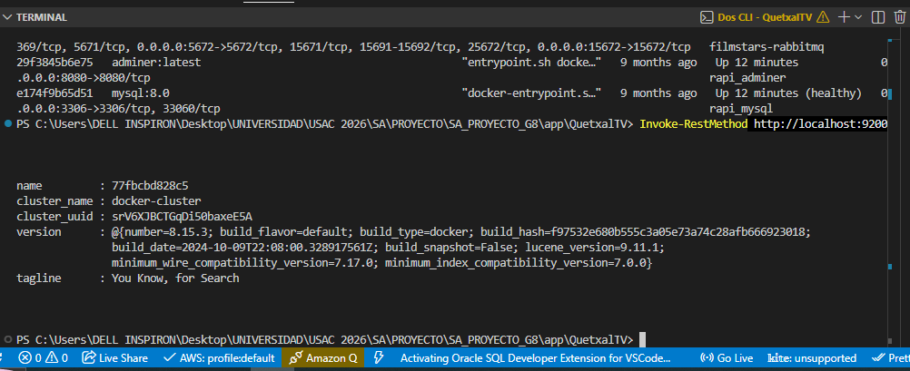
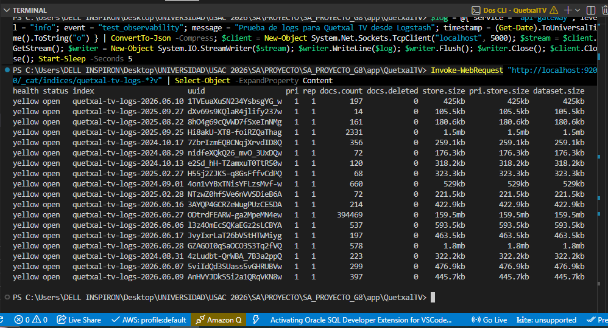
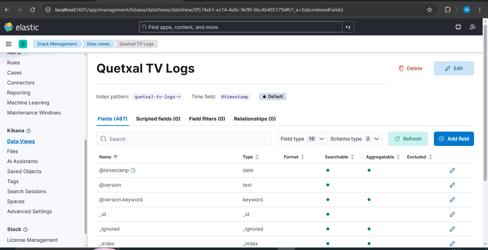
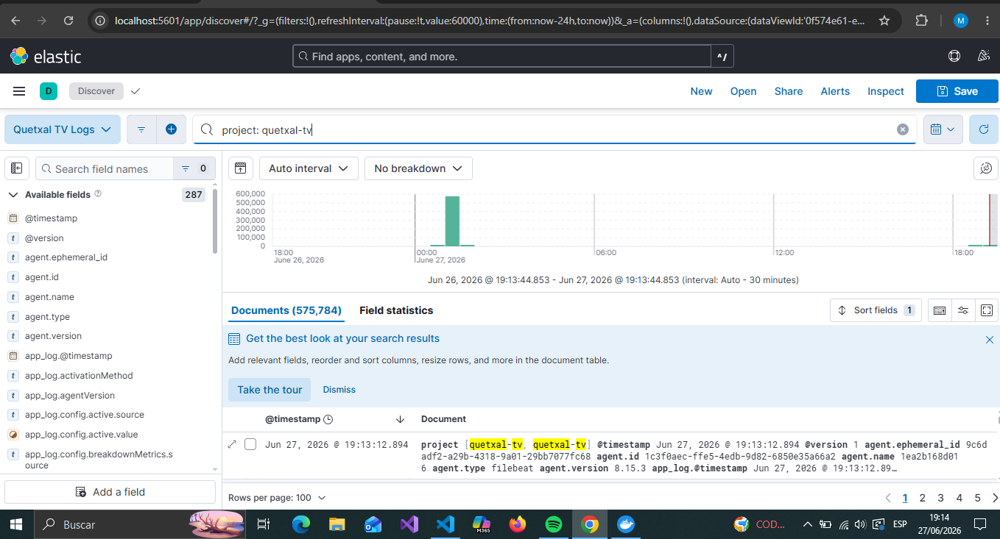

# Documentación del Stack ELK - Quetxal TV

## 1. Introducción

En esta sección se documenta la implementación del **Stack ELK** dentro del proyecto **Quetxal TV**, como parte de la Fase 3 del curso de Software Avanzado.

El objetivo de esta implementación es centralizar los logs generados por los contenedores del sistema, procesarlos, almacenarlos y visualizarlos desde una interfaz gráfica. Esto permite analizar errores, revisar eventos importantes, detectar fallos, validar trazabilidad y tener evidencia operativa del comportamiento del sistema.

El Stack ELK implementado está compuesto por:

* **Elasticsearch:** almacena los logs indexados.
* **Logstash:** recibe, procesa y transforma los logs.
* **Kibana:** permite visualizar y consultar los logs.
* **Filebeat:** recolecta los logs generados por los contenedores Docker y los envía hacia Logstash.

Esta solución fue agregada en una carpeta separada de observabilidad para no modificar directamente los archivos principales de despliegue del proyecto.

---

## 2. Relación con el requerimiento de la Fase 3

El proyecto solicita implementar un **Stack de Observabilidad de Logs con ELK Stack**, con el objetivo de recolectar y centralizar logs de auditoría de contenedores y servidores externos.

Además, se solicita documentar:

* Qué es y cómo funciona ELK.
* La arquitectura de recolección de logs.
* El flujo de inyección de agentes o redirección de streams de salida.
* Capturas de Kibana mostrando la indexación de logs transaccionales y de auditoría.

Esta documentación cubre esa parte mediante la configuración de Filebeat, Logstash, Elasticsearch y Kibana.

---

## 3. Ubicación de los archivos

La configuración del Stack ELK se encuentra dentro de:

```txt
app/QuetxalTV/observability/
```

Estructura principal relacionada con ELK:

```txt
app/QuetxalTV/observability/
├── docker-compose.observability.yml
├── filebeat/
│   └── filebeat.yml
├── logstash/
│   ├── config/
│   │   └── logstash.yml
│   └── pipeline/
│       └── logstash.conf
```

Los servicios ELK se definen dentro de:

```txt
app/QuetxalTV/observability/docker-compose.observability.yml
```

Servicios incluidos:

```txt
elasticsearch
logstash
kibana
filebeat
```

---

## 4. Problema que resuelve ELK

En una arquitectura basada en microservicios, cada servicio genera sus propios logs. Esto puede dificultar el análisis cuando ocurre un error, porque habría que revisar manualmente los logs de cada contenedor.

Sin una solución centralizada, el equipo tendría que revisar logs de forma separada:

```txt
Auth Service logs          -> revisión manual
Catalog Service logs       -> revisión manual
Subscription Service logs  -> revisión manual
History Service logs       -> revisión manual
Notification Service logs  -> revisión manual
FX Service logs            -> revisión manual
API Gateway logs           -> revisión manual
```

Con ELK, todos los logs se recolectan, procesan y visualizan desde un punto central:

```txt
Contenedores Docker
        ↓
Filebeat
        ↓
Logstash
        ↓
Elasticsearch
        ↓
Kibana
```

Esto facilita la búsqueda de errores, la revisión de auditoría, el análisis de actividad y la trazabilidad operativa.

---

## 5. Arquitectura de logs implementada

El flujo implementado es el siguiente:

```txt
Microservicios / Contenedores Docker
        ↓
Logs por stdout / stderr
        ↓
Filebeat
        ↓
Logstash
        ↓
Elasticsearch
        ↓
Kibana
```

### 5.1 Contenedores Docker

Los microservicios del proyecto generan logs por consola mediante `stdout` y `stderr`, que es el mecanismo estándar de logging en contenedores.

Ejemplos de eventos que pueden aparecer en los logs:

```txt
API Gateway iniciado
GET /health/live
GET /metrics
Error al conectar con historial-service
Catalog Service respondió con error 500
Subscription Service no disponible
```

### 5.2 Filebeat

Filebeat actúa como agente recolector. Su función es leer los logs generados por Docker y enviarlos a Logstash.

Archivo de configuración:

```txt
app/QuetxalTV/observability/filebeat/filebeat.yml
```

### 5.3 Logstash

Logstash recibe los logs enviados por Filebeat, los procesa y los transforma.

Archivo principal:

```txt
app/QuetxalTV/observability/logstash/pipeline/logstash.conf
```

Logstash permite agregar campos, interpretar JSON y enviar los logs a Elasticsearch.

### 5.4 Elasticsearch

Elasticsearch almacena los logs procesados por Logstash.

Los logs se guardan en índices con el siguiente patrón:

```txt
quetxal-tv-logs-YYYY.MM.dd
```

Ejemplo:

```txt
quetxal-tv-logs-2026.06.26
```

### 5.5 Kibana

Kibana permite consultar y visualizar los logs almacenados en Elasticsearch.

URL local:

```txt
http://localhost:5601
```

Desde Kibana se pueden buscar logs por fecha, servicio, contenedor, mensaje, nivel de log o campos personalizados.

---

## 6. Configuración de Filebeat

Archivo:

```txt
app/QuetxalTV/observability/filebeat/filebeat.yml
```

Contenido principal:

```yml
filebeat.inputs:
  - type: filestream
    id: quetxal-tv-docker-logs
    enabled: true
    paths:
      - /var/lib/docker/containers/*/*.log
    parsers:
      - container: ~
    fields_under_root: true
    fields:
      project: quetxal-tv

processors:
  - add_docker_metadata:
      host: "unix:///var/run/docker.sock"
  - add_host_metadata: ~

output.logstash:
  hosts: ["logstash:5044"]
```

### Explicación

`paths` indica la ruta donde Docker almacena los logs de los contenedores.

`add_docker_metadata` agrega información del contenedor, como nombre, imagen e identificador.

`output.logstash` indica que Filebeat enviará los logs hacia Logstash por el puerto `5044`.

---

## 7. Configuración de Logstash

Archivo:

```txt
app/QuetxalTV/observability/logstash/pipeline/logstash.conf
```

Contenido principal:

```conf
input {
  beats {
    port => 5044
  }

  tcp {
    port => 5000
    codec => json
  }
}

filter {
  if [container] and [container][name] {
    mutate {
      add_field => { "service_name" => "%{[container][name]}" }
    }
  }

  if [message] =~ /^\s*\{/ {
    json {
      source => "message"
      target => "app_log"
      skip_on_invalid_json => true
    }
  }

  mutate {
    add_field => { "project" => "quetxal-tv" }
  }
}

output {
  elasticsearch {
    hosts => ["http://elasticsearch:9200"]
    index => "quetxal-tv-logs-%{+YYYY.MM.dd}"
  }

  stdout { codec => rubydebug }
}
```

### Explicación

`beats` recibe logs desde Filebeat.

`tcp` permite recibir logs JSON directamente por el puerto `5000`. Esto es útil para enviar logs de prueba o integrar aplicaciones que envíen logs en formato JSON.

`filter` procesa los logs recibidos. Si el mensaje tiene estructura JSON, Logstash intenta convertirlo en campos internos.

`mutate` agrega el campo `project = quetxal-tv`, lo que permite identificar los logs del proyecto.

`output elasticsearch` envía los logs procesados a Elasticsearch.

---

## 8. Logs estructurados desde el API Gateway

Además del Stack ELK, se agregó un middleware en el API Gateway para generar logs estructurados en formato JSON.

Archivo:

```txt
app/QuetxalTV/api-gateway/src/metrics/observability.middleware.ts
```

Cada solicitud HTTP genera un log con información como:

```txt
timestamp
level
service
event
method
path
status_code
duration_ms
user_agent
ip
```

Ejemplo conceptual:

```json
{
  "timestamp": "2026-06-26T21:30:00.000Z",
  "level": "info",
  "service": "api-gateway",
  "event": "http_request",
  "method": "GET",
  "path": "/health/live",
  "status_code": 200,
  "duration_ms": 12,
  "user_agent": "Locust",
  "ip": "::1"
}
```

Esto facilita que Kibana pueda filtrar logs por ruta, método HTTP, estado de respuesta, duración o servicio.

---

## 9. Servicios definidos en Docker Compose

El archivo:

```txt
app/QuetxalTV/observability/docker-compose.observability.yml
```

define los servicios necesarios para el Stack ELK.

### Elasticsearch

Almacena los logs indexados.

Puerto local:

```txt
9200
```

URL local:

```txt
http://localhost:9200
```

### Logstash

Recibe logs desde Filebeat y los procesa.

Puertos principales:

```txt
5044
5000
```

### Kibana

Permite visualizar y consultar los logs.

Puerto local:

```txt
5601
```

URL local:

```txt
http://localhost:5601
```

### Filebeat

Recolecta logs de contenedores Docker y los envía a Logstash.

---

## 10. Validación de configuración

Antes de levantar el stack, se validó la configuración de Docker Compose con:

```powershell
cd app/QuetxalTV
docker compose -f docker-compose.local.yml -f observability/docker-compose.observability.yml config
```

Si el comando no muestra errores, significa que la configuración YAML es válida.

---

## 11. Comando para levantar el Stack ELK

Desde:

```txt
app/QuetxalTV/
```

Ejecutar:

```powershell
docker compose -f docker-compose.local.yml -f observability/docker-compose.observability.yml up -d elasticsearch logstash kibana filebeat
```

También se puede levantar todo el stack de observabilidad:

```powershell
docker compose -f docker-compose.local.yml -f observability/docker-compose.observability.yml up -d
```

---

## 12. Verificación de contenedores

Para validar que los contenedores estén activos:

```powershell
docker ps
```

Se espera observar contenedores como:

```txt
quetxaltv-elasticsearch
quetxaltv-logstash
quetxaltv-kibana
quetxaltv-filebeat
```

---

## 13. Verificación de Elasticsearch

Para validar que Elasticsearch esté respondiendo:

```powershell
Invoke-RestMethod http://localhost:9200
```

También se puede abrir en navegador:

```txt
http://localhost:9200
```

---

## 14. Verificación de Kibana

Para ingresar a Kibana:

```txt
http://localhost:5601
```

Kibana puede tardar algunos minutos en iniciar.

Si no carga inmediatamente, se puede revisar su estado con:

```powershell
docker logs quetxaltv-kibana --tail=50
```

---

## 15. Envío de log de prueba a Logstash

Para validar que Logstash puede recibir logs JSON por TCP, se puede enviar un log de prueba desde PowerShell:

```powershell
$log = @{
  service = "api-gateway"
  level = "info"
  event = "test_observability"
  message = "Prueba de logs para Quetxal TV desde Logstash"
  timestamp = (Get-Date).ToUniversalTime().ToString("o")
} | ConvertTo-Json -Compress

$client = New-Object System.Net.Sockets.TcpClient("localhost", 5000)
$stream = $client.GetStream()
$writer = New-Object System.IO.StreamWriter($stream)
$writer.WriteLine($log)
$writer.Flush()
$writer.Close()
$client.Close()
```

Luego se puede revisar si Elasticsearch creó el índice:

```powershell
Invoke-RestMethod "http://localhost:9200/_cat/indices/quetxal-tv-logs-*?v"
```

---

## 16. Creación del Data View en Kibana

Para consultar logs en Kibana:

1. Abrir Kibana:

```txt
http://localhost:5601
```

2. Ir a:

```txt
Stack Management → Data Views
```

3. Seleccionar:

```txt
Create data view
```

4. Nombre sugerido:

```txt
Quetxal TV Logs
```

5. Index pattern:

```txt
quetxal-tv-logs-*
```

6. Timestamp field:

```txt
@timestamp
```

7. Guardar.

---

## 17. Consulta de logs en Kibana Discover

Para visualizar logs:

1. Ir a:

```txt
Discover
```

2. Seleccionar el Data View:

```txt
Quetxal TV Logs
```

3. Cambiar el rango de tiempo a:

```txt
Last 15 minutes
```

o:

```txt
Last 24 hours
```

4. Buscar:

```txt
test_observability
```

o filtrar por:

```txt
project: quetxal-tv
```

---

# 18. Evidencias con capturas

Las capturas deben guardarse directamente dentro de la carpeta:

```txt
Documentation/
```

---

## 18.1 Docker Compose levantando ELK

Comando utilizado:

```powershell
cd app/QuetxalTV
docker compose -f docker-compose.local.yml -f observability/docker-compose.observability.yml up -d elasticsearch logstash kibana filebeat
```

Captura esperada:

* Terminal ejecutando el comando.
* Contenedores creados o iniciados.

Imagen:


Nombre del archivo:

```txt
Documentation/elk_01_docker_compose_up.png
```

---

## 18.2 Contenedores ELK activos

Comando utilizado:

```powershell
docker ps
```

Captura esperada:

* `quetxaltv-elasticsearch`
* `quetxaltv-logstash`
* `quetxaltv-kibana`
* `quetxaltv-filebeat`

Imagen:


Nombre del archivo:

```txt
Documentation/elk_02_docker_ps.png
```

---

## 18.3 Elasticsearch respondiendo

Comando utilizado:

```powershell
Invoke-RestMethod http://localhost:9200
```

También se puede abrir:

```txt
http://localhost:9200
```

Captura esperada:

* Respuesta del nodo Elasticsearch.
* Nombre del clúster.
* Versión.
* Estado de respuesta.

Imagen:



Nombre del archivo:

```txt
Documentation/elk_03_elasticsearch.png
```

---

## 18.4 Kibana abierto

URL:

```txt
http://localhost:5601
```

Captura esperada:

* Pantalla inicial de Kibana.
* Kibana cargado correctamente.

Imagen:


Nombre del archivo:

```txt
Documentation/elk_04_kibana_home.png
```

---

## 18.5 Log de prueba enviado a Logstash

Comando utilizado:

```powershell
$log = @{
  service = "api-gateway"
  level = "info"
  event = "test_observability"
  message = "Prueba de logs para Quetxal TV desde Logstash"
  timestamp = (Get-Date).ToUniversalTime().ToString("o")
} | ConvertTo-Json -Compress

$client = New-Object System.Net.Sockets.TcpClient("localhost", 5000)
$stream = $client.GetStream()
$writer = New-Object System.IO.StreamWriter($stream)
$writer.WriteLine($log)
$writer.Flush()
$writer.Close()
$client.Close()
```

Después validar:

```powershell
Invoke-RestMethod "http://localhost:9200/_cat/indices/quetxal-tv-logs-*?v"
```

Captura esperada:

* Comando de envío del log.
* Índice `quetxal-tv-logs-*` creado.

Imagen:



Nombre del archivo:

```txt
Documentation/elk_05_logstash_test_log.png
```

---

## 18.6 Data View en Kibana

Ruta:

```txt
Kibana → Stack Management → Data Views
```

Configuración:

```txt
Name: Quetxal TV Logs
Index pattern: quetxal-tv-logs-*
Timestamp field: @timestamp
```

Captura esperada:

* Data View creado correctamente.

Imagen:



Nombre del archivo:

```txt
Documentation/elk_06_kibana_dataview.png
```

---

## 18.7 Logs indexados en Kibana Discover

Ruta:

```txt
Kibana → Discover
```

Búsqueda sugerida:

```txt
test_observability
```

o:

```txt
project: quetxal-tv
```

Captura esperada:

* Logs visibles en Discover.
* Índice `quetxal-tv-logs-*`.
* Campos del log de prueba.

Imagen:



Nombre del archivo:

```txt
Documentation/elk_07_kibana_discover_logs.png
```

---

## 19. Interpretación de resultados

Con ELK funcionando, se valida que el sistema cuenta con una solución centralizada de logs.

La evidencia esperada es:

* Elasticsearch activo y disponible.
* Logstash recibiendo logs.
* Filebeat configurado para leer logs de contenedores.
* Kibana disponible para visualizar información.
* Índice `quetxal-tv-logs-*` creado.
* Logs consultables desde Kibana Discover.
* Logs del API Gateway preparados en formato JSON.

---

## 20. Relación con observabilidad del sistema

La observabilidad permite entender qué ocurre dentro del sistema a partir de datos emitidos por sus componentes.

En este caso, el Stack ELK se enfoca en **logs**, permitiendo responder preguntas como:

* ¿Qué servicio generó un error?
* ¿Cuándo ocurrió el error?
* ¿Qué ruta fue consultada?
* ¿Qué contenedor emitió el evento?
* ¿Qué mensajes de auditoría o transacciones quedaron registrados?
* ¿Qué eventos ocurrieron antes o después de una falla?

Esto ayuda a diagnosticar problemas sin entrar manualmente a cada contenedor.

---

## 21. Consideraciones

* ELK se configuró en una carpeta separada para no modificar los Docker Compose principales.
* Filebeat recolecta logs de contenedores Docker.
* Logstash procesa logs y los envía a Elasticsearch.
* Kibana permite consultar logs.
* El API Gateway genera logs estructurados en JSON.
* Los logs se almacenan en índices `quetxal-tv-logs-*`.
* En ambiente local puede ser necesario generar un log de prueba para visualizar datos en Kibana.
* En ambiente de nube, el flujo debe apuntar a los contenedores y servidores externos configurados.

---

## 22. Conclusión

El Stack ELK agregado a Quetxal TV proporciona una base de observabilidad para logs centralizados.

Filebeat recolecta logs desde los contenedores Docker. Logstash recibe y procesa esos logs. Elasticsearch los almacena en índices por fecha. Kibana permite visualizarlos y filtrarlos.

Además, el API Gateway genera logs estructurados en JSON, lo que facilita la búsqueda de eventos importantes como rutas consultadas, errores HTTP, duración de peticiones y eventos técnicos.

Con esta implementación se cumple la parte de **documentación sobre Stack ELK** solicitada para la Fase 3 del proyecto.
