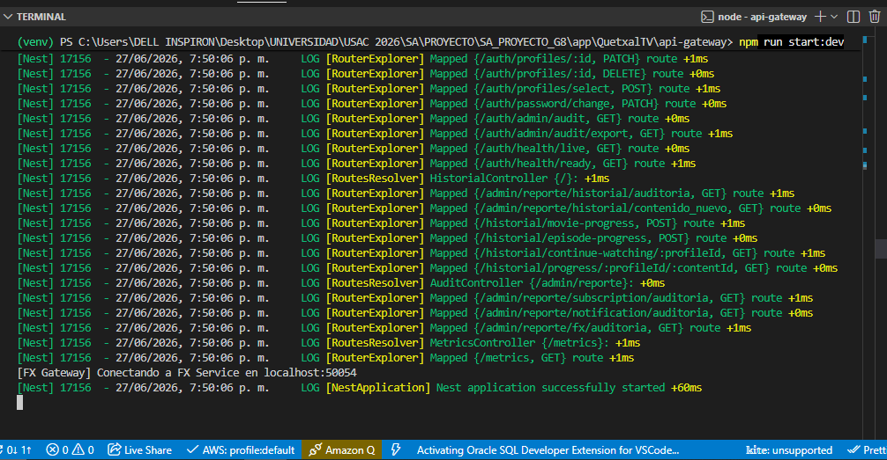
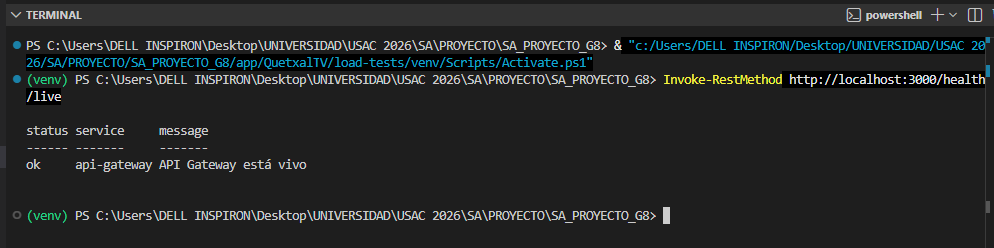
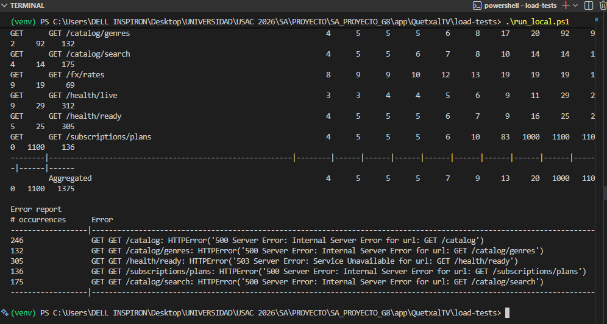
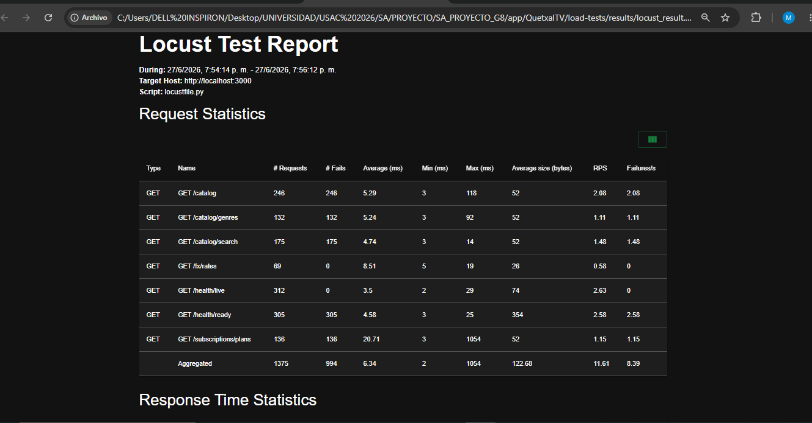
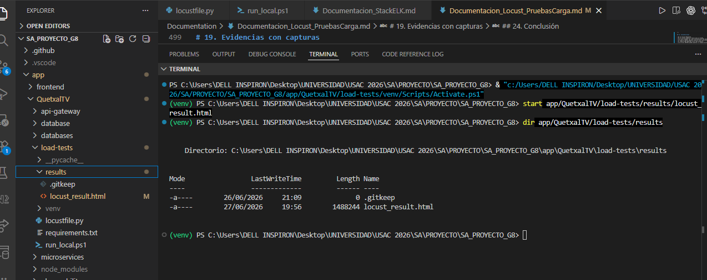

# Documentación de Locust - Pruebas de Carga Quetxal TV

En esta sección se documenta la implementación de Locust para realizar pruebas de carga ligera sobre el proyecto Quetxal TV.

Locust es una herramienta de pruebas de carga que permite simular usuarios concurrentes realizando peticiones HTTP hacia una aplicación. En este proyecto se utilizó para generar tráfico contra el API Gateway, ya que este es el punto de entrada principal del frontend hacia los microservicios internos.

El objetivo principal es validar el comportamiento del sistema ante múltiples solicitudes concurrentes, observar tiempos de respuesta, identificar errores y generar evidencia mediante un reporte HTML.

---

## Objetivo de las pruebas de carga

El objetivo de estas pruebas es simular usuarios consumiendo rutas reales del sistema para evaluar cómo responde el API Gateway bajo carga.

Con Locust se busca obtener información como:

* Cantidad total de solicitudes realizadas.
* Cantidad de usuarios concurrentes simulados.
* Tiempo promedio de respuesta.
* Tiempo mínimo y máximo de respuesta.
* Errores generados durante la prueba.
* Rutas con mayor cantidad de solicitudes.
* Porcentaje de fallos por endpoint.
* Evidencia en formato HTML.

Estas pruebas no sustituyen pruebas de estrés completas, pero sí permiten tener una validación inicial del comportamiento del sistema ante tráfico concurrente.

---

## Ubicación de los archivos

La implementación de Locust se encuentra en:

```txt
app/QuetxalTV/load-tests/
```

Estructura agregada:

```txt
app/QuetxalTV/load-tests/
├── locustfile.py
├── requirements.txt
├── run_local.ps1
└── results/
    ├── .gitkeep
    └── locust_result.html
```

---

## Herramienta utilizada

La herramienta utilizada fue:

```txt
Locust
```

No se utilizó Mosquitto.

Mosquitto es un broker MQTT utilizado para comunicación mediante tópicos, comúnmente en sistemas IoT o mensajería publish/subscribe. En este caso, el requerimiento corresponde a pruebas de carga HTTP, por lo que se utilizó Locust.

Comparación:

```txt
Mosquitto -> Mensajería MQTT
Locust    -> Pruebas de carga HTTP
```

En Quetxal TV se simulan usuarios HTTP consumiendo endpoints del API Gateway.

---

## ¿Por qué se prueba desde el API Gateway?

El API Gateway es el punto central de entrada hacia el sistema.

El frontend no consume directamente los microservicios internos. En lugar de eso, realiza solicitudes HTTP hacia el API Gateway, y este se encarga de comunicarse con los servicios correspondientes.

Por esa razón, las pruebas de carga se ejecutan contra:

```txt
http://localhost:3000
```

Esto permite simular un comportamiento más parecido al flujo real del sistema.

Flujo general:

```txt
Usuario simulado por Locust
        ↓
API Gateway
        ↓
Microservicios internos
        ↓
Base de datos / servicios externos
```

---

## Endpoints utilizados

Los endpoints configurados en Locust corresponden a rutas reales del API Gateway.

No se crearon endpoints falsos únicamente para la prueba.

Endpoints evaluados:

```txt
GET /health/live
GET /health/ready
GET /catalog
GET /catalog/search
GET /catalog/genres
GET /subscriptions/plans
GET /fx/rates
GET /historial/continue-watching/:profileId
```

---

## Justificación de endpoints seleccionados

### GET /health/live

Valida si el API Gateway está vivo.

Este endpoint es importante porque indica que el proceso del Gateway está ejecutándose.

---

### GET /health/ready

Valida si el API Gateway está listo para recibir tráfico.

Este endpoint puede depender del estado de otros microservicios o dependencias. Si algún servicio requerido no responde correctamente, puede devolver un estado de no disponibilidad.

---

### GET /catalog

Representa la consulta general del catálogo de películas o series.

Es una ruta importante porque el catálogo es una de las funcionalidades principales de la plataforma.

---

### GET /catalog/search

Representa la búsqueda de contenido.

Este flujo es importante porque los usuarios suelen buscar películas o series dentro de la plataforma.

---

### GET /catalog/genres

Consulta la lista de géneros disponibles.

Sirve para validar una ruta relacionada con filtros o clasificación de contenido.

---

### GET /subscriptions/plans

Consulta los planes de suscripción disponibles.

Es importante porque forma parte del flujo de compra o selección de planes.

---

### GET /fx/rates

Consulta información relacionada con tasas de cambio o conversión de divisas.

Este endpoint representa la integración con el servicio de divisas.

---

### GET /historial/continue-watching/:profileId

Consulta la información de historial de reproducción del perfil.

Este flujo permite mostrar la sección de “Continuar viendo”, que es una funcionalidad importante dentro de una plataforma de streaming.

---

## Archivo requirements.txt

Ubicación:

```txt
app/QuetxalTV/load-tests/requirements.txt
```

Contenido:

```txt
locust==2.31.6
```

Este archivo define la dependencia necesaria para instalar Locust.

Instalación:

```powershell
pip install -r requirements.txt
```

---

## Archivo locustfile.py

Ubicación:

```txt
app/QuetxalTV/load-tests/locustfile.py
```

Este archivo define los usuarios virtuales y las tareas que ejecuta Locust durante la prueba de carga.

La clase principal es:

```python
class QuetxalTvUser(HttpUser):
    wait_time = between(1, 3)
```

Esto significa que cada usuario virtual espera entre 1 y 3 segundos entre una petición y otra, simulando un comportamiento más realista.

---

## Manejo de autenticación

Dentro del archivo `locustfile.py` se agregó una función para manejar token JWT de forma opcional:

```python
def auth_headers():
    token = os.getenv("JWT_TOKEN", "").strip()
    if not token:
        return {}
    return {"Authorization": f"Bearer {token}"}
```

Esta función permite enviar un token JWT en rutas protegidas si se define la variable de entorno `JWT_TOKEN`.

Si no existe token, la función devuelve un objeto vacío y evita ejecutar la ruta autenticada.

Esto permite que la prueba pueda ejecutarse localmente sin depender obligatoriamente de un login.

---

## Distribución de carga

Cada tarea tiene un peso definido con `@task`.

Mientras mayor sea el número, más frecuente será la ejecución de esa tarea.

Distribución utilizada:

```txt
GET /health/live                       -> peso 5
GET /health/ready                      -> peso 5
GET /catalog                           -> peso 4
GET /catalog/search                    -> peso 3
GET /catalog/genres                    -> peso 2
GET /subscriptions/plans               -> peso 2
GET /fx/rates                          -> peso 1
GET /historial/continue-watching       -> peso 1
```

Las rutas de salud y catálogo tienen mayor peso porque son rutas críticas y comunes dentro del sistema.

---

## Archivo run_local.ps1

Ubicación:

```txt
app/QuetxalTV/load-tests/run_local.ps1
```

Este archivo permite ejecutar Locust de forma automática desde PowerShell.

Contenido conceptual:

```powershell
$HostUrl = $env:LOCUST_HOST

if ([string]::IsNullOrWhiteSpace($HostUrl)) {
  $HostUrl = "http://localhost:3000"
}

locust -f .\locustfile.py --headless -u 25 -r 5 -t 2m --host $HostUrl --html .\results\locust_result.html
```

---

## Parámetros utilizados

El comando de Locust utiliza los siguientes parámetros:

```txt
--headless
```

Ejecuta Locust sin interfaz gráfica.

```txt
-u 25
```

Simula 25 usuarios concurrentes.

```txt
-r 5
```

Crea 5 usuarios por segundo hasta llegar al total configurado.

```txt
-t 2m
```

Ejecuta la prueba durante 2 minutos.

```txt
--host http://localhost:3000
```

Define el host objetivo de la prueba.

```txt
--html .\results\locust_result.html
```

Genera un reporte HTML con los resultados.

---

## Ejecución local

Antes de ejecutar Locust, se debe tener levantado el API Gateway.

### Levantar API Gateway

Desde la raíz del proyecto:

```powershell
cd app/QuetxalTV/api-gateway
npm run start:dev
```

Se debe esperar hasta que aparezca un mensaje como:

```txt
Nest application successfully started
```

---

### Validar que API Gateway responde

En otra terminal:

```powershell
Invoke-RestMethod http://localhost:3000/health/live
```

Respuesta esperada:

```txt
status service     message
------ -------     -------
ok     api-gateway API Gateway está vivo
```

---

### Ejecutar Locust

Desde la raíz del proyecto:

```powershell
cd app/QuetxalTV/load-tests
.\venv\Scripts\Activate.ps1
.\run_local.ps1
```

Si PowerShell bloquea el script, usar:

```powershell
powershell -ExecutionPolicy Bypass -File .\run_local.ps1
```

---

## Ejecución contra otro entorno

El script permite cambiar el host usando la variable de entorno `LOCUST_HOST`.

Ejemplo:

```powershell
$env:LOCUST_HOST="http://34.149.86.86"
.\run_local.ps1
```

Esto permite ejecutar las pruebas contra un entorno en nube, una máquina virtual o un Ingress.

---

## Reporte generado

El reporte de Locust se genera en:

```txt
app/QuetxalTV/load-tests/results/locust_result.html
```

Este archivo contiene la evidencia de la prueba de carga.

El reporte muestra:

* Estadísticas generales.
* Cantidad de requests.
* Requests por segundo.
* Tiempos promedio.
* Tiempos mínimos.
* Tiempos máximos.
* Percentiles.
* Errores.
* Rutas evaluadas.

---

## Interpretación de errores

Durante una ejecución local pueden aparecer errores como:

```txt
500 Internal Server Error
503 Service Unavailable
```

Esto puede ocurrir cuando:

* No todos los microservicios están levantados.
* Algún servicio no puede conectarse a su base de datos.
* El API Gateway intenta comunicarse con un servicio no disponible.
* El readiness check detecta una dependencia caída.
* Un endpoint depende de datos o configuración que no existe localmente.

Estos errores no significan que Locust esté mal configurado.

La prueba se considera ejecutada correctamente si:

* Locust genera tráfico.
* Las rutas son llamadas.
* Se registran tiempos de respuesta.
* Se registran errores cuando existen.
* Se genera el reporte HTML.

---

## Validaciones realizadas

Se validó la instalación de Locust:

```powershell
pip install -r requirements.txt
```

Se validó que el archivo Python no tuviera errores de sintaxis:

```powershell
python -m py_compile .\locustfile.py
```

Se ejecutó la prueba de carga:

```powershell
.\run_local.ps1
```

Se generó el reporte HTML:

```txt
app/QuetxalTV/load-tests/results/locust_result.html
```

---

# Evidencias con capturas

Las capturas deben guardarse directamente dentro de la carpeta:

```txt
Documentation/
```

---

## API Gateway levantado

Comando utilizado:

```powershell
cd app/QuetxalTV/api-gateway
npm run start:dev
```

Captura esperada:

* Terminal con API Gateway iniciado.
* Mensaje `Nest application successfully started`.
* Rutas mapeadas como `/health/live`, `/health/ready` y `/metrics`.

Imagen:



Nombre del archivo:

```txt
Documentation/locust_01_api_gateway_running.png
```

---

## Health live respondiendo

Comando utilizado:

```powershell
Invoke-RestMethod http://localhost:3000/health/live
```

Captura esperada:

* Respuesta del endpoint `/health/live`.
* Estado `ok`.
* Servicio `api-gateway`.

Imagen:



Nombre del archivo:

```txt
Documentation/locust_02_health_live.png
```

---

## Locust ejecutando prueba de carga

Comando utilizado:

```powershell
cd app/QuetxalTV/load-tests
.\venv\Scripts\Activate.ps1
.\run_local.ps1
```

Captura esperada:

* Tabla de resultados en terminal.
* Endpoints ejecutados.
* Cantidad de solicitudes.
* Tiempos de respuesta.
* Errores si existieron.

Imagen:



Nombre del archivo:

```txt
Documentation/locust_03_ejecucion_terminal.png
```

---

## Reporte HTML de Locust

Archivo generado:

```txt
app/QuetxalTV/load-tests/results/locust_result.html
```

Para abrirlo desde la raíz del proyecto:

```powershell
start app/QuetxalTV/load-tests/results/locust_result.html
```

Captura esperada:

* Reporte HTML abierto en navegador.
* Estadísticas generales.
* Rutas evaluadas.
* Cantidad de requests.
* Tiempo promedio.
* Errores.

Imagen:



Nombre del archivo:

```txt
Documentation/locust_04_reporte_html.png
```

---

## Resultados generados

Comando utilizado:

```powershell
dir app/QuetxalTV/load-tests/results
```

Captura esperada:

* Archivo `locust_result.html` visible.
* Archivo `.gitkeep`, si aplica.

Imagen:



Nombre del archivo:

```txt
Documentation/locust_05_resultados_generados.png
```

---

## Relación con observabilidad

Locust se relaciona con la observabilidad porque genera tráfico controlado hacia el sistema.

Ese tráfico puede ser utilizado para alimentar:

* Logs en ELK.
* Métricas en Prometheus.
* Dashboards en Grafana.
* Validaciones de respuesta en API Gateway.

Al ejecutar Locust, el API Gateway recibe solicitudes reales y genera información útil para observar el comportamiento del sistema.

---

## Relación con la tabla de pruebas

Dentro de la tabla de control del grupo, esta implementación corresponde a:

```txt
Pruebas de carga -> Locust
```

La parte de logs corresponde a:

```txt
Logs -> Stack ELK
```

La parte de métricas corresponde a:

```txt
Métricas -> Prometheus + Grafana
```

---

## Conclusión

Locust fue agregado como herramienta para ejecutar pruebas de carga HTTP sobre Quetxal TV.

La prueba simula usuarios concurrentes consumiendo endpoints reales del API Gateway, genera estadísticas de rendimiento y produce un reporte HTML como evidencia.

Esta implementación permite evaluar de forma inicial el comportamiento del sistema ante tráfico concurrente y cumple con la parte de pruebas de carga ligera con Locust requerida para la Fase 3 del proyecto.
