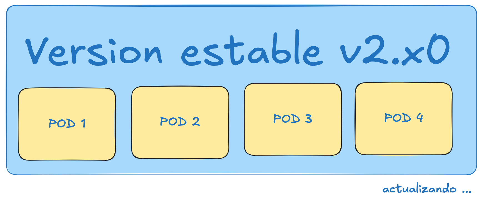
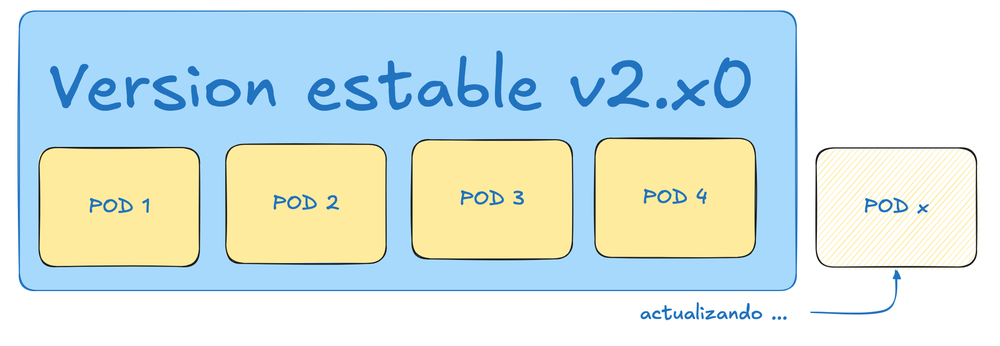
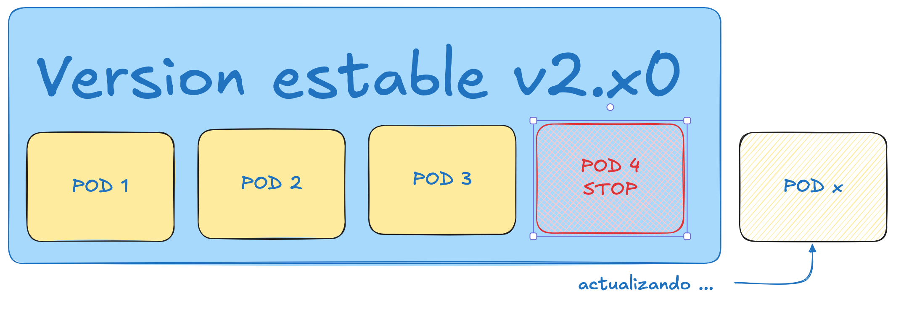
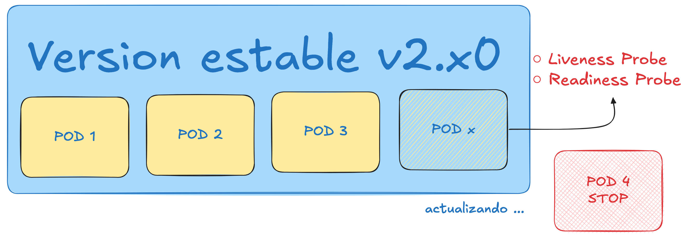
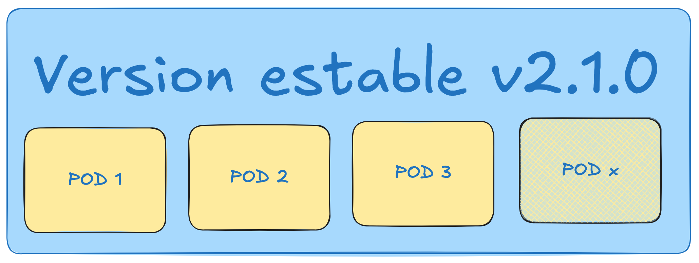
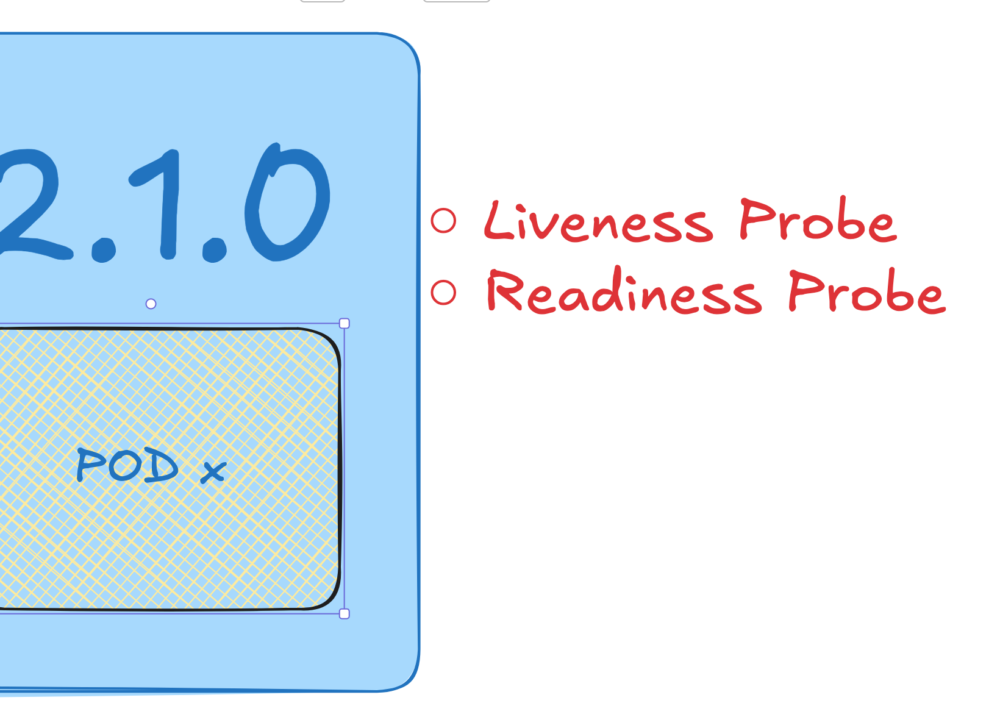
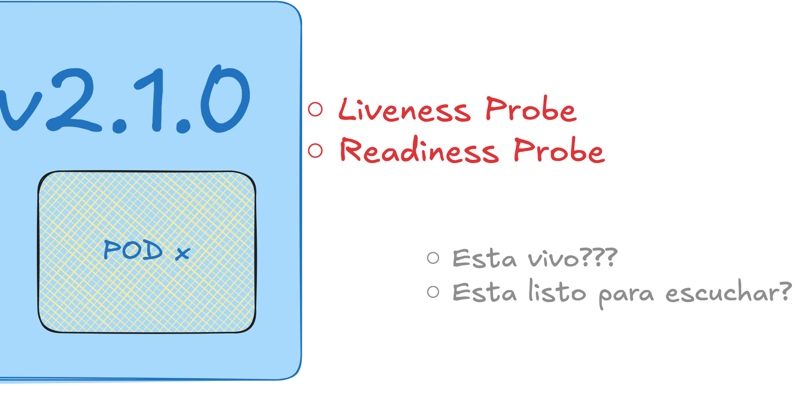

# Estrategia Operativa de Despliegue y Recuperación ante Fallos

## 1 Estrategia de Despliegue RollingUpdate

La plataforma QuetxalTV utiliza Kubernetes como orquestador principal de contenedores y adopta la estrategia de despliegue RollingUpdate para realizar actualizaciones controladas de los componentes de producción. Esta estrategia permite sustituir gradualmente una versión existente por una nueva versión sin necesidad de eliminar completamente el Deployment ni recrear la infraestructura asociada.

Todos los microservicios y componentes principales de la solución utilizan la siguiente configuración:

```yaml
strategy:
  type: RollingUpdate
  rollingUpdate:
    maxSurge: 0
    maxUnavailable: 1
```

Esta configuración se aplica en:

* frontend
* api-gateway
* auth-service
* catalogo-service
* subscription-service
* fx-service
* historial-service
* notification-service

La estrategia RollingUpdate controla el proceso mediante dos parámetros fundamentales:

### maxSurge

El parámetro `maxSurge` define la cantidad máxima de Pods adicionales que Kubernetes puede crear temporalmente durante una actualización.

Matemáticamente:

```text
Pods máximos durante despliegue =
Replicas configuradas + maxSurge
```

En QuetxalTV:

```yaml
maxSurge: 0
```

Por lo tanto:

```text
Pods máximos = 1 + 0 = 1
```



Esto significa que Kubernetes nunca crea una instancia adicional durante la actualización.

La principal razón de esta decisión es la optimización de recursos. El proyecto fue desplegado sobre infraestructura limitada y se buscó minimizar el consumo simultáneo de CPU, memoria y direcciones IP internas durante los procesos de actualización.

Al evitar Pods adicionales se garantiza que la utilización de recursos permanezca constante independientemente de la versión desplegada.

### maxUnavailable

El parámetro `maxUnavailable` define la cantidad máxima de Pods que pueden encontrarse indisponibles simultáneamente durante el proceso de actualización.

Matemáticamente:

```text
Pods disponibles mínimos =
Replicas configuradas - maxUnavailable
```

Para QuetxalTV:

```yaml
maxUnavailable: 1
```

Entonces:

```text
Pods disponibles mínimos =
1 - 1 = 0
```



Esto autoriza a Kubernetes a retirar completamente el Pod existente antes de iniciar la nueva versión.

El flujo resultante es:

1. Kubernetes detiene el Pod de la versión anterior.
2. Libera los recursos asociados.
3. Crea el nuevo Pod utilizando la nueva imagen.



4. Espera que la aplicación arranque.
5. Verifica las sondas de salud.



6. Marca el Pod como disponible.



Esta estrategia minimiza el consumo de infraestructura porque nunca existen dos instancias ejecutándose simultáneamente.

### Justificación Arquitectónica

Desde una perspectiva teórica, un despliegue completamente Zero-Downtime suele requerir al menos dos réplicas activas o la utilización de valores positivos en `maxSurge`, permitiendo que la nueva versión entre en funcionamiento antes de retirar la anterior.

Sin embargo, QuetxalTV fue diseñado para ejecutarse dentro de las limitaciones de la capa gratuita de Google Cloud Platform. Mantener múltiples réplicas permanentes hubiera incrementado significativamente el consumo de CPU, memoria y recursos de red.

Por esta razón se adoptó una estrategia conservadora orientada a la eficiencia de infraestructura. Aunque puede existir una breve ventana de indisponibilidad durante la sustitución de Pods, el tiempo de interrupción se reduce mediante mecanismos de validación automática y monitoreo continuo del estado de los servicios.

---

## 2 Rollback Automatizado

La estrategia de despliegue se complementa con un mecanismo de recuperación automática ante fallos.

El objetivo principal es evitar que una versión defectuosa permanezca activa en producción cuando no logra iniciar correctamente.

Durante cada despliegue, el pipeline de Continuous Delivery ejecuta una actualización mediante:

```bash
kubectl apply -f deployment.yaml
```

Posteriormente Kubernetes comienza el proceso de creación del nuevo Pod.

La nueva versión debe superar satisfactoriamente:

* Inicialización de contenedor.
* Carga de configuración.
* Conexión a bases de datos.
* Registro de endpoints gRPC.
* Verificación de sondas de salud.

Si alguna de estas etapas falla, Kubernetes genera eventos asociados al Pod.

Los casos más comunes son:

* CrashLoopBackOff.
* Error de conexión a base de datos.
* Error de configuración.
* Fallo de inicialización de NestJS.
* Timeout de readiness probe.
* Timeout de liveness probe.

Cuando el pipeline detecta que el Deployment no alcanza el estado esperado dentro del tiempo definido, se considera que el despliegue ha fallado.

El flujo de recuperación es el siguiente:

```text
Cuando el pipeline despliega una nueva versión, 
Kubernetes crea un nuevo Pod que debe pasar las 
verificaciones de salud. Si estos *health checks* 
fallan y el Deployment no alcanza el estado **Ready** 
dentro del tiempo definido, el pipeline detecta el error 
y considera que el despliegue ha fallado. En ese 
momento se activa automáticamente el flujo de recuperación: 
se ejecuta el comando `kubectl rollout undo deployment/<servicio>`,
lo que restaura la versión estable previa y permite que el 
servicio vuelva a estar disponible sin interrupciones prolongadas.  

Este mecanismo asegura que, ante un fallo en la nueva versión, 
el sistema regrese de inmediato a un estado confiable y operativo.
```

La reversión se realiza mediante:

```bash
kubectl rollout undo deployment/auth-service
```

o el Deployment correspondiente.

Esta estrategia permite que el sistema vuelva automáticamente a la última versión funcional conocida sin intervención manual del equipo operativo.

---

# 10. Monitoreo de Salud de la Aplicación (Health Checks)

## 10.1 Objetivo de las Sondas de Salud

Los mecanismos de monitoreo de salud permiten que Kubernetes tome decisiones automáticas sobre el ciclo de vida de cada contenedor.

En QuetxalTV se implementaron dos tipos de sondas:

* Liveness Probe.
* Readiness Probe.



Estas sondas son utilizadas tanto en componentes HTTP (Frontend y API Gateway) como en microservicios gRPC.

Su objetivo es garantizar que solamente los servicios funcionales participen en el procesamiento de solicitudes.

---

## 10.2 Readiness Probe

La Readiness Probe determina si una instancia está preparada para recibir tráfico real.

Mientras una Readiness Probe no sea satisfactoria, Kubernetes mantiene el Pod fuera de los Endpoints del Service.

En consecuencia, el tráfico nunca es dirigido hacia una instancia que todavía se encuentra inicializando recursos internos.

Para el API Gateway basado en NestJS se implementó:

```yaml
readinessProbe:
  httpGet:
    path: /health
    port: 3000
  initialDelaySeconds: 30
  periodSeconds: 10
  failureThreshold: 6
```

El endpoint `/health` verifica que la aplicación NestJS haya completado su proceso de arranque y pueda responder correctamente a solicitudes HTTP.

Para los microservicios gRPC se utilizó el protocolo estándar de Health Checking:

```yaml
readinessProbe:
  grpc:
    port: 50051
    service: auth-service-readiness
```

Cada microservicio expone un servicio de salud independiente que informa a Kubernetes cuándo la aplicación se encuentra lista para aceptar solicitudes.

Esto implica que:

* El proceso gRPC está activo.
* Las dependencias críticas están disponibles.
* Las conexiones requeridas fueron inicializadas.
* El servicio puede procesar tráfico de negocio.

---

## 10.3 Liveness Probe

La Liveness Probe determina si una aplicación continúa funcionando correctamente después de haber iniciado.

Mientras la Readiness Probe responde la pregunta:

```text
¿Está lista para recibir tráfico?
```

La Liveness Probe responde:

```text
¿Sigue viva y funcionando?
```

En el API Gateway se configuró:

```yaml
livenessProbe:
  httpGet:
    path: /health
    port: 3000
  initialDelaySeconds: 90
  periodSeconds: 20
  failureThreshold: 3
```

El retraso inicial de 90 segundos evita reinicios prematuros durante el arranque de la aplicación.

Para los microservicios gRPC se implementó:

```yaml
livenessProbe:
  grpc:
    port: 50051
    service: auth-service-liveness
```

Cuando la sonda falla repetidamente:

```text
3 intentos consecutivos
(periodSeconds = 20)
```

Kubernetes considera que el contenedor está en estado no saludable y ejecuta automáticamente un reinicio.

Esta capacidad permite recuperarse automáticamente de situaciones como:

* Deadlocks.
* Bloqueos internos.
* Fugas de memoria.
* Fallos de comunicación.
* Procesos congelados.



---

## 10.4 Validación de las Sondas

Durante el desarrollo y pruebas de integración se validó el comportamiento de las sondas utilizando el protocolo estándar gRPC Health Checking.

Las verificaciones fueron ejecutadas mediante la herramienta `grpcurl`, tanto en entornos Docker Compose como dentro del clúster Kubernetes.

Cada servicio expone dos identificadores independientes:

```text
<servicio>-readiness
<servicio>-liveness
```

Por ejemplo:

```text
auth-service-readiness
auth-service-liveness
catalogo-service-readiness
catalogo-service-liveness
subscription-service-readiness
subscription-service-liveness
```

La respuesta esperada es:

```text
SERVING
```

Lo cual confirma que el servicio se encuentra operativo y puede participar en el flujo normal de ejecución.

---

# 11. Relación entre Rolling Updates, Rollbacks y Health Checks

Los mecanismos de despliegue y monitoreo implementados en QuetxalTV funcionan de manera complementaria y forman una estrategia integral de resiliencia operacional.

La estrategia RollingUpdate controla cómo una nueva versión es introducida en producción. Sin embargo, por sí sola no puede determinar si la nueva versión realmente funciona correctamente. Para ello intervienen las Readiness y Liveness Probes.

Durante una actualización, Kubernetes crea la nueva instancia y comienza a ejecutar las verificaciones de salud configuradas. Mientras la Readiness Probe no sea satisfactoria, el Pod permanece fuera del flujo de tráfico. Esto evita que los usuarios interactúen con una instancia incompleta o defectuosa.

Una vez que la aplicación supera las verificaciones de disponibilidad, Kubernetes la considera apta para operación normal. Posteriormente la Liveness Probe continúa supervisando permanentemente el estado interno del proceso para detectar bloqueos o fallos posteriores al arranque.

Si una nueva versión presenta errores graves, como fallos de inicialización, dependencias inaccesibles o ciclos continuos de reinicio (CrashLoopBackOff), las sondas de salud no alcanzarán el estado esperado. Esta condición es detectada por el pipeline de despliegue, que ejecuta automáticamente el mecanismo de rollback hacia la última versión estable mediante `kubectl rollout undo`.

En conjunto, RollingUpdate, Rollback Automatizado, Readiness Probes y Liveness Probes constituyen la estrategia de continuidad operativa de QuetxalTV. Mientras las actualizaciones permiten evolucionar el sistema de forma controlada, las sondas verifican continuamente el estado real de cada servicio y los rollbacks garantizan la recuperación rápida ante versiones defectuosas, reduciendo el riesgo de indisponibilidad y mejorando la confiabilidad general de la plataforma.
