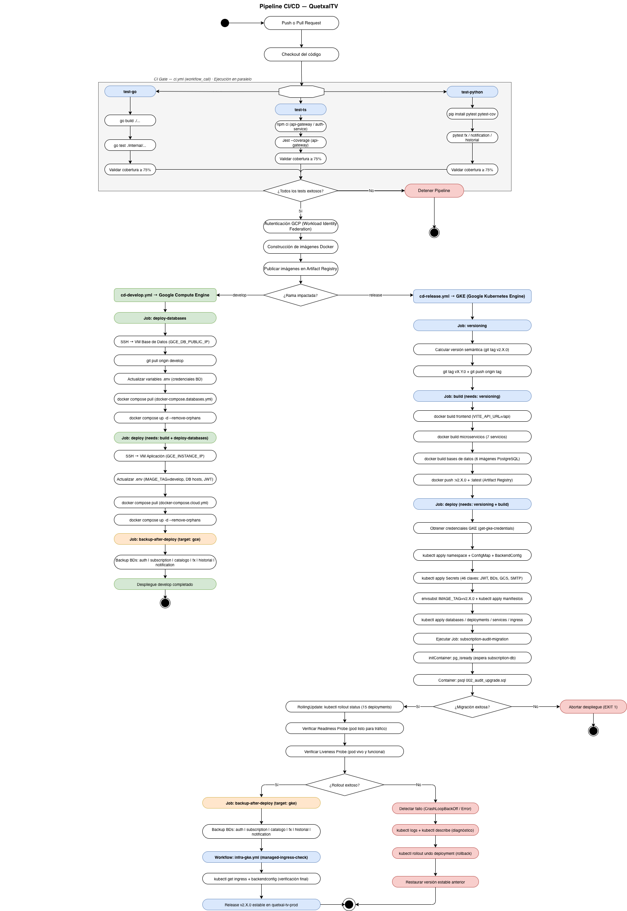

# Justificación del Diseño del Pipeline CI/CD — QuetxalTV

## 1. Visión General del Pipeline

El pipeline de CI/CD de QuetxalTV fue diseñado bajo una filosofía de **cortocircuito crítico**: ninguna etapa puede avanzar si la anterior presenta fallos. Esta decisión de diseño responde directamente al requisito de garantizar que únicamente código verificado, probado y con cobertura suficiente llegue a los entornos de despliegue. El pipeline se implementa con GitHub Actions y está compuesto por cinco archivos de workflow: `ci.yml`, `cd-develop.yml`, `cd-release.yml`, `backup.yml` e `infra-gke.yml`, cada uno con responsabilidades claramente delimitadas.

La arquitectura de workflows sigue el principio de separación de responsabilidades: la integración continua (CI) se define como un workflow reutilizable (`workflow_call`) invocado tanto por `cd-develop.yml` como por `cd-release.yml` mediante el mecanismo `needs: ci-gate`. Esto elimina la duplicación de lógica de pruebas y garantiza que el mismo conjunto de verificaciones se aplique de manera uniforme independientemente de la rama que dispare el pipeline.

---

## 2. Fase de Integración Continua (CI)

### 2.1 Paralelismo y Políglotsmo del Backend

El backend de QuetxalTV es políglota: está compuesto por servicios escritos en Go (subscription-service, catalogo-service), TypeScript/Node.js (api-gateway, auth-service) y Python (fx-service, notification-service, historial-service). Para respetar esta heterogeneidad sin bloquear el pipeline por dependencias entre lenguajes, se optó por ejecutar tres jobs de testing en **paralelo**: `test-go`, `test-ts` y `test-python`. Cada job configura su propio entorno de ejecución (go-version, node-version, python-version) de manera independiente, maximizando la velocidad del ciclo de retroalimentación para el equipo de desarrollo.

### 2.2 Umbral de Cobertura del 75%

El requisito de cobertura mínima del 75% se aplica directamente en cada job mediante las herramientas nativas de cada ecosistema. En Go, se calcula con `go tool cover -func` filtrando el archivo de repositorio para medir únicamente handlers y servicios, ya que el repositorio contiene lógica de infraestructura que no es representativa del comportamiento de los endpoints. En TypeScript, se utiliza `--coverageThreshold='{"global":{"lines":75}}'` en Jest. En Python, se emplea `--cov-fail-under=75` en pytest. Si cualquiera de estos umbrales no se cumple, el job termina con `exit 1`, lo que provoca el cortocircuito del pipeline completo antes de llegar a cualquier etapa de build o despliegue.

La decisión de fijar el umbral en el 75% responde a un balance pragmático: es suficientemente exigente para garantizar que la lógica de negocio crítica (autenticación, pagos, catálogo) esté cubierta, pero no tan restrictivo como para bloquear el desarrollo cuando se introducen nuevos endpoints aún sin tests completos en fases iniciales de una feature.

### 2.3 Concurrencia y Cancelación

El archivo `ci.yml` define una política de concurrencia con `cancel-in-progress: true` bajo el grupo `ci-${{ github.ref }}`. Esto significa que si se hace push a una rama mientras el CI de esa misma rama aún está corriendo, el workflow anterior se cancela automáticamente. La razón es evitar el desperdicio de minutos de runner y garantizar que siempre se valide el estado más reciente del código, no un estado intermedio que ya fue superado por commits posteriores.

---

## 3. Versionamiento Semántico (Solo Rama Release)

### 3.1 Restricción de Etiquetado

El job `versioning` en `cd-release.yml` es el único punto del sistema donde se generan tags semánticos de producción del formato `v2.X.0`. La lógica inspecciona los tags existentes en el repositorio mediante `git tag --sort=-v:refname | grep '^v2\.'`, determina el número de versión actual e incrementa el componente MINOR de forma automática. Este tag se publica en el repositorio con `git push origin $NEW`.

La decisión de restringir el etiquetado semántico exclusivamente a la rama `release` responde al requisito explícito de impedir que código en desarrollo o staging reciba tags de producción. Las imágenes construidas para la rama `develop` únicamente reciben el tag `:develop`, lo que las diferencia claramente de las imágenes productivas y evita que un operador pueda confundir versiones al hacer pull desde el Artifact Registry.

### 3.2 Doble Tag en Artifact Registry

En la rama `release`, cada imagen se publica con dos tags: `:v2.X.0` (inmutable, referencia histórica) y `:latest` (apunta siempre a la última versión estable). El tag `:latest` facilita los entornos de prueba que no necesitan fijar una versión específica, mientras que el tag semántico garantiza la trazabilidad completa de cada despliegue en producción.

---

## 4. Despliegue Continuo en Rama Develop (GCE)

### 4.1 Topología de Dos VMs

El despliegue en la rama `develop` utiliza **dos máquinas virtuales de Google Compute Engine**: una VM dedicada a las bases de datos (`GCE_DB_PUBLIC_IP`) y una VM de aplicación (`GCE_INSTANCE_IP`). Esta separación replica en entorno no productivo el principio de aislamiento de datos que se aplica en GKE con Kubernetes, y permite actualizar la capa de aplicación sin afectar el estado de las bases de datos, y viceversa.

### 4.2 Despliegue por SSH con appleboy/ssh-action

El mecanismo de despliegue utiliza SSH directo hacia las VMs mediante `appleboy/ssh-action@v1.0.3`. Una vez conectado, el pipeline ejecuta `git pull origin develop` para sincronizar el código, actualiza el archivo `.env` de forma segura mediante la función `set_env` (que hace `sed -i` si la variable ya existe o la agrega al final si no existe), y luego ejecuta `docker compose pull` seguido de `docker compose up -d --remove-orphans`. El uso de `--remove-orphans` garantiza que contenedores de servicios eliminados del `docker-compose.yml` sean también eliminados de la VM, evitando la acumulación de contenedores huérfanos.

### 4.3 Separación de Jobs con `needs`

Los jobs `deploy-databases` y `deploy` tienen una relación de dependencia explícita: `deploy` declara `needs: [build, deploy-databases]`. Esto garantiza que la aplicación nunca intente levantarse antes de que las bases de datos estén disponibles y actualizadas, previniendo errores de conexión durante el arranque de los servicios.

---

## 5. Despliegue Continuo en Rama Release (GKE)

### 5.1 Autenticación sin Claves Estáticas (Workload Identity Federation)

Tanto en `cd-develop.yml` como en `cd-release.yml`, la autenticación hacia GCP se realiza mediante `google-github-actions/auth@v2` con Workload Identity Federation, sin que ninguna clave JSON de cuenta de servicio sea almacenada en GitHub Secrets. Este mecanismo permite que el runner de GitHub Actions se autentique ante GCP de forma federada usando el token OIDC del workflow, que es efímero y no puede ser reutilizado fuera del contexto de ejecución. Esto elimina el riesgo de filtración de credenciales de larga duración.

### 5.2 Gestión Declarativa de Manifiestos (Sin Despliegues Manuales)

El pipeline aplica los manifiestos de Kubernetes con `kubectl apply` usando `envsubst` para sustituir la variable `IMAGE_TAG` con la versión semántica calculada en el job `versioning`. Este enfoque cumple con el requisito de prohibir despliegues manuales mediante CLI: el único vector de cambio en el clúster es el pipeline de CD, que actúa sobre los archivos YAML versionados en el repositorio. Cualquier modificación estructural al clúster debe pasar por un Pull Request, aprobación del equipo y merge a `release`, momento en el que el pipeline toma el control de forma automática.

### 5.3 Gestión de Secrets de Forma Idempotente

El job `deploy` en `cd-release.yml` crea el Secret `quetxal-tv-secrets` con 46 claves mediante `kubectl create secret --dry-run=client -o yaml | kubectl apply -f -`. El patrón `dry-run + apply` hace la operación idempotente: si el Secret ya existe, se actualiza con los valores actuales de los GitHub Secrets; si no existe, se crea. Esto resuelve el problema clásico de que `kubectl create secret` falla si el recurso ya existe, sin necesidad de un paso previo de `kubectl delete`.

### 5.4 Job de Migración como Control de Calidad de Datos

El Job `subscription-audit-migration` se elimina explícitamente antes de cada despliegue (`kubectl delete job --ignore-not-found=true`) y se recrea, forzando su re-ejecución con el SQL más reciente. El pipeline espera su completación con `kubectl wait --for=condition=complete --timeout=300s`, y si la migración falla, el pipeline termina con `exit 1` antes de verificar los deployments. Esto garantiza que ninguna versión de la aplicación se active en el clúster con un esquema de base de datos incompleto.

### 5.5 RollingUpdate como Estrategia de Disponibilidad Continua

Los Deployments de microservicios y frontend utilizan la estrategia `RollingUpdate` de Kubernetes, que sustituye los Pods de la versión anterior de forma gradual sin interrumpir el tráfico. Esto es especialmente crítico para QuetxalTV, donde los usuarios pueden tener sesiones activas de reproducción de video: un reinicio abrupto de todos los Pods simultáneamente cortaría esas sesiones. Con `RollingUpdate`, mientras los nuevos Pods pasan sus Readiness Probes y se marcan como listos, los Pods antiguos siguen sirviendo tráfico; solo entonces se eliminan.

Las bases de datos, en cambio, utilizan la estrategia `Recreate`. Esto se debe a que PostgreSQL no soporta múltiples escritores simultáneos sobre el mismo PersistentVolumeClaim en modo `ReadWriteOnce`. La estrategia `Recreate` garantiza que el Pod antiguo se termina completamente antes de que el nuevo se inicie, evitando corrupción de datos por escrituras concurrentes sobre el mismo volumen.

### 5.6 Rollback Automático Ante Fallos

El pipeline itera sobre los 15 deployments del clúster y ejecuta `kubectl rollout status --timeout=10m` para cada uno. Si algún deployment no completa el rollout en el tiempo límite (indicativo de Pods en `CrashLoopBackOff`, `OOMKilled`, o fallos en las Readiness/Liveness Probes), el pipeline recolecta logs de diagnóstico completos y ejecuta `kubectl rollout undo` de forma inmediata, restaurando la versión anterior estable. La variable `FAILED=1` acumula los errores de todos los deployments antes de evaluar la salida, lo que permite diagnosticar múltiples fallos en un mismo despliegue en lugar de detenerse al primer error.

---

## 6. Estrategia de Backup Automatizado

El workflow `backup.yml` es invocado como job final (`backup-after-deploy`) tanto en el pipeline de `develop` (target: gce) como en el de `release` (target: gke), utilizando `needs: deploy` para garantizar que el backup ocurre únicamente después de un despliegue exitoso. El backup cubre las seis bases de datos operacionales: auth-db, subscription-db, catalogo-db, fx-db, historial-db y notification-db. Redis queda explícitamente excluido porque es un caché en memoria; su contenido es volátil por diseño y no contiene estado persistente que deba ser respaldado.

La decisión de ejecutar el backup post-despliegue (y no pre-despliegue) responde a la lógica de capturar el estado más reciente de los datos una vez que la nueva versión ya está activa y las migraciones han sido aplicadas con éxito. Un backup previo al despliegue podría capturar un estado inconsistente si la migración transforma estructuras de datos existentes.

---

## 7. Gobierno de Código y Seguridad

El pipeline implementa el requisito de gobierno de código prohibiendo commits directos a `main` y `develop` mediante la configuración de reglas de protección de ramas en GitHub. Todo cambio debe integrarse mediante Pull Request, lo que activa el CI de forma automática gracias al trigger `pull_request: branches: [develop, release, main]` en `ci.yml`. Esto garantiza que ningún código sin verificar llega a las ramas protegidas.

En cuanto a la seguridad de la información sensible, el pipeline cumple estrictamente la prohibición de hardcoding: todas las contraseñas, tokens JWT, claves de API y credenciales de bases de datos se gestionan como GitHub Secrets encriptados, que se inyectan en tiempo de ejecución. En el lado de Kubernetes, esta información se almacena en el Secret `quetxal-tv-secrets` (tipo Opaque), que Kubernetes gestiona cifrado en etcd, y se inyecta en los Pods mediante `secretKeyRef`, nunca mediante variables de entorno planas en los manifiestos YAML.