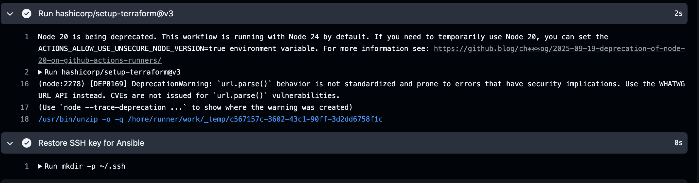
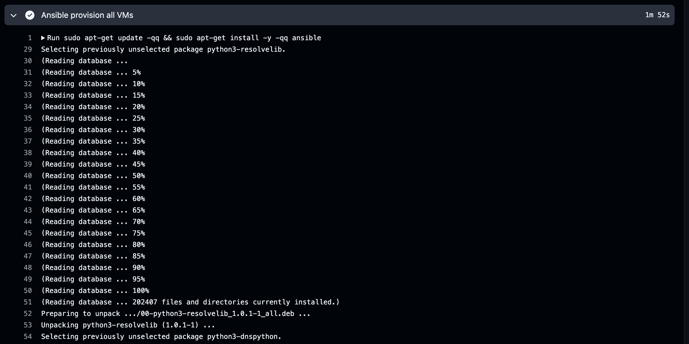
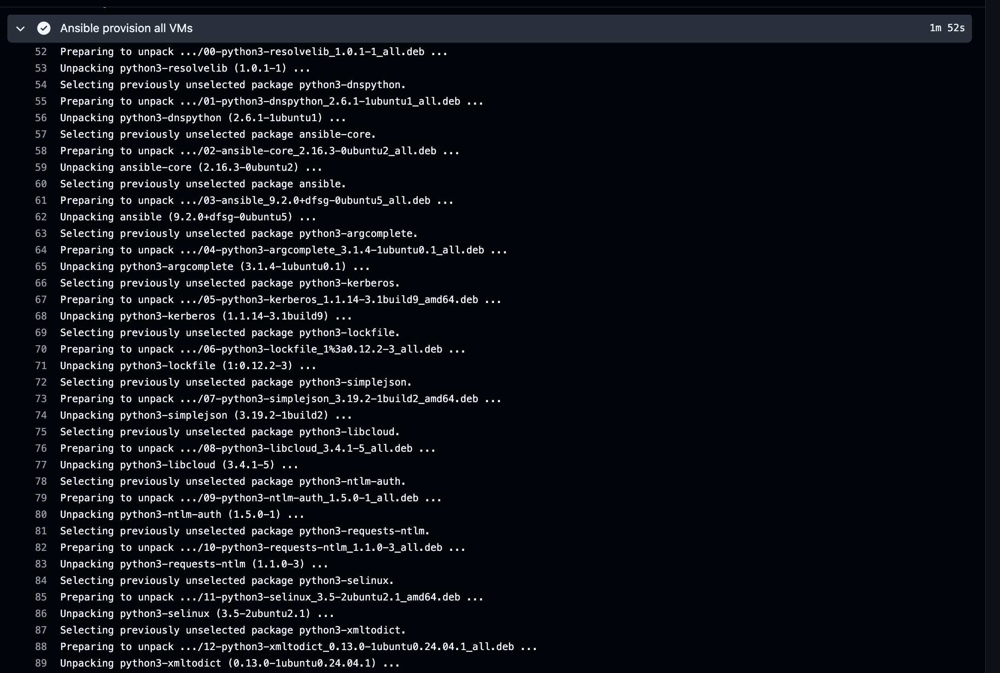
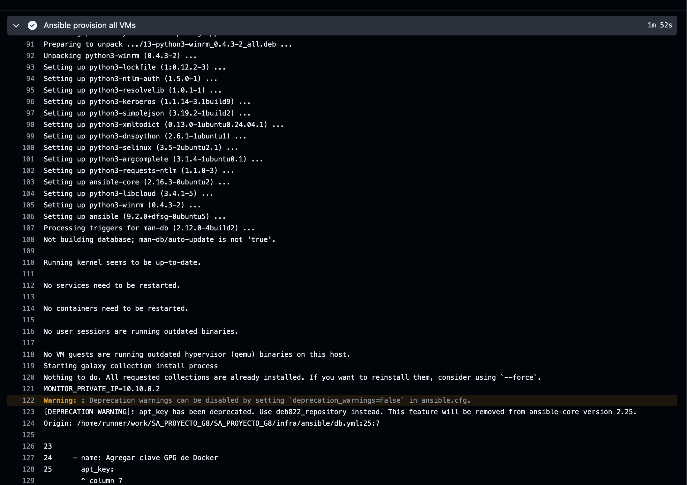
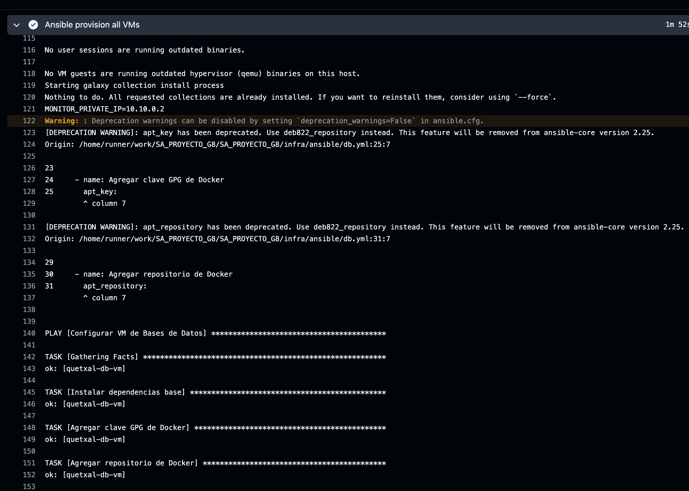
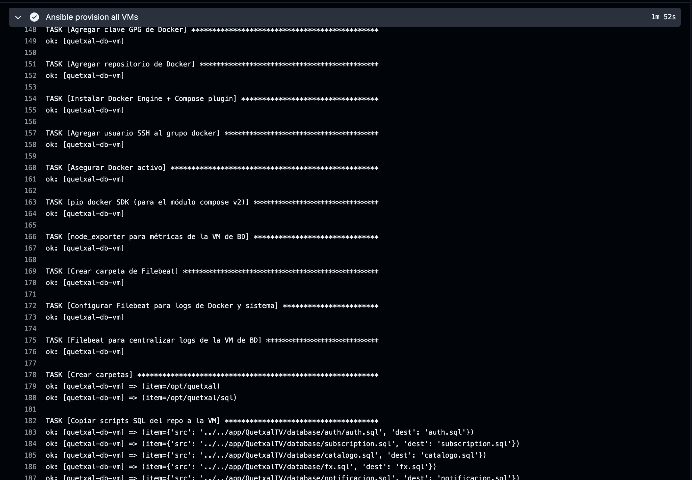
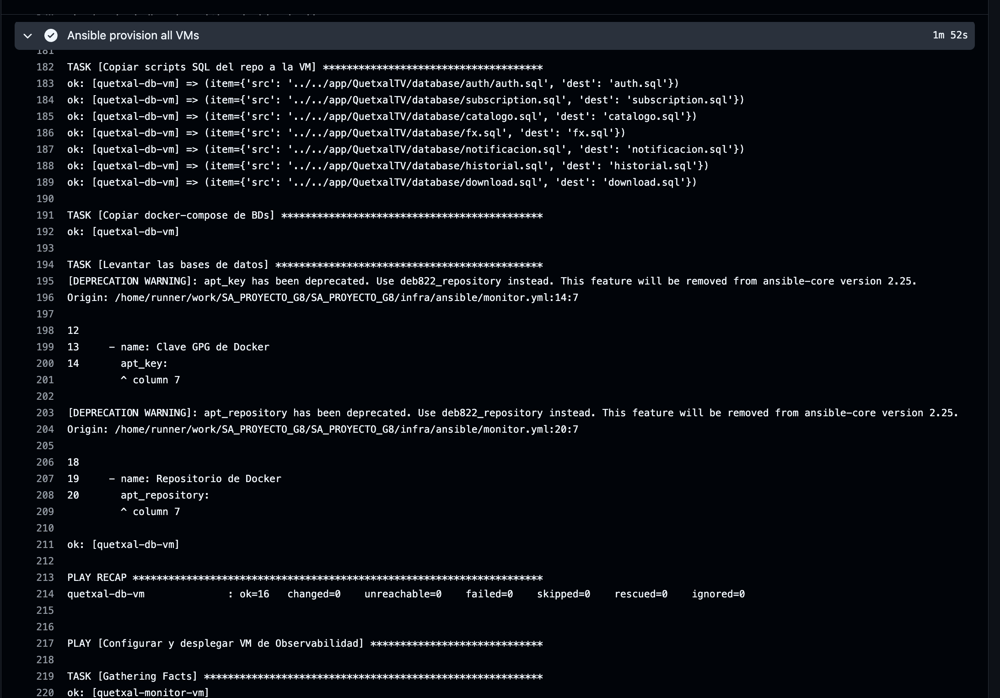
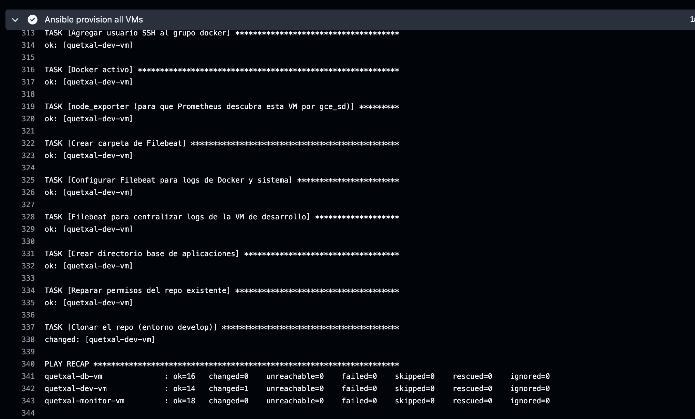

# Documentación Técnica: Ansible — QuetxalTV VM Provisioning

**Proyecto:** QuetxalTV — Software Avanzado, USAC  
**Grupo:** G8  
**Plataforma:** Ubuntu/Debian en GCE (Google Compute Engine)  
**Versión de Ansible:** 2.x (community.docker, community.general)  
**Colecciones usadas:** `community.docker`, `community.general`

---

## Tabla de Contenidos

1. [¿Qué es Ansible?](#1-qué-es-ansible)
2. [¿Cómo funciona?](#2-cómo-funciona)
3. [Arquitectura de la automatización en QuetxalTV](#3-arquitectura-de-la-automatización-en-quetxaltv)
4. [Estructura de archivos](#4-estructura-de-archivos)
5. [Configuración paso a paso](#5-configuración-paso-a-paso)
   - [5.1 ansible.cfg — Configuración global](#51-ansiblecfg--configuración-global)
   - [5.2 Inventario dinámico desde Terraform](#52-inventario-dinámico-desde-terraform)
   - [5.3 db.yml — Playbook de la VM de Base de Datos](#53-dbym--playbook-de-la-vm-de-base-de-datos)
   - [5.4 dev.yml — Playbook de la VM de Desarrollo](#54-devyml--playbook-de-la-vm-de-desarrollo)
   - [5.5 monitor.yml — Playbook de la VM de Observabilidad](#55-monitoryml--playbook-de-la-vm-de-observabilidad)
   - [5.6 db-migrations.yml — Aplicación de migraciones SQL](#56-db-migrationsyml--aplicación-de-migraciones-sql)
   - [5.7 Archivos de soporte (files/)](#57-archivos-de-soporte-files)
6. [Integración con CI/CD](#6-integración-con-cicd)
7. [Variables de entorno críticas](#7-variables-de-entorno-críticas)
8. [Ejecución y logs — Evidencia](#8-ejecución-y-logs--evidencia)

---

## 1. ¿Qué es Ansible?

Ansible es una herramienta de **automatización IT agentless** (sin agente) desarrollada por Red Hat que permite configurar servidores, desplegar aplicaciones y orquestar flujos de trabajo complejos, usando únicamente conexiones **SSH** estándar.

### ¿Por qué "agentless"?

A diferencia de otras herramientas como Puppet o Chef que requieren instalar un agente (daemon) en cada servidor gestionado, Ansible solo necesita:

| Requisito en la máquina de control | Requisito en el servidor objetivo |
|------------------------------------|-----------------------------------|
| Python 3 + Ansible instalado | Python 3 (preinstalado en Debian/Ubuntu) |
| Acceso SSH con llave privada | Puerto 22 abierto + llave pública autorizada |

Esto simplifica enormemente la gestión inicial: las VMs creadas por Terraform ya tienen Python 3 y la llave SSH inyectada via metadatos, por lo que Ansible puede conectarse inmediatamente.

### Conceptos clave

| Concepto | Descripción |
|----------|-------------|
| **Inventario** | Lista de hosts organizados en grupos (`[db]`, `[dev]`, `[monitor]`) |
| **Playbook** | Archivo YAML con la secuencia de tareas a ejecutar en los hosts |
| **Task** | Unidad de trabajo: instala un paquete, copia un archivo, inicia un servicio |
| **Module** | Biblioteca de Ansible que implementa una tarea (apt, copy, service, docker_container) |
| **Handler** | Tarea que se ejecuta solo si otra tarea la notifica (ej. reiniciar nginx) |
| **Variable** | Valor parametrizable (IPs, contraseñas, nombres) que puede venir de inventory, env vars o archivos |
| **Role** | Estructura para reusar conjuntos de tareas, handlers y templates |
| **Template (Jinja2)** | Archivo con variables `{{ var }}` que Ansible reemplaza antes de copiarlo |
| **Idempotencia** | Propiedad de que ejecutar el playbook N veces produce el mismo resultado que ejecutarlo 1 vez |

---

## 2. ¿Cómo funciona?

### Flujo de ejecución

```
┌─────────────────────────────────────────────────────────────────────┐
│                    FLUJO DE ANSIBLE                                  │
│                                                                      │
│  1. ansible-playbook db.yml -i inventory.ini                         │
│       │                                                              │
│       ▼                                                              │
│  2. Lee inventario → resuelve IPs del grupo [db]                     │
│       │                                                              │
│       ▼                                                              │
│  3. Conecta por SSH a cada host del grupo                            │
│       │                                                              │
│       ▼                                                              │
│  4. Para cada task:                                                  │
│       ├── Sube módulo Python temporal al host                        │
│       ├── Ejecuta el módulo en el host                               │
│       ├── Recibe resultado (OK / CHANGED / FAILED)                   │
│       └── Elimina el módulo temporal                                 │
│       │                                                              │
│       ▼                                                              │
│  5. Muestra resumen (PLAY RECAP): ok / changed / failed / skipped   │
└─────────────────────────────────────────────────────────────────────┘
```

### Idempotencia

Un playbook de Ansible es **idempotente**: se puede ejecutar múltiples veces sin efectos secundarios. Por ejemplo:

- `apt: name: docker-ce state: present` → Si Docker ya está instalado, la tarea reporta `ok` (sin cambios). Si no está, lo instala y reporta `changed`.
- `service: name: docker state: started` → Si Docker ya está corriendo, `ok`. Si no, lo inicia y reporta `changed`.

Esta propiedad permite que el CI/CD ejecute los playbooks en cada push sin temor a romper configuraciones existentes.

### Modelo de conexión SSH

```
GitHub Actions Runner
      │
      │  SSH (llave privada: ~/.ssh/quetxal_deploy)
      ▼
quetxal-db-vm (Debian 12)
quetxal-monitor-vm (Debian 12)
quetxal-dev-vm (Debian 12)
```

La llave privada se restaura desde el secret `GCE_SSH_PRIVATE_KEY` en el inicio del workflow. La llave pública correspondiente fue inyectada en las VMs por Terraform via el metadato `ssh-keys`.

---

## 3. Arquitectura de la automatización en QuetxalTV

Cada VM tiene un rol claro y un playbook dedicado:

```
infra/ansible/
│
├── db.yml          ──►  quetxal-db-vm
│                        ├── Docker Engine + Compose
│                        ├── 7 contenedores PostgreSQL (puertos 5432-5438)
│                        ├── node-exporter (métricas VM → Prometheus)
│                        └── filebeat (logs Docker → Logstash)
│
├── dev.yml         ──►  quetxal-dev-vm
│                        ├── Docker Engine + Compose
│                        ├── Git + clonación del repo (rama develop)
│                        ├── node-exporter
│                        └── filebeat
│
├── monitor.yml     ──►  quetxal-monitor-vm
│                        ├── ELK Stack (Elasticsearch + Logstash + Kibana)
│                        ├── Prometheus + Grafana
│                        └── Locust (pruebas de carga)
│
└── db-migrations.yml ──►  quetxal-db-vm
                           └── Aplica migraciones SQL sin borrar datos
```

---

## 4. Estructura de archivos

```
infra/ansible/
├── ansible.cfg                    # Configuración global de Ansible
├── inventory.ini.example          # Plantilla de inventario (no commitear IPs reales)
├── db.yml                         # Playbook: VM de Base de Datos
├── dev.yml                        # Playbook: VM de Desarrollo
├── monitor.yml                    # Playbook: VM de Observabilidad
├── db-migrations.yml              # Playbook: Migraciones SQL
└── files/
    ├── apply-migrations.sh        # Script bash de aplicación de migraciones
    ├── docker-compose.db.yml      # Compose para los 7 PostgreSQL
    └── observability/
        ├── elk/
        │   ├── docker-compose.yml # Elasticsearch + Logstash + Kibana
        │   └── logstash.conf      # Pipeline de procesamiento de logs
        ├── load/
        │   ├── locustfile.py      # Pruebas de carga con Locust
        │   └── run-locust.sh      # Script de arranque de Locust
        └── metrics/
            ├── docker-compose.yml # Prometheus + Grafana
            ├── prometheus.yml     # Configuración de scraping
            └── grafana/           # Dashboards preconfigurados
```

---

## 5. Configuración paso a paso

### 5.1 ansible.cfg — Configuración global

**Archivo:** `infra/ansible/ansible.cfg`

```ini
[defaults]
inventory            = inventory.ini
host_key_checking    = False
private_key_file     = ~/.ssh/quetxal_deploy
remote_user          = deployer
retry_files_enabled  = False
stdout_callback      = default
result_format        = yaml

[ssh_connection]
pipelining = True
```

| Parámetro | Valor | Propósito |
|-----------|-------|-----------|
| `host_key_checking = False` | Deshabilitado | Evita el prompt de "¿confías en este host?" en CI (IPs cambian con cada Terraform apply) |
| `private_key_file` | `~/.ssh/quetxal_deploy` | Llave SSH restaurada desde el secret de GitHub |
| `remote_user = deployer` | `deployer` | Usuario Linux creado por Terraform en las VMs |
| `retry_files_enabled = False` | Deshabilitado | No genera archivos `.retry` que ensucian el repositorio |
| `stdout_callback = default` | Por defecto | Salida legible; evitar `yaml` (fue removido de community.general) |
| `pipelining = True` | Habilitado | Reduce las conexiones SSH agrupando comandos (mejora rendimiento ~3x) |

---

### 5.2 Inventario dinámico desde Terraform

**Archivo generado:** `infra/ansible/inventory.ini`

Terraform genera este archivo automáticamente con las IPs reales:

```ini
[db]
quetxal-db-vm ansible_host=34.X.X.X private_ip=10.10.0.X

[monitor]
quetxal-monitor-vm ansible_host=34.X.X.X private_ip=10.10.0.X

[dev]
quetxal-dev-vm ansible_host=34.X.X.X private_ip=10.10.0.X

[all:vars]
ansible_user=deployer
ansible_python_interpreter=/usr/bin/python3
```

La variable `private_ip` es un campo personalizado (no es un parámetro estándar de Ansible) que se lee con `awk` para construir la variable de entorno `MONITOR_PRIVATE_IP` antes de ejecutar los playbooks:

```bash
export MONITOR_PRIVATE_IP=$(awk '/\[monitor\]/{getline; match($0, /private_ip=([^ ]+)/, m); print m[1]}' inventory.ini)
```

Esta IP privada es la que Filebeat usa para enviar logs a Logstash (`output.logstash.hosts`), asegurando que el tráfico de logs nunca salga de la VPC.

---

### 5.3 db.yml — Playbook de la VM de Base de Datos

**Archivo:** `infra/ansible/db.yml`  
**Hosts objetivo:** grupo `[db]`  
**Usuario SSH:** `become: true` (sudo)

Este playbook convierte la VM `quetxal-db-vm` en un servidor de bases de datos con 7 instancias de PostgreSQL aisladas, cada una en su propio contenedor y puerto.

#### Sección de variables

```yaml
vars:
  app_user: "{{ ansible_user }}"     # usuario deployer
  db_user: "quetxal"
  db_password: "{{ lookup('env', 'QUETXAL_DB_PASSWORD') | default('CAMBIA_ESTA_PASSWORD', true) }}"
  auth_db_name:         "{{ lookup('env', 'AUTH_DB_NAME')         | default('auth_db', true) }}"
  subscription_db_name: "{{ lookup('env', 'SUBSCRIPTION_DB_NAME') | default('subscription_db', true) }}"
  catalogo_db_name:     "{{ lookup('env', 'CATALOGO_DB_NAME')     | default('catalogo_db', true) }}"
  fx_db_name:           "{{ lookup('env', 'FX_DB_NAME')           | default('fx_db', true) }}"
  notification_db_name: "{{ lookup('env', 'NOTIFICATION_DB_NAME') | default('notification_db', true) }}"
  historial_db_name:    "{{ lookup('env', 'HISTORIAL_DB_NAME')    | default('historial_db', true) }}"
  download_db_name:     "{{ lookup('env', 'DOWNLOAD_DB_NAME')     | default('download_db', true) }}"
  logstash_host:        "{{ lookup('env', 'MONITOR_PRIVATE_IP')   | default('10.10.0.9', true) }}"
```

`lookup('env', ...)` lee variables de entorno del runner de CI. Si no están definidas, usa un default. La contraseña viene del secret `AUTH_DB_PASSWORD` de GitHub Actions.

#### Tareas principales

**1. Instalación de dependencias**

```yaml
- name: Instalar dependencias base
  apt:
    name: [ca-certificates, curl, gnupg, python3-pip]
    update_cache: true
```

Actualiza el cache de apt e instala las herramientas base necesarias para agregar repositorios de terceros (Docker).

**2. Instalación de Docker**

```yaml
- name: Agregar clave GPG de Docker
  apt_key:
    url: https://download.docker.com/linux/debian/gpg
    keyring: /usr/share/keyrings/docker.gpg

- name: Agregar repositorio de Docker
  apt_repository:
    repo: "deb [signed-by=/usr/share/keyrings/docker.gpg] https://download.docker.com/linux/debian bookworm stable"

- name: Instalar Docker Engine + Compose plugin
  apt:
    name: [docker-ce, docker-ce-cli, containerd.io, docker-compose-plugin]

- name: Agregar usuario SSH al grupo docker
  user: { name: "{{ app_user }}", groups: docker, append: true }

- name: Asegurar Docker activo
  service: { name: docker, state: started, enabled: true }
```

Se agrega la clave GPG oficial de Docker para verificar la autenticidad del paquete antes de instalarlo. El usuario `deployer` se agrega al grupo `docker` para poder ejecutar comandos `docker` sin `sudo`.

**3. Node Exporter (métricas de la VM)**

```yaml
- name: node_exporter para métricas de la VM de BD
  community.docker.docker_container:
    name: node-exporter
    image: prom/node-exporter:v1.8.1
    network_mode: host
    restart_policy: unless-stopped
```

`network_mode: host` permite que node_exporter exponga métricas en el puerto `9100` de la IP real de la VM (no dentro de una red Docker). Prometheus lo descubre automáticamente via `gce_sd_configs` (autodescubrimiento por tags de GCP).

**4. Filebeat (centralización de logs)**

```yaml
- name: Configurar Filebeat para logs de Docker y sistema
  copy:
    dest: /opt/filebeat/filebeat.yml
    content: |
      filebeat.inputs:
        - type: container
          paths: ["/var/lib/docker/containers/*/*.log"]
          processors:
            - add_docker_metadata:
                host: "unix:///var/run/docker.sock"
        - type: filestream
          id: system-logs
          paths: ["/var/log/*.log"]
      fields:
        environment: gce-db
        host_role: db
      fields_under_root: true
      output.logstash:
        hosts: ["{{ logstash_host }}:5044"]

- name: Filebeat para centralizar logs de la VM de BD
  community.docker.docker_container:
    name: filebeat
    image: docker.elastic.co/beats/filebeat:8.13.4
    user: root
    volumes:
      - /opt/filebeat/filebeat.yml:/usr/share/filebeat/filebeat.yml:ro
      - /var/lib/docker/containers:/var/lib/docker/containers:ro
      - /var/run/docker.sock:/var/run/docker.sock:ro
      - /var/log:/var/log:ro
```

Filebeat recolecta logs de todos los contenedores Docker de la VM y los envía a Logstash (IP privada del monitor). Los campos `environment: gce-db` y `host_role: db` permiten filtrar en Kibana.

**5. Despliegue de las bases de datos**

```yaml
- name: Copiar scripts SQL del repo a la VM
  copy:
    src: "{{ item.src }}"
    dest: "/opt/quetxal/sql/{{ item.dest }}"
  loop:
    - { src: "../../app/QuetxalTV/database/auth/auth.sql",    dest: "auth.sql" }
    - { src: "../../app/QuetxalTV/database/subscription.sql", dest: "subscription.sql" }
    - { src: "../../app/QuetxalTV/database/catalogo.sql",     dest: "catalogo.sql" }
    # ... etc.

- name: Copiar docker-compose de BDs
  template:
    src: files/docker-compose.db.yml
    dest: /opt/quetxal/docker-compose.db.yml

- name: Levantar las bases de datos
  community.docker.docker_compose_v2:
    project_src: /opt/quetxal
    files: [docker-compose.db.yml]
    state: present
```

El módulo `template` procesa `docker-compose.db.yml` con Jinja2, reemplazando `{{ db_user }}`, `{{ db_password }}`, `{{ auth_db_name }}`, etc., con los valores reales antes de copiarlo. `docker_compose_v2` levanta los 7 contenedores de PostgreSQL con idempotencia (no los recrea si ya están corriendo con la misma configuración).

---

### 5.4 dev.yml — Playbook de la VM de Desarrollo

**Archivo:** `infra/ansible/dev.yml`  
**Hosts objetivo:** grupo `[dev]`

Prepara la VM `quetxal-dev-vm` para ejecutar el entorno develop mediante Docker Compose.

#### Tareas distintivas respecto a db.yml

**Clonación del repositorio**

```yaml
- name: Crear directorio base de aplicaciones
  file:
    path: /app
    state: directory
    owner: "{{ app_user }}"
    group: "{{ app_user }}"
    mode: "0755"

- name: Reparar permisos del repo existente
  file:
    path: /app/SA_PROYECTO_G8
    state: directory
    owner: "{{ app_user }}"
    group: "{{ app_user }}"
    recurse: true

- name: Clonar el repo (entorno develop)
  git:
    repo: "https://github.com/Ggi0/SA_PROYECTO_G8.git"
    dest: /app/SA_PROYECTO_G8
    version: develop
  become_user: "{{ app_user }}"
```

La tarea de reparar permisos previene errores de `git` cuando el runner de CI/CD accede como root pero el repo fue clonado por otro usuario. Se clona específicamente la rama `develop`, que es la que el CD pipeline usará para hacer `git pull` en los deploys posteriores.

**Filebeat con etiquetas de develop**

```yaml
fields:
  environment: gce-dev
  host_role: dev
```

Los logs de la VM de desarrollo se etiquetan como `gce-dev` para distinguirlos en Kibana de los logs de producción.

---

### 5.5 monitor.yml — Playbook de la VM de Observabilidad

**Archivo:** `infra/ansible/monitor.yml`  
**Hosts objetivo:** grupo `[monitor]`

Configura la VM `quetxal-monitor-vm` con toda la stack de observabilidad:

#### ELK Stack

Los archivos de configuración se toman de `files/observability/elk/`:

- **`docker-compose.yml`**: Define los contenedores de Elasticsearch, Logstash y Kibana.
- **`logstash.conf`**: Pipeline de Logstash que recibe logs de Filebeat (puerto `5044`), los procesa y los indexa en Elasticsearch. Ejemplo de pipeline:

```
input { beats { port => 5044 } }
filter {
  # Parseo de logs JSON de Docker
  if [log][file][path] =~ "docker" {
    json { source => "message" }
  }
}
output {
  elasticsearch {
    hosts => ["elasticsearch:9200"]
    index => "quetxal-%{environment}-%{+YYYY.MM.dd}"
  }
}
```

#### Prometheus + Grafana

Los archivos vienen de `files/observability/metrics/`:

- **`prometheus.yml`**: Configura los scrape targets. Usa `gce_sd_configs` para autodescubrir las VMs de GCP:

```yaml
scrape_configs:
  - job_name: 'gce-vms'
    gce_sd_configs:
      - project: quetxal-project
        zone: us-central1-a
    relabel_configs:
      - source_labels: [__meta_gce_tag_ssh]
        action: keep
        regex: "true"
```

- **`grafana/`**: Dashboards JSON preconfigurados para visualizar métricas de node_exporter (CPU, RAM, disco de las VMs) y métricas de la aplicación.

#### Locust (pruebas de carga)

Los archivos de `files/observability/load/`:

- **`locustfile.py`**: Define los escenarios de carga (endpoints a probar, patrones de usuarios).
- **`run-locust.sh`**: Arranca Locust en modo headless o web UI en el puerto `8089`.

---

### 5.6 db-migrations.yml — Aplicación de migraciones SQL

**Archivo:** `infra/ansible/db-migrations.yml`

Aplica migraciones SQL incrementales **sin destruir datos**:

```yaml
- name: Crear carpeta de migraciones
  file: { path: /opt/quetxal/migrations, state: directory, mode: "0755" }

- name: Sincronizar migraciones del repo a la VM
  copy:
    src: "{{ repo_migrations_dir }}/"
    dest: /opt/quetxal/migrations/

- name: Copiar el script aplicador
  copy:
    src: files/apply-migrations.sh
    dest: /opt/quetxal/apply-migrations.sh
    mode: "0755"

- name: Ejecutar migraciones pendientes
  command: bash /opt/quetxal/apply-migrations.sh
  register: mig
  changed_when: "'aplicando' in mig.stdout"

- name: Mostrar salida
  debug: { var: mig.stdout_lines }
```

`changed_when: "'aplicando' in mig.stdout"` implementa idempotencia manual: la tarea solo reporta `changed` si el script realmente aplicó alguna migración. Si todas las migraciones ya estaban aplicadas, reporta `ok`.

El script `apply-migrations.sh` lleva un registro de qué migraciones ya se ejecutaron (similar a Flyway/Liquibase) para no ejecutar la misma migración dos veces.

---

### 5.7 Archivos de soporte (files/)

#### `docker-compose.db.yml`

Template Jinja2 que define los 7 contenedores de PostgreSQL. Cada base de datos del microservicio tiene su propio contenedor en un puerto diferente:

| Contenedor | Puerto | Base de datos | Microservicio |
|-----------|--------|---------------|---------------|
| `postgres-auth` | 5432 | `auth_db` | auth-service |
| `postgres-subscription` | 5433 | `subscription_db` | subscription-service |
| `postgres-catalogo` | 5434 | `catalogo_db` | catalogo-service |
| `postgres-fx` | 5435 | `fx_db` | fx-service |
| `postgres-notification` | 5436 | `notification_db` | notification-service |
| `postgres-historial` | 5437 | `historial_db` | historial-service |
| `postgres-download` | 5438 | `download_db` | download-service |

#### `apply-migrations.sh`

Script bash que itera sobre los archivos `*.sql` en `/opt/quetxal/migrations/` en orden alfabético y los aplica a la base de datos correspondiente, manteniendo un registro de los ya aplicados.

---

## 6. Integración con CI/CD

Ansible se ejecuta al final del workflow `infra.yml`, después de que Terraform ha creado o actualizado la infraestructura:

```
infra.yml (GitHub Actions)
│
├── Terraform init
├── Terraform plan
├── Terraform apply (si hay cambios)
├── Restore SSH key desde secret
├── terraform output -raw ansible_inventory > ansible/inventory.ini
├── Verificar SSH reachability (espera hasta 2 min por VM)
│
├── apt-get install ansible
├── ansible-galaxy collection install community.docker community.general
│
└── ansible-playbook db.yml monitor.yml dev.yml
        │
        ├── Conecta a quetxal-db-vm → instala Docker, PostgreSQL ×7
        ├── Conecta a quetxal-monitor-vm → instala ELK, Prometheus, Grafana
        └── Conecta a quetxal-dev-vm → instala Docker, clona repo
```

La sección de verificación SSH antes de ejecutar Ansible es crítica:

```bash
awk '/ansible_host=/{match($0, /ansible_host=([^ ]+)/, m); print m[1]}' ansible/inventory.ini | while read -r host; do
  for i in $(seq 1 12); do
    if timeout 10 bash -c "</dev/tcp/$host/22" 2>/dev/null; then
      echo "✓ $host reachable"
      break
    fi
    sleep 10
  done
done
```

Espera hasta 2 minutos (12 intentos × 10 segundos) a que el puerto 22 esté disponible en cada VM. Esto es necesario porque Terraform puede retornar "apply complete" antes de que la VM termine de inicializarse.

---

## 7. Variables de entorno críticas

Las siguientes variables de entorno del job de GitHub Actions se inyectan en los playbooks via `lookup('env', ...)`:

| Variable de entorno | Secret de GitHub | Usado en | Descripción |
|--------------------|-----------------|----------|-------------|
| `QUETXAL_DB_PASSWORD` | `AUTH_DB_PASSWORD` | db.yml | Contraseña del usuario `quetxal` en PostgreSQL |
| `AUTH_DB_NAME` | — (hardcoded) | db.yml | Nombre de la BD de auth |
| `SUBSCRIPTION_DB_NAME` | — | db.yml | Nombre de la BD de subscriptions |
| `CATALOGO_DB_NAME` | — | db.yml | Nombre de la BD de catálogo |
| `FX_DB_NAME` | — | db.yml | Nombre de la BD de fx |
| `NOTIFICATION_DB_NAME` | — | db.yml | Nombre de la BD de notificaciones |
| `HISTORIAL_DB_NAME` | — | db.yml | Nombre de la BD de historial |
| `DOWNLOAD_DB_NAME` | — | db.yml | Nombre de la BD de downloads |
| `MONITOR_PRIVATE_IP` | (generado por Terraform) | db.yml, dev.yml | IP privada del monitor para Filebeat |

El valor de `MONITOR_PRIVATE_IP` se extrae del inventario generado por Terraform antes de ejecutar Ansible:

```bash
export MONITOR_PRIVATE_IP=$(awk '/\[monitor\]/{getline; match($0, /private_ip=([^ ]+)/, m); print m[1]}' inventory.ini)
```

---

## 8. Ejecución y logs — Evidencia

A continuación se documentan los logs esperados de la ejecución de los playbooks. Las capturas corresponden a la ejecución en el pipeline CI/CD de QuetxalTV G8.

### 8.1 Instalación de Ansible y colecciones

El paso de setup en GitHub Actions instala Ansible y las colecciones necesarias.

> GitHub Actions > infra.yml > paso `Ansible provision all VMs` — inicio del log mostrando la instalación de `community.docker` y `community.general`.



### 8.2 Ejecución de db.yml

El log de Ansible para el playbook de la VM de BD muestra cada tarea con su resultado:

```
PLAY [Configurar VM de Bases de Datos] *************************************

TASK [Gathering Facts] ******************************************************
ok: [quetxal-db-vm]

TASK [Instalar dependencias base] ******************************************
changed: [quetxal-db-vm]

TASK [Agregar clave GPG de Docker] ******************************************
changed: [quetxal-db-vm]

TASK [Agregar repositorio de Docker] ****************************************
changed: [quetxal-db-vm]

TASK [Instalar Docker Engine + Compose plugin] ******************************
changed: [quetxal-db-vm]

TASK [Agregar usuario SSH al grupo docker] **********************************
changed: [quetxal-db-vm]

TASK [Asegurar Docker activo] ***********************************************
ok: [quetxal-db-vm]

TASK [pip docker SDK] *******************************************************
changed: [quetxal-db-vm]

TASK [node_exporter para métricas de la VM de BD] ***************************
changed: [quetxal-db-vm]

TASK [Crear carpeta de Filebeat] ********************************************
changed: [quetxal-db-vm]

TASK [Configurar Filebeat] **************************************************
changed: [quetxal-db-vm]

TASK [Filebeat para centralizar logs] ***************************************
changed: [quetxal-db-vm]

TASK [Crear carpetas] *******************************************************
changed: [quetxal-db-vm]

TASK [Copiar scripts SQL del repo a la VM] **********************************
changed: [quetxal-db-vm] => (item=auth.sql)
changed: [quetxal-db-vm] => (item=subscription.sql)
changed: [quetxal-db-vm] => (item=catalogo.sql)
changed: [quetxal-db-vm] => (item=fx.sql)
changed: [quetxal-db-vm] => (item=notificacion.sql)
changed: [quetxal-db-vm] => (item=historial.sql)
changed: [quetxal-db-vm] => (item=download.sql)

TASK [Copiar docker-compose de BDs] ******************************************
changed: [quetxal-db-vm]

TASK [Levantar las bases de datos] *******************************************
changed: [quetxal-db-vm]

PLAY RECAP *******************************************************************
quetxal-db-vm : ok=16  changed=14  unreachable=0  failed=0  skipped=0
```

>  GitHub Actions > infra.yml > paso `Ansible provision all VMs` — log completo del playbook `db.yml` mostrando el `PLAY RECAP` con `failed=0`.
> paso 1


> paso 2


> paso 3


> paso 4


> paso 5



> paso 6



> paso 7



> paso 8


### 8.3 Ejecución de dev.yml

```
PLAY [Configurar VM de Desarrollo] *****************************************

...

TASK [Clonar el repo (entorno develop)] *************************************
changed: [quetxal-dev-vm]

PLAY RECAP *******************************************************************
quetxal-dev-vm : ok=14  changed=12  unreachable=0  failed=0  skipped=0
```

> **📸 Captura:** GitHub Actions > infra.yml > log del playbook `dev.yml` — mostrar especialmente la tarea `Clonar el repo` y el `PLAY RECAP` exitoso.

### 8.4 Segunda ejecución (idempotencia)

En una segunda ejecución (sin cambios en la infraestructura), Ansible reporta `ok` en todas las tareas ya aplicadas:

```
PLAY RECAP *******************************************************************
quetxal-db-vm     : ok=16  changed=0  unreachable=0  failed=0  skipped=0
quetxal-monitor-vm: ok=12  changed=0  unreachable=0  failed=0  skipped=0
quetxal-dev-vm    : ok=14  changed=0  unreachable=0  failed=0  skipped=0
```

`changed=0` confirma que Ansible detectó que el estado deseado ya estaba presente y no realizó cambios innecesarios. Esto es la idempotencia en acción.

> **📸 Captura:** Segunda ejecución del job en GitHub Actions mostrando `changed=0` en los tres hosts.

### 8.5 Verificación en la VM (estado de contenedores)

Después de ejecutar Ansible sobre `quetxal-db-vm`, el comando `docker ps` dentro de la VM muestra los 7 contenedores de PostgreSQL corriendo:

```
CONTAINER ID   IMAGE            COMMAND                  STATUS          PORTS
a1b2c3d4e5f6   postgres:15      "docker-entrypoint.s…"  Up 2 minutes    0.0.0.0:5432->5432/tcp   postgres-auth
b2c3d4e5f6a1   postgres:15      "docker-entrypoint.s…"  Up 2 minutes    0.0.0.0:5433->5432/tcp   postgres-subscription
c3d4e5f6a1b2   postgres:15      "docker-entrypoint.s…"  Up 2 minutes    0.0.0.0:5434->5432/tcp   postgres-catalogo
d4e5f6a1b2c3   postgres:15      "docker-entrypoint.s…"  Up 2 minutes    0.0.0.0:5435->5432/tcp   postgres-fx
e5f6a1b2c3d4   postgres:15      "docker-entrypoint.s…"  Up 2 minutes    0.0.0.0:5436->5432/tcp   postgres-notification
f6a1b2c3d4e5   postgres:15      "docker-entrypoint.s…"  Up 2 minutes    0.0.0.0:5437->5432/tcp   postgres-historial
a1b2c3d4e5f7   postgres:15      "docker-entrypoint.s…"  Up 2 minutes    0.0.0.0:5438->5432/tcp   postgres-download
7f6a1b2c3d4e   prom/node-expo…  "/bin/node_exporter"    Up 2 minutes                             node-exporter
8a1b2c3d4e5f   filebeat:8.13.4  "filebeat -e -strict…"  Up 2 minutes                             filebeat
```

> **📸 Captura:** SSH a `quetxal-db-vm` → `docker ps` mostrando los 9 contenedores activos (7 PostgreSQL + node-exporter + filebeat).

### 8.6 Kibana y Grafana operativos

Tras la ejecución exitosa de `monitor.yml`, las interfaces web de observabilidad están disponibles en los puertos correspondientes de la VM de monitoreo.

> **📸 Captura:** Kibana en `http://{MONITOR_IP}:5601` — pantalla principal con índices `quetxal-*` mostrando logs del sistema.

> **📸 Captura:** Grafana en `http://{MONITOR_IP}:3000` — dashboard de métricas de nodo mostrando CPU y memoria de las VMs de QuetxalTV.

---
