# Documentación Técnica: Terraform — QuetxalTV Infrastructure as Code

**Proyecto:** QuetxalTV — Software Avanzado, USAC  
**Grupo:** G8  
**Plataforma:** Google Cloud Platform (GCP)  
**Versión de Terraform:** >= 1.5.0  
**Provider:** `hashicorp/google ~> 5.0`

---

## Tabla de Contenidos

1. [¿Qué es Terraform?](#1-qué-es-terraform)
2. [¿Cómo funciona?](#2-cómo-funciona)
3. [Arquitectura General de la Infraestructura](#3-arquitectura-general-de-la-infraestructura)
4. [Estructura de Archivos](#4-estructura-de-archivos)
5. [Configuración paso a paso](#5-configuración-paso-a-paso)
   - [5.1 Backend remoto (estado)](#51-backend-remoto-estado)
   - [5.2 Provider y versiones](#52-provider-y-versiones)
   - [5.3 APIs de GCP habilitadas](#53-apis-de-gcp-habilitadas)
   - [5.4 Red: VPC, Subred y Firewall](#54-red-vpc-subred-y-firewall)
   - [5.5 Instancias de Cómputo (VMs)](#55-instancias-de-cómputo-vms)
   - [5.6 Clúster GKE](#56-clúster-gke)
   - [5.7 Artifact Registry](#57-artifact-registry)
   - [5.8 IAM y Workload Identity Federation](#58-iam-y-workload-identity-federation)
   - [5.9 Almacenamiento (GCS Buckets)](#59-almacenamiento-gcs-buckets)
   - [5.10 Outputs y generación de inventario Ansible](#510-outputs-y-generación-de-inventario-ansible)
   - [5.11 Variables](#511-variables)
6. [Integración con CI/CD](#6-integración-con-cicd)
7. [Recursos levantados — Evidencia](#7-recursos-levantados--evidencia)

---

## 1. ¿Qué es Terraform?

Terraform es una herramienta de **Infrastructure as Code (IaC)** desarrollada por HashiCorp que permite definir, previsualizar y aprovisionar infraestructura en la nube (y on-premise) usando un lenguaje declarativo llamado **HCL (HashiCorp Configuration Language)**.

### Modelo declarativo vs. imperativo

| Paradigma | Descripción | Ejemplo |
|-----------|-------------|---------|
| **Declarativo** (Terraform) | Describes *qué* quieres que exista. Terraform calcula cómo llegar ahí. | `resource "google_compute_instance" "db" { machine_type = "e2-medium" }` |
| **Imperativo** (scripts bash/gcloud) | Describes *cómo* crearlo paso a paso. | `gcloud compute instances create db-vm --machine-type=e2-medium` |

Con Terraform, si el recurso ya existe y su estado coincide con el código, **no se toca**. Si hay diferencias, Terraform calcula un plan de cambios mínimo.

### Conceptos clave

- **Provider:** Plugin que conecta Terraform con un proveedor de nube o servicio. En QuetxalTV se usa `hashicorp/google` para GCP.
- **Resource:** Unidad de infraestructura gestionada (VM, red, bucket, etc.).
- **State file (`.tfstate`):** Archivo JSON donde Terraform registra el estado actual conocido de toda la infraestructura. Es la fuente de verdad que usa para calcular diferencias.
- **Plan:** Operación de solo lectura que muestra qué cambiaría si se aplica el código.
- **Apply:** Ejecuta los cambios calculados en el plan.
- **Destroy:** Elimina todos los recursos gestionados por Terraform.

---

## 2. ¿Cómo funciona?

El flujo de trabajo estándar de Terraform sigue tres fases:
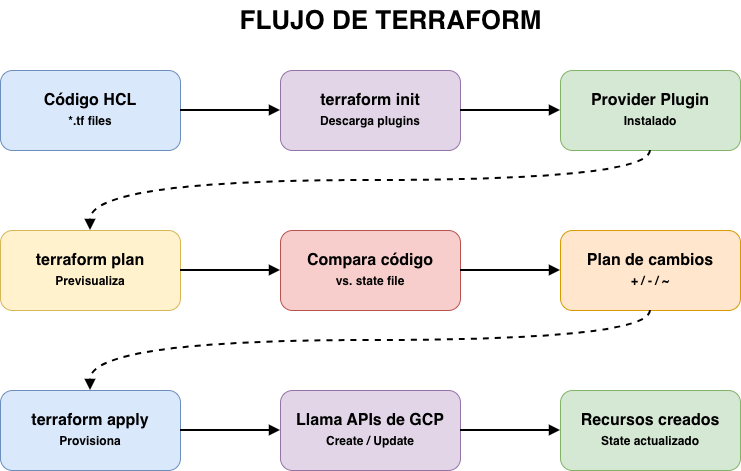

### Gestión del estado remoto

El estado de Terraform es crítico: si se pierde o corrompe, Terraform pierde rastreo de los recursos existentes. Por eso QuetxalTV usa un **backend remoto en GCS** en lugar del archivo local `terraform.tfstate`:

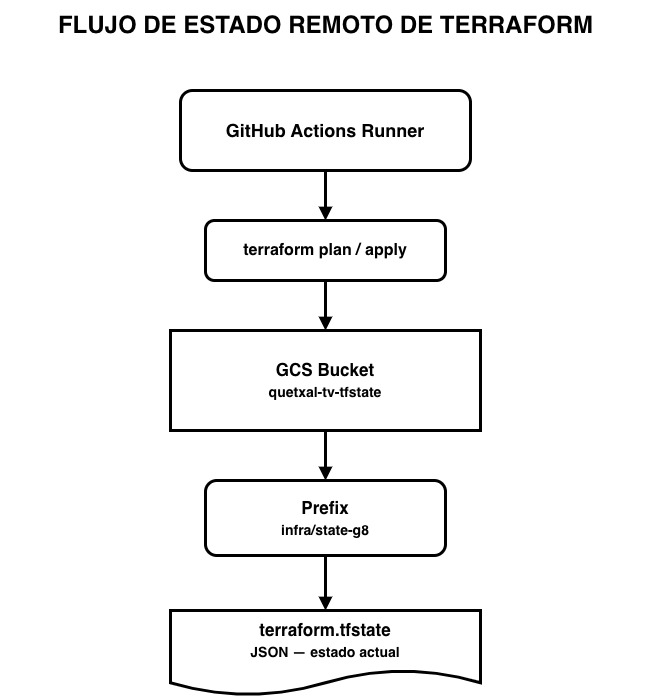
Beneficios del backend remoto:
- **Compartido:** Todos los miembros del equipo y el CI/CD acceden al mismo estado.
- **Locking:** GCS provee locking automático para evitar applies concurrentes.
- **Historial:** Las versiones del bucket permiten recuperar estados anteriores.

---

## 3. Arquitectura General de la Infraestructura

QuetxalTV despliega dos entornos sobre una VPC compartida en GCP:


---

## 4. Estructura de Archivos

```
infra/terraform/
├── apis.tf          # Habilitación de APIs de GCP
├── artifact.tf      # Artifact Registry (repositorio Docker)
├── backend.tf       # Estado remoto en GCS
├── compute.tf       # VMs (DB, Monitor, Dev) con IPs estáticas
├── gke.tf           # Clúster GKE y node pool
├── iam.tf           # Service Accounts, roles y Workload Identity
├── network.tf       # VPC, subred, firewalls, NAT
├── outputs.tf       # IPs, nombres, inventario Ansible
├── providers.tf     # Versión de Terraform y provider Google
├── storage.tf       # Buckets GCS (videos + backups)
├── variables.tf     # Declaración de todas las variables
└── terraform.tfvars.example  # Plantilla de valores (no commitear tfvars reales)
```

La separación por archivo sigue el principio de **separación de responsabilidades**: cada archivo agrupa recursos del mismo dominio, haciendo el código más legible y mantenible.

---

## 5. Configuración paso a paso

### 5.1 Backend remoto (estado)

**Archivo:** `backend.tf`

```hcl
terraform {
  backend "gcs" {
    bucket = "quetxal-tv-tfstate"
    prefix = "infra/state-g8"
  }
}
```

Este bloque le indica a Terraform que **no almacene el estado localmente**. En su lugar, lo guarda en el bucket `quetxal-tv-tfstate` bajo la ruta `infra/state-g8/default.tfstate`.

> **Prerequisito manual:** El bucket `quetxal-tv-tfstate` debe existir antes de ejecutar `terraform init`. Se crea una sola vez con `gcloud storage buckets create gs://quetxal-tv-tfstate --location=us-central1`.

---

### 5.2 Provider y versiones

**Archivo:** `providers.tf`

```hcl
terraform {
  required_version = ">= 1.5.0"
  required_providers {
    google = {
      source  = "hashicorp/google"
      version = "~> 5.0"
    }
  }
}

provider "google" {
  project = var.project_id
  region  = var.region
  zone    = var.zone
}
```

- `required_version`: Garantiza que todos usen Terraform 1.5+ (sintaxis compatible).
- `~> 5.0`: Acepta cualquier versión `5.x` del provider pero no la `6.0` (evita breaking changes).
- La autenticación en CI/CD ocurre via **Workload Identity Federation** (sin claves JSON).

---

### 5.3 APIs de GCP habilitadas

**Archivo:** `apis.tf`

```hcl
locals {
  gcp_apis = [
    "serviceusage.googleapis.com",
    "compute.googleapis.com",
    "container.googleapis.com",
    "artifactregistry.googleapis.com",
    "iam.googleapis.com",
    "iamcredentials.googleapis.com",
    "iap.googleapis.com",
    "sts.googleapis.com",
    "storage.googleapis.com",
    "cloudresourcemanager.googleapis.com",
  ]
}

resource "google_project_service" "enabled" {
  for_each           = toset(local.gcp_apis)
  service            = each.value
  disable_on_destroy = false
}
```

**¿Por qué es necesario?** GCP deshabilita la mayoría de sus APIs por defecto. Antes de crear cualquier recurso (VMs, GKE, buckets), la API correspondiente debe estar activa. El uso de `for_each` sobre el set de APIs itera y habilita cada una sin duplicar código.

`disable_on_destroy = false` evita que un `terraform destroy` deshabilite las APIs (lo cual podría romper otros proyectos o recursos no gestionados por este código).

Todas las demás resources tienen `depends_on = [google_project_service.enabled]` para garantizar que las APIs existan primero.

---

### 5.4 Red: VPC, Subred y Firewall

**Archivo:** `network.tf`

#### VPC y Subred

```hcl
resource "google_compute_network" "vpc" {
  name                    = "quetxal-vpc"
  auto_create_subnetworks = false
}

resource "google_compute_subnetwork" "subnet" {
  name          = "quetxal-subnet"
  ip_cidr_range = "10.10.0.0/24"
  region        = var.region
  network       = google_compute_network.vpc.id

  secondary_ip_range {
    range_name    = "pods"
    ip_cidr_range = "10.20.0.0/16"
  }
  secondary_ip_range {
    range_name    = "services"
    ip_cidr_range = "10.30.0.0/16"
  }
}
```

Se usa `auto_create_subnetworks = false` para tener **control total** sobre el espacio de IPs. La subred principal (`10.10.0.0/24`) aloja las VMs. Los rangos secundarios son requeridos por GKE en modo **VPC-native** para asignar IPs a pods (`10.20.0.0/16`) y services (`10.30.0.0/16`) sin conflicto.

#### Reglas de Firewall

| Nombre | Puertos | Origen | Destino (tag) | Propósito |
|--------|---------|--------|----------------|-----------|
| `allow_ssh` | 22 | `0.0.0.0/0` | `ssh` | GitHub Actions necesita SSH dinámico |
| `allow_iap_ssh` | 22 | `35.235.240.0/20` | `ssh` | Fallback SSH via IAP de Google |
| `allow_internal` | tcp/udp/icmp | VPC ranges | todos | Comunicación interna libre |
| `allow_postgres` | 5432-5438 | Red interna | `db` | PostgreSQL solo desde dentro de la VPC |
| `allow_monitor` | 5601, 3000, 9090, 8089 | `var.admin_cidr` | `monitor` | Kibana, Grafana, Prometheus, Locust |
| `allow_logstash` | 5044 | Red interna | `monitor` | Filebeat → Logstash |
| `allow_dev_app` | 8080, 3000 | `var.admin_cidr` | `dev-app` | Frontend + API Gateway en develop |

#### Cloud NAT

```hcl
resource "google_compute_router" "router" { ... }
resource "google_compute_router_nat" "nat" {
  nat_ip_allocate_option             = "AUTO_ONLY"
  source_subnetwork_ip_ranges_to_nat = "ALL_SUBNETWORKS_ALL_IP_RANGES"
}
```

Los nodos de GKE son **privados** (sin IP pública). Cloud NAT les permite salir a Internet (para descargar imágenes Docker de Artifact Registry, actualizaciones apt, etc.) sin exponer puertos de entrada.

---

### 5.5 Instancias de Cómputo (VMs)

**Archivo:** `compute.tf`

Se crean **tres VMs** con IPs públicas estáticas (no cambian al reiniciar):

```hcl
resource "google_compute_address" "db"      { name = "quetxal-db-ip"      }
resource "google_compute_address" "monitor" { name = "quetxal-monitor-ip" }
resource "google_compute_address" "dev"     { name = "quetxal-dev-ip"     }
```

#### VM de Base de Datos

```hcl
resource "google_compute_instance" "db" {
  name         = "quetxal-db-vm"
  machine_type = "e2-medium"
  zone         = var.zone
  tags         = ["ssh", "db"]
  boot_disk {
    initialize_params { image = "debian-cloud/debian-12"; size = 30 }
  }
  ...
}
```

- **`e2-medium`** (2 vCPU, 4 GB RAM): Suficiente para 7 instancias de PostgreSQL.
- **30 GB disco**: Para los datos de las bases de datos.
- **Tags `ssh` y `db`**: Las reglas de firewall usan estos tags para aplicar políticas específicas (SSH abierto, PostgreSQL solo desde red interna).

#### VM de Observabilidad

```hcl
resource "google_compute_instance" "monitor" {
  name         = "quetxal-monitor-vm"
  machine_type = "e2-standard-2"
  tags         = ["ssh", "monitor"]
  boot_disk {
    initialize_params { size = 50 }
  }
  service_account {
    email  = local.cicd_sa_email
    scopes = ["cloud-platform"]
  }
}
```

- **`e2-standard-2`** (2 vCPU, 8 GB RAM) con **50 GB disco**: ELK consume bastante memoria.
- Tiene **Service Account** con `cloud-platform`: Prometheus usa `gce_sd_configs` para **autodescubrir** VMs y nodos de GKE sin IPs manuales.

#### VM de Desarrollo

```hcl
resource "google_compute_instance" "dev" {
  name                      = "quetxal-dev-vm"
  machine_type              = "e2-standard-2"
  tags                      = ["ssh", "dev-app"]
  allow_stopping_for_update = true
  boot_disk {
    initialize_params { size = 40 }
  }
  service_account {
    email  = local.cicd_sa_email
    scopes = ["cloud-platform"]
  }
}
```

- **`allow_stopping_for_update = true`**: Permite que Terraform detenga la VM para cambiar el tipo de máquina sin destruirla.
- **40 GB**: Para imágenes Docker del entorno develop.
- **Tag `dev-app`**: Abre los puertos `8080` (frontend) y `3000` (API Gateway) al equipo.

---

### 5.6 Clúster GKE

**Archivo:** `gke.tf`

```hcl
resource "google_container_cluster" "primary" {
  name     = "quetxal-tv-cluster"
  location = var.zone

  remove_default_node_pool = true
  initial_node_count       = 1

  network    = google_compute_network.vpc.name
  subnetwork = google_compute_subnetwork.subnet.name

  ip_allocation_policy {
    cluster_secondary_range_name  = "pods"
    services_secondary_range_name = "services"
  }

  workload_identity_config {
    workload_pool = "${var.project_id}.svc.id.goog"
  }

  private_cluster_config {
    enable_private_nodes    = true
    enable_private_endpoint = false
    master_ipv4_cidr_block  = "172.16.0.0/28"
  }

  deletion_protection = false
}
```

Puntos clave:

- **`remove_default_node_pool = true`**: Se elimina el node pool por defecto para gestionar uno propio con autoscaling.
- **VPC-native** (`ip_allocation_policy`): Los pods reciben IPs reales de la VPC, habilitando comunicación directa entre GKE y las VMs sin NAT adicional.
- **Workload Identity**: Permite que pods de Kubernetes asuman identidades de GCP Service Accounts sin necesidad de claves JSON. Usado por `catalogo-service` para acceder a GCS.
- **Nodos privados** (`enable_private_nodes = true`): Los nodos no tienen IP pública. Salen a Internet por Cloud NAT. `enable_private_endpoint = false` permite que el master endpoint sea público (para que kubectl desde GitHub Actions funcione).

#### Node Pool con Autoscaling

```hcl
resource "google_container_node_pool" "primary_nodes" {
  name       = "quetxal-pool"
  node_count = var.gke_node_count   # default: 2

  autoscaling {
    min_node_count = 1
    max_node_count = 3
  }

  node_config {
    machine_type = var.gke_machine_type  # default: e2-standard-2
    disk_size_gb = 50
    oauth_scopes = ["https://www.googleapis.com/auth/cloud-platform"]
    workload_metadata_config { mode = "GKE_METADATA" }
  }

  management {
    auto_repair  = true
    auto_upgrade = true
  }
}
```

El autoscaling ajusta entre 1 y 3 nodos según la carga. `auto_repair` y `auto_upgrade` mantienen el clúster sano sin intervención manual.

---

### 5.7 Artifact Registry

**Archivo:** `artifact.tf`

```hcl
resource "google_artifact_registry_repository" "rp" {
  repository_id = "quetxal-tv-rp"
  location      = var.region
  format        = "DOCKER"
  description   = "Imágenes Docker de Quetxal TV"
  depends_on    = [google_project_service.enabled]
}
```

Este repositorio centraliza todas las imágenes Docker del proyecto. El CD pipeline construye las imágenes y las publica aquí bajo el formato `{LOCATION}-docker.pkg.dev/{PROJECT}/{REPO}/{SERVICE}:{TAG}`.

---

### 5.8 IAM y Workload Identity Federation

**Archivo:** `iam.tf`

```hcl
locals {
  cicd_sa_email = "quetxal-tv-cicd@${var.project_id}.iam.gserviceaccount.com"

  cicd_roles = [
    "roles/artifactregistry.writer",
    "roles/container.admin",
    "roles/storage.admin",
    "roles/compute.admin",
    "roles/iam.serviceAccountAdmin",
    "roles/iam.workloadIdentityPoolAdmin",
    ...
  ]
}

resource "google_project_iam_member" "cicd_roles" {
  for_each = toset(local.cicd_roles)
  project  = var.project_id
  role     = each.value
  member   = "serviceAccount:${local.cicd_sa_email}"

  lifecycle { prevent_destroy = true }
}
```

La Service Account `quetxal-tv-cicd` es la identidad usada por GitHub Actions. `lifecycle.prevent_destroy = true` evita que un `terraform destroy` accidental elimine los roles de IAM.

#### Workload Identity Federation (WIF)

Permite que GitHub Actions se autentique con GCP **sin claves JSON**:

```hcl
resource "google_service_account_iam_member" "wif_binding" {
  service_account_id = local.cicd_sa_name
  role               = "roles/iam.workloadIdentityUser"
  member             = "principalSet://iam.googleapis.com/projects/${data.google_project.current.number}/locations/global/workloadIdentityPools/github-pool/attribute.repository/${var.github_repo}"
}
```

Solo el repositorio especificado en `var.github_repo` puede suplantar a la SA. Esto es más seguro que una clave JSON que podría ser filtrada.

---

### 5.9 Almacenamiento (GCS Buckets)

**Archivo:** `storage.tf`

```hcl
locals {
  bucket_prefix = "quetxal-tv-${var.project_id}"
}

resource "google_storage_bucket" "backups" {
  name          = "${local.bucket_prefix}-backups"
  location      = var.region
  force_destroy = false  # protege respaldos ante terraform destroy
}

resource "google_storage_bucket" "videos" {
  name          = "${local.bucket_prefix}-videos"
  location      = var.region
  force_destroy = false

  cors {
    origin          = ["*"]
    method          = ["GET", "HEAD", "PUT", "POST", "OPTIONS"]
    response_header = ["*"]
    max_age_seconds = 3600
  }
}
```

- **`force_destroy = false`**: Terraform no podrá destruir el bucket si contiene objetos. Protege los videos y backups ante un `terraform destroy` accidental.
- **CORS en videos**: Los microservicios suben videos directamente a GCS usando URLs firmadas (`PUT`), y el frontend los reproduce (`GET`/`HEAD`). Sin CORS configurado, el navegador bloquearía estas peticiones.
- El prefijo `quetxal-tv-{project_id}` garantiza nombres globalmente únicos (requerimiento de GCS).

---

### 5.10 Outputs y generación de inventario Ansible

**Archivo:** `outputs.tf`

Los outputs exponen las IPs y nombres generados para ser consumidos por los workflows de GitHub Actions y por Ansible:

```hcl
output "ansible_inventory" {
  value = <<-EOT
    [db]
    ${google_compute_instance.db.name} ansible_host=${google_compute_instance.db.network_interface[0].access_config[0].nat_ip} private_ip=${...}

    [monitor]
    ${google_compute_instance.monitor.name} ansible_host=${...} private_ip=${...}

    [dev]
    ${google_compute_instance.dev.name} ansible_host=${...} private_ip=${...}

    [all:vars]
    ansible_user=${var.ssh_user}
    ansible_python_interpreter=/usr/bin/python3
  EOT
}
```

Este output genera automáticamente el archivo `inventory.ini` de Ansible con las IPs reales. En el workflow `infra.yml` se ejecuta:

```bash
terraform -chdir=terraform output -raw ansible_inventory > ansible/inventory.ini
```

Así **Ansible siempre tiene las IPs actualizadas** de Terraform, eliminando la necesidad de configuración manual.

Otros outputs críticos:

| Output | Descripción | Usado en |
|--------|-------------|----------|
| `DB_HOST` | IP pública de la VM de BD | SSH para migraciones |
| `DB_PRIVATE_IP` | IP privada de la VM de BD | Conexión desde servicios |
| `DEV_HOST` | IP pública de la VM dev | Deploy Docker Compose |
| `MONITOR_PRIVATE_IP` | IP privada del monitor | Logstash, Prometheus targets |
| `GCS_VIDEO_BUCKET` | Nombre del bucket de videos | `catalogo-service`, `download-service` |
| `GCS_BACKUP_BUCKET` | Nombre del bucket de backups | Workflow `backup.yml` |
| `workload_identity_provider` | Valor para `WORKLOAD_IDENTITY_PROVIDER` secret | GitHub Actions auth |

---

### 5.11 Variables

**Archivo:** `variables.tf`

| Variable | Tipo | Default | Descripción |
|----------|------|---------|-------------|
| `project_id` | string | — | ID del proyecto GCP (obligatorio) |
| `region` | string | `us-central1` | Región de GCP |
| `zone` | string | `us-central1-a` | Zona para VMs y GKE |
| `ssh_user` | string | `deployer` | Usuario Linux para SSH en VMs |
| `ssh_pub_key_path` | string | `~/.ssh/quetxal_deploy.pub` | Ruta a la llave pública SSH |
| `gke_node_count` | number | `2` | Nodos iniciales del pool de GKE |
| `gke_machine_type` | string | `e2-standard-2` | Tipo de máquina de los nodos GKE |
| `github_repo` | string | — | `owner/repo` para WIF (obligatorio) |
| `admin_cidr` | string | `0.0.0.0/0` | CIDR para acceso a monitor (restringir en producción) |
| `ssh_admin_cidr` | string | — | CIDR para SSH (no puede ser `0.0.0.0/0`) |

La variable `ssh_admin_cidr` incluye validación explícita:

```hcl
validation {
  condition     = can(cidrhost(var.ssh_admin_cidr, 0)) && var.ssh_admin_cidr != "0.0.0.0/0"
  error_message = "ssh_admin_cidr debe ser un CIDR válido y no puede ser 0.0.0.0/0."
}
```

---

## 6. Integración con CI/CD

Terraform se ejecuta automáticamente dentro del workflow `.github/workflows/infra.yml`, que es invocado como `workflow_call` desde los pipelines CD (develop y release):

```
Push a develop
      │
      ▼
cd-develop.yml
      │
      ├──► ci-gate (ci.yml — tests)
      │
      └──► infra.yml (Terraform + Ansible)
              │
              ├── terraform init   (descarga provider, conecta backend GCS)
              ├── terraform plan   (compara código vs estado)
              ├── terraform apply  (solo si hay cambios)
              ├── Genera inventory.ini desde outputs
              └── Ansible provisiona VMs
```

El job tiene configurado `concurrency: group: terraform-infra` con `cancel-in-progress: false`, lo que garantiza que **solo un apply de Terraform corra a la vez**, evitando conflictos de estado.

El bloque `Terraform plan` usa `detailed-exitcode` para distinguir tres estados:

| Exit code | Significado | Acción |
|-----------|-------------|--------|
| `0` | Sin cambios | Skip apply |
| `2` | Hay cambios | Ejecutar apply |
| `1` | Error en plan | Falla el workflow |

---

## 7. Recursos levantados — Evidencia

A continuación se documentan los recursos que Terraform crea en GCP. Las capturas de pantalla corresponden a la ejecución del pipeline CI/CD sobre el proyecto QuetxalTV G8.

### 7.1 VMs de Compute Engine

Las tres instancias (`quetxal-db-vm`, `quetxal-monitor-vm`, `quetxal-dev-vm`) aparecen en la consola de GCP bajo **Compute Engine > Instancias de VM**.

> Captura: Consola GCP > Compute Engine > Instancias de VM — mostrar las tres instancias con sus IPs externas estáticas, estado RUNNING y zona `us-central1-a`.

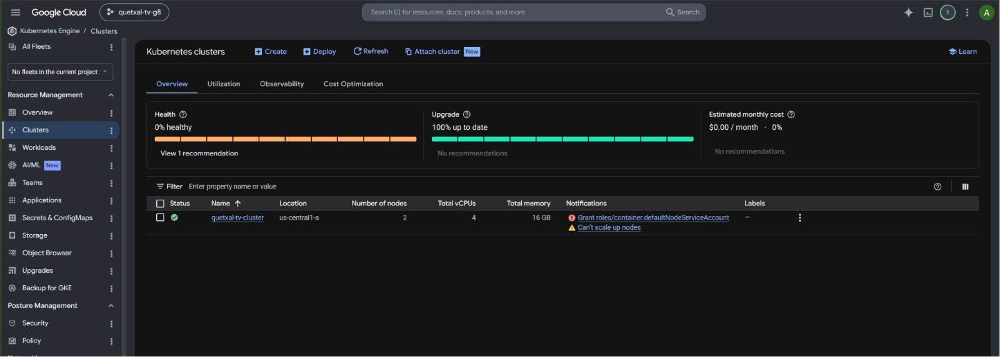

> nodos y autoscaling


> cuenta github
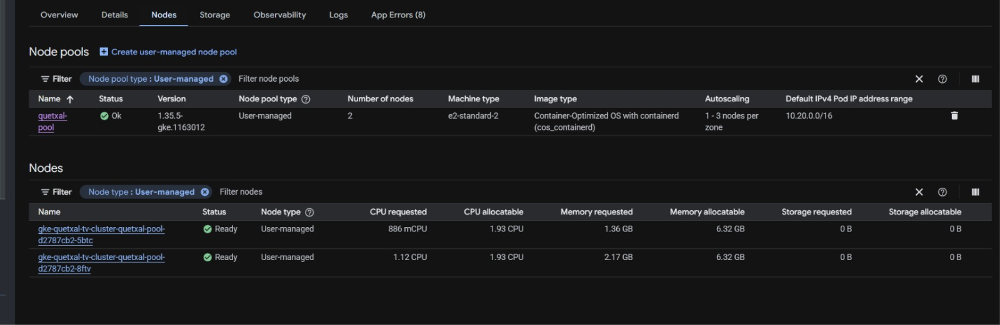


> reglas firewall
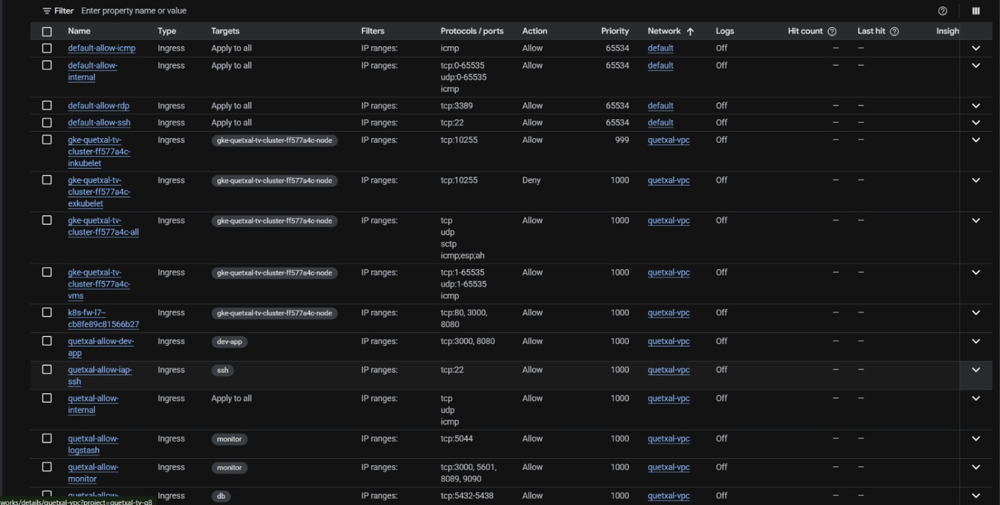

> taggeo de imagenes
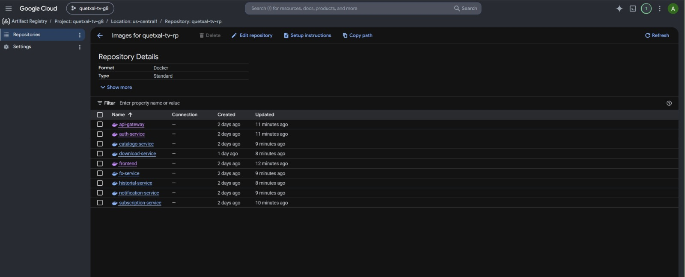


### 7.2 Clúster GKE

El clúster `quetxal-tv-cluster` aparece en **Kubernetes Engine > Clústeres** con el node pool `quetxal-pool` y autoscaling activo (1-3 nodos).

> Consola GCP > Kubernetes Engine > Clústeres — mostrar `quetxal-tv-cluster` en estado OK, versión de Kubernetes y nodos activos.
vm.png)

### 7.3 VPC y Reglas de Firewall

La red `quetxal-vpc` y sus reglas de firewall (7 reglas) aparecen en **VPC Network > Redes de VPC** y **Firewall**.

>  Consola GCP > VPC Network > Firewall — mostrar la lista de reglas (`quetxal-allow-ssh`, `quetxal-allow-internal`, `quetxal-allow-postgres`, etc.).

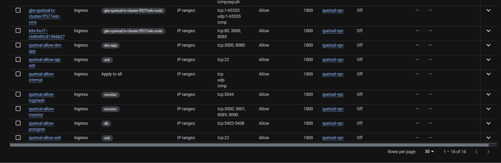

### 7.4 Artifact Registry

El repositorio Docker `quetxal-tv-rp` con las imágenes de todos los microservicios aparece en **Artifact Registry**.

> Consola GCP > Artifact Registry > quetxal-tv-rp — mostrar las imágenes (`api-gateway`, `auth-service`, `frontend`, etc.) con sus tags (`develop`, versión semántica).


### 7.5 GCS Buckets

Los dos buckets (`-videos` y `-backups`) aparecen en **Cloud Storage > Buckets**.

> Consola GCP > Cloud Storage — mostrar ambos buckets con la región `us-central1` y el acceso uniforme habilitado.

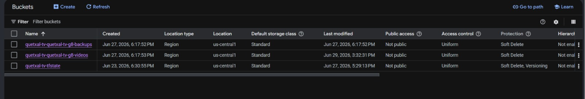
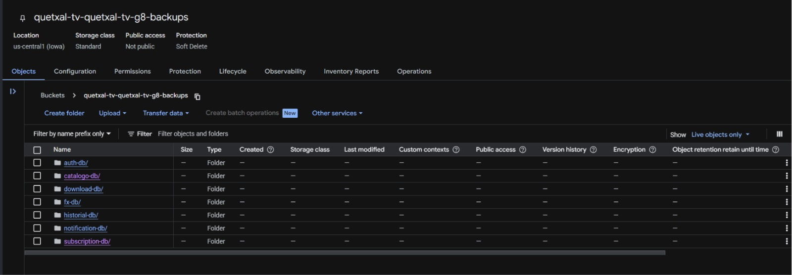

### 7.6 Ejecución de Terraform en GitHub Actions

El log del step `Terraform apply` en el workflow `infra.yml` muestra el plan y la confirmación de recursos creados.
> terraform init
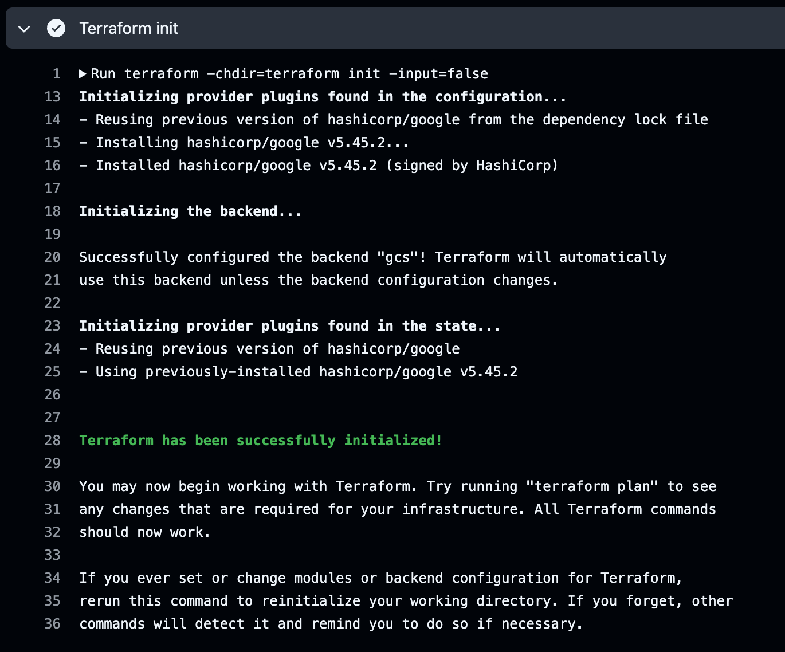

> terraform plan
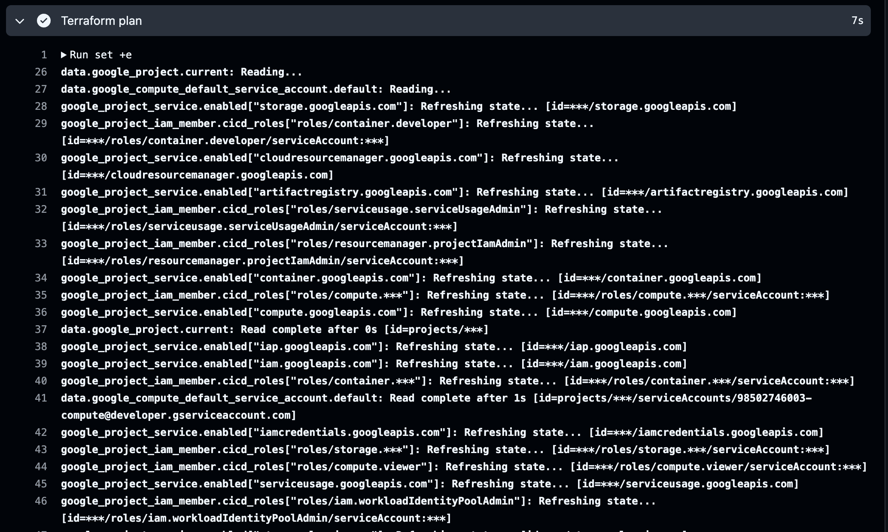
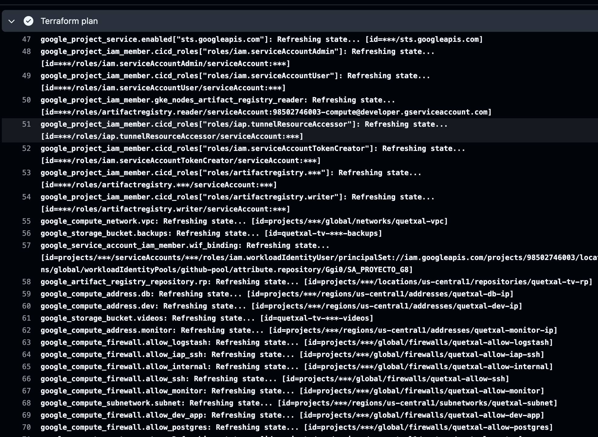
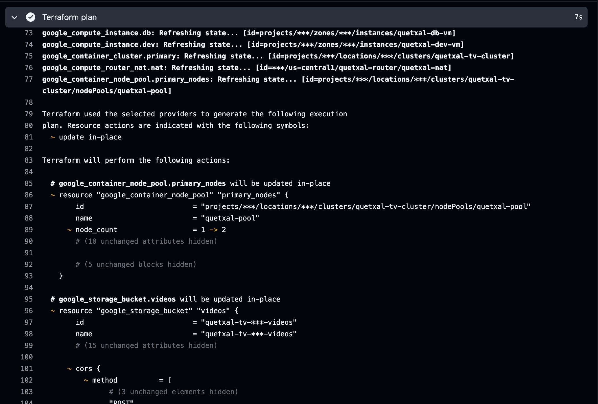
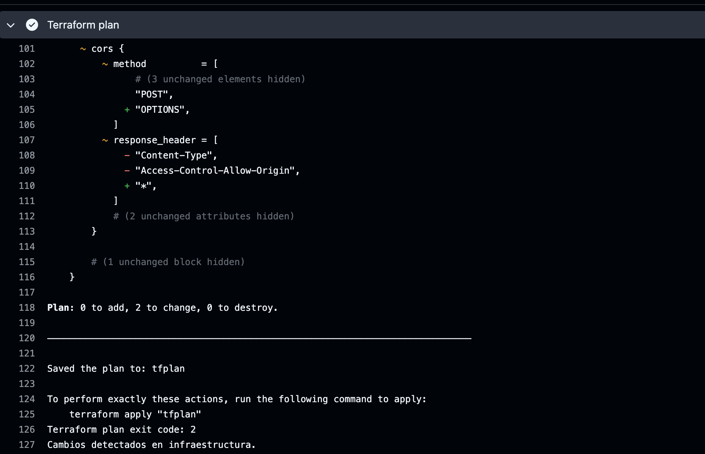

### 7.7 Outputs de Terraform

El step `Export Terraform outputs` del workflow muestra las IPs asignadas a las VMs.

> terraform apply
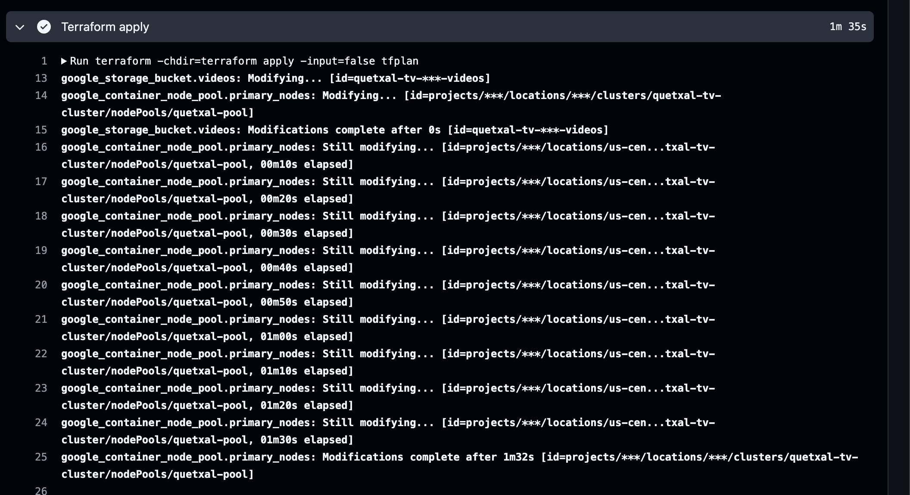
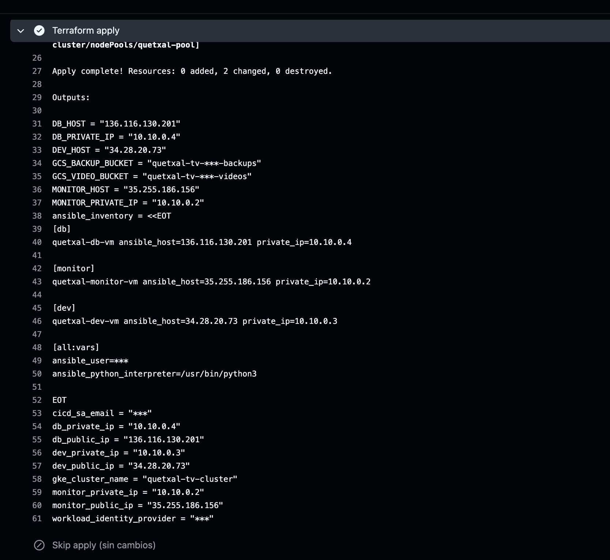


#### crudo
https://drive.google.com/file/d/1towGZz00lGXB02oczV24j0nvB5-FU6IM/view?usp=sharing
