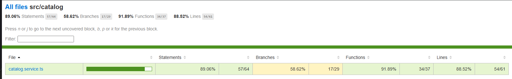
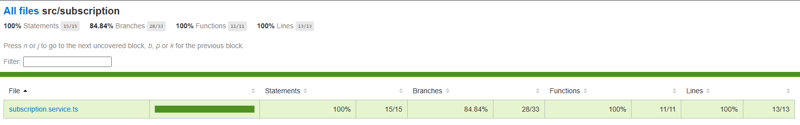

# Entregable: Pruebas Unitarias y Cobertura del Backend Políglota

## 1. Estrategia de cobertura

Dado el carácter políglota del backend (Go, TypeScript, Python) y la diversidad de
responsabilidades entre microservicios, el equipo priorizó la cobertura de pruebas
unitarias en función de la **complejidad de la lógica de negocio** de cada componente,
en lugar de distribuir el esfuerzo de forma homogénea entre todos los servicios.

Esta priorización se sustenta en que el pipeline de CI/CD exige un umbral mínimo del
75% de cobertura sobre el total de endpoints del backend, y que dicho umbral se
certifica de forma diferenciada por job/lenguaje dentro del workflow de GitHub Actions
(`ci.yml`), permitiendo evaluar cada microservicio según su propio nivel de criticidad
transaccional.

## 2. Criterio de priorización

Se identificaron dos categorías de microservicios según su complejidad de lógica interna:

**Servicios con lógica transaccional compleja** (alta prioridad de testing):
estos microservicios concentran reglas de negocio, validaciones de dominio,
cálculos derivados y flujos con múltiples ramas condicionales, por lo que representan
el mayor riesgo de regresión ante cambios de código.

**Servicios de integración/utilitarios** (prioridad diferida): estos microservicios
actúan principalmente como adaptadores hacia servicios externos (APIs de terceros,
SMTP, tasas de cambio) con lógica interna más delgada y menor superficie de
condicionales propios.

## 3. Cobertura implementada por microservicio

| Microservicio | Lenguaje | Estado de cobertura | Justificación |
|---|---|---|---|
| `catalogo-service` | Go | **Implementado** | Lógica de negocio más extensa del sistema: CRUD de contenido, géneros, personas, temporadas/episodios, calificaciones, programación de estrenos y exportación de auditoría (CSV/PDF). Suite de pruebas en `internal/catalog/service_test.go`, `handler_test.go`, `mock_test.go` y `repository_utils_test.go`. |
| `subscription-service` | Go | **Implementado** | Lógica transaccional crítica: procesamiento de pagos, conversión de divisas (FX), generación de recibos asíncronos y reglas de fallback. Suite de pruebas en `internal/subscriptions/service_test.go`, además de cobertura en `internal/payments` y `internal/plans`. |
| `api-gateway` (capa de integración) | TypeScript | **Implementado** | Pruebas de la capa de traducción HTTP → gRPC para los servicios de catálogo y suscripciones, validando el armado correcto de payloads y delegación a los clientes gRPC. Suite en `src/catalog/*.spec.ts` y `src/subscription/*.spec.ts`. |
| `fx-service` | Python | **Pendiente — próxima iteración** | Servicio de integración con proveedor externo de tasas de cambio. Su lógica actual es mayormente de adaptación (consumo de API externa + cacheo en Redis), con menor densidad de reglas de negocio propias respecto a catálogo/suscripciones. |
| `notification-service` | Python | **Pendiente — próxima iteración** | Servicio de envío de correos transaccionales (confirmaciones, recibos, alertas). Actúa como adaptador hacia el proveedor SMTP/API de correo, con lógica de formateo de plantillas como principal superficie a testear. |


## 4. Evidencia de ejecución

Los comandos de verificación local utilizados para certificar las suites existentes:

```bash
# Go - catalogo-service
cd microservices/catalogo-service
go test ./internal/catalog/... -v -cover

# Go - subscription-service
cd microservices/subscription-service
go test ./... -v -cover

# TypeScript - api-gateway
cd api-gateway
npx jest --coverage
```

Los resultados de estas ejecuciones (logs de consola) se incluyen como evidencia
complementaria en el repositorio, junto con los Pull Requests correspondientes que
documentan la integración de cada suite de pruebas al pipeline de CI/CD.

