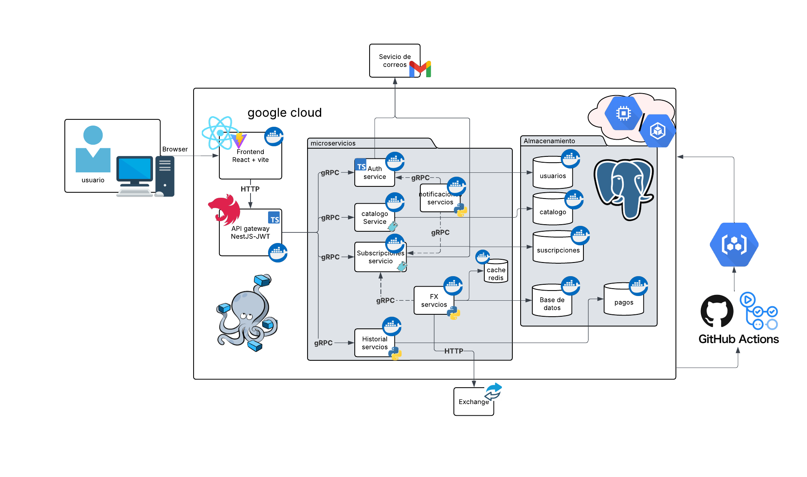

# SA_PROYECTO_G8

## Integrantes

| Grupo | Carné     | Nombre                           |
| ----- | --------- | -------------------------------- |
| 8     | 202100229 | Giovanni Saul Concohá Cax        |
| 8     | 202200214 | Pablo Alejandro Marroquín Cutz   |
| 8     | 201602619 | María de los Ángeles Paz de León |
| 8     | 202180003 | Ángel Isaías Mendoza Martínez    |
| 8     | 202001814 | Naomi Rashel Yos Cujcuj          |

---

# Introducción

Quetxal TV es una plataforma de streaming de video bajo demanda inspirada en servicios como Netflix, Disney+ y Prime Video. El proyecto fue desarrollado aplicando principios modernos de Arquitectura de Software orientados a escalabilidad, desacoplamiento, resiliencia operativa y despliegue automatizado en la nube.

La solución adopta una arquitectura basada en microservicios, donde cada dominio funcional posee su propia lógica de negocio, contratos de comunicación y persistencia independiente. La interacción entre componentes se realiza mediante gRPC y Protocol Buffers, mientras que la persistencia se implementa utilizando el patrón Database per Service sobre PostgreSQL.

Durante la segunda fase del proyecto se incorporó una infraestructura completa de despliegue en Google Cloud Platform mediante Kubernetes, pipelines CI/CD automatizados, monitoreo de salud mediante sondas de Kubernetes, almacenamiento de contenido multimedia en Google Cloud Storage y mecanismos de recuperación automática ante fallos.

El resultado es una plataforma distribuida preparada para evolucionar de forma independiente, facilitar el mantenimiento y garantizar la continuidad operativa de los servicios.



---

# Documentación del Proyecto

Toda la documentación asociada al análisis, diseño, implementación e infraestructura se encuentra organizada dentro del directorio:

```text
Documentation/
```

La documentación se encuentra dividida en diferentes secciones que describen tanto los aspectos funcionales como las decisiones arquitectónicas adoptadas durante el desarrollo.

---

## Requerimientos

La especificación de requerimientos funcionales y no funcionales se encuentra en:

```text
Documentation/Requerimientos
```

En esta sección se describen las funcionalidades principales de la plataforma, las reglas de negocio asociadas y los atributos de calidad considerados durante el diseño de la solución, incluyendo disponibilidad, mantenibilidad, escalabilidad, seguridad y tolerancia a fallos.

---

## Casos de Uso

La documentación relacionada con los casos de uso se encuentra en:

```text
Documentation/CasosDeUso
```

Esta sección incluye los diagramas de casos de uso y sus respectivas especificaciones expandidas, documentando actores, flujos principales, escenarios alternativos, excepciones y reglas de negocio para cada funcionalidad implementada.

---

## Arquitectura 4+1

La descripción arquitectónica completa se encuentra en:

```text
Documentation/4+1
```

La arquitectura se documenta utilizando el modelo 4+1 de Philippe Kruchten, incluyendo:

* Vista Lógica.
* Vista de Desarrollo.
* Vista de Procesos.
* Vista Física.
* Escenarios Arquitectónicos.

Estas vistas permiten comprender tanto la estructura estática como el comportamiento dinámico de la solución.

---

## Diagramas del Sistema

La documentación de diagramas se encuentra en:

```text
Documentation/Diagramas
```

Incluyendo:

* Diagrama de Arquitectura General.
* Diagramas de Componentes.
* Diagramas de Secuencia.
* Diagramas de Actividades.
* Diagramas Entidad-Relación.
* Diagramas de Despliegue.
* Diagramas de Infraestructura Kubernetes.
* Diagramas de CI/CD.
* Diagramas de Rollout y Rollback.

---

## Infraestructura y DevOps

La documentación relacionada con despliegue e infraestructura se encuentra en:

```text
Documentation/Infraestructura
```

Esta sección describe:

* Configuración del clúster Kubernetes.
* Estrategia de despliegue RollingUpdate.
* Rollback automático.
* Health Checks.
* ConfigMaps y Secrets.
* Gestión de imágenes mediante Artifact Registry.
* Google Cloud Storage.
* Automatización CI/CD mediante GitHub Actions.
* Estrategias de alta disponibilidad y recuperación ante fallos.

---

## Justificación Arquitectónica

Las decisiones arquitectónicas y tecnológicas adoptadas durante el proyecto se documentan en:

```text
Documentation/JustificacionGeneral.md
```

En esta sección se justifican aspectos como:

* Uso de microservicios.
* Comunicación mediante gRPC.
* Uso de Protocol Buffers.
* Aplicación del patrón Database per Service.
* Uso de Redis para optimización de consultas.
* Uso de PostgreSQL como mecanismo de persistencia.
* Uso de Kubernetes como plataforma de orquestación.
* Uso de Google Cloud Platform como proveedor de infraestructura.
* Estrategias de despliegue y monitoreo.

---

# Arquitectura General

La arquitectura de Quetxal TV se encuentra organizada siguiendo una estrategia de microservicios desacoplados.

El acceso de los usuarios se realiza mediante una aplicación Frontend desarrollada en React. Todas las solicitudes son canalizadas a través de un API Gateway desarrollado con NestJS, el cual actúa como punto único de entrada para la plataforma.

El API Gateway coordina la comunicación con los microservicios internos mediante gRPC, centralizando aspectos relacionados con autenticación, autorización y agregación de respuestas.

Los dominios funcionales fueron separados en servicios independientes:

* Auth Service.
* Catalog Service.
* Subscription Service.
* FX Service.
* Notification Service.
* Historial Service.

Cada servicio posee:

* Base de datos propia.
* Contratos Protocol Buffers independientes.
* Configuración aislada.
* Pipeline de construcción independiente.
* Imagen Docker propia.
* Deployment Kubernetes independiente.

Esta separación permite reducir el acoplamiento y facilitar la evolución independiente de cada componente.

---

# Arquitectura de Infraestructura

La infraestructura productiva se encuentra desplegada sobre Google Cloud Platform utilizando Kubernetes como plataforma principal de orquestación.

Los componentes desplegados incluyen:

* Frontend.
* API Gateway.
* Auth Service.
* Catalog Service.
* Subscription Service.
* FX Service.
* Historial Service.
* Notification Service.

Cada componente es desplegado mediante Deployments Kubernetes y expuesto internamente mediante Services.

La configuración operacional incluye:

* Rolling Updates.
* Rollback automático.
* Liveness Probes.
* Readiness Probes.
* ConfigMaps.
* Secrets.
* Gestión centralizada de imágenes.
* Monitoreo de salud de aplicaciones.

Esta infraestructura permite automatizar completamente el ciclo de vida de despliegue de la plataforma.

---

# Pipeline CI/CD

La segunda fase incorpora una estrategia completa de Integración Continua y Despliegue Continuo.

El flujo general consiste en:

1. Desarrollo en ramas de características.
2. Pull Requests hacia ramas de integración.
3. Ejecución automática de validaciones.
4. Construcción de imágenes Docker.
5. Publicación en Artifact Registry.
6. Actualización automática de Deployments Kubernetes.
7. Validación mediante Health Checks.
8. Rollback automático en caso de fallo.

Este proceso permite reducir errores manuales y garantizar consistencia entre versiones desplegadas.

---

# Tecnologías Utilizadas

## Frontend

* React
* TypeScript
* Vite
* Axios

## API Gateway

* NestJS
* TypeScript
* JWT
* gRPC

## Microservicios

### TypeScript

* Auth Service

### Go

* Catalog Service
* Subscription Service
* Historial Service

### Python

* FX Service
* Notification Service

## Persistencia

* PostgreSQL
* Redis

## Comunicación

* gRPC
* Protocol Buffers

## Contenedores y Orquestación

* Docker
* Kubernetes

## Cloud Computing

* Google Cloud Platform
* Google Kubernetes Engine (GKE)
* Artifact Registry
* Google Cloud Storage

## DevOps

* GitHub Actions
* CI/CD Pipelines
* Rolling Updates
* Rollback Automático

---

# Principales Características Implementadas

La plataforma incorpora las siguientes capacidades arquitectónicas:

* Arquitectura basada en microservicios.
* Comunicación síncrona mediante gRPC.
* Bases de datos independientes por servicio.
* Gestión centralizada de autenticación mediante JWT.
* Caché distribuido mediante Redis.
* Despliegue automatizado mediante Kubernetes.
* Monitoreo de salud mediante Health Checks.
* Actualizaciones controladas mediante RollingUpdate.
* Recuperación automática mediante Rollback.
* Almacenamiento multimedia mediante Google Cloud Storage.
* Gestión centralizada de secretos y configuración.
* Automatización CI/CD mediante GitHub Actions.

---

# Conclusiones

La implementación de Quetxal TV permitió aplicar de manera práctica múltiples conceptos avanzados de Arquitectura de Software, Sistemas Distribuidos y DevOps.

La adopción de una arquitectura basada en microservicios permitió desacoplar responsabilidades de negocio y facilitar la evolución independiente de cada componente. La utilización de gRPC y Protocol Buffers proporcionó una comunicación eficiente entre servicios, mientras que PostgreSQL y Redis permitieron implementar mecanismos robustos de persistencia y optimización.

Durante la segunda fase del proyecto se incorporó una infraestructura completa basada en Kubernetes y Google Cloud Platform, integrando despliegues automatizados, monitoreo de salud, gestión de configuración, almacenamiento distribuido y mecanismos de recuperación automática ante fallos.

Como resultado, la solución final constituye una plataforma moderna, mantenible, escalable y preparada para futuras extensiones tanto funcionales como operativas.
