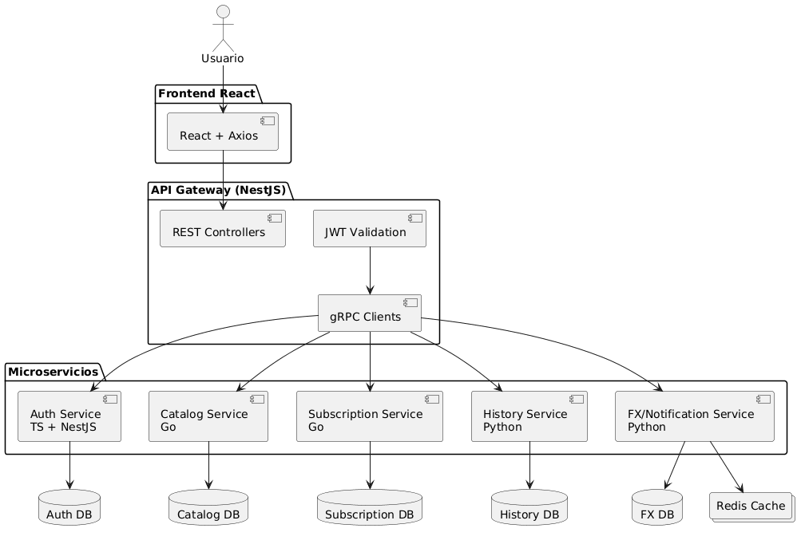

# SA_PROYECTO_G8




```
(app) streaming-platform/
│
├── proto/                          <-- CONTRATOS COMPARTIDOS 
│   ├── auth/
│   │   └── auth.proto
│   ├── catalog/
│   │   └── catalog.proto
│   ├── subscription/
│   │   └── subscription.proto
│   ├── history/
│   │   └── history.proto
│   └── fx/
│       └── fx.proto
│
├── api-gateway/                    <-- NestJS | Puerto 3000 | TypeScript
│   ├── src/
│   │   ├── main.ts
│   │   ├── app.module.ts
│   │   ├── auth/                   <-- Módulo que proxea a auth-service
│   │   │   ├── auth.module.ts
│   │   │   ├── auth.controller.ts  <-- Recibe HTTP, llama gRPC
│   │   │   └── auth.service.ts     <-- Cliente gRPC de auth
│   │   ├── catalog/
│   │   │   ├── catalog.module.ts
│   │   │   ├── catalog.controller.ts
│   │   │   └── catalog.service.ts
│   │   ├── subscription/
│   │   ├── history/
│   │   ├── fx/
│   │   ├── common/
│   │   │   ├── guards/
│   │   │   │   └── jwt.guard.ts    <-- Valida JWT en cada request
│   │   │   ├── interceptors/
│   │   │   └── decorators/
│   │   └── proto/                  <-- Archivos .proto compilados para TS (generados)
│   ├── Dockerfile
│   ├── .env
│   ├── package.json
│   └── tsconfig.json
│
├── auth-service/                   <-- NestJS | Puerto 50051 | TypeScript
│   ├── src/
│   │   ├── main.ts                 <-- Levanta servidor gRPC, NO HTTP
│   │   ├── app.module.ts
│   │   ├── auth/
│   │   │   ├── auth.module.ts
│   │   │   ├── auth.controller.ts  <-- Implementa métodos gRPC del .proto
│   │   │   ├── auth.service.ts
│   │   │   └── auth.repository.ts
│   │   ├── profiles/
│   │   │   ├── profiles.module.ts
│   │   │   ├── profiles.controller.ts
│   │   │   └── profiles.service.ts
│   │   ├── common/
│   │   │   ├── jwt/
│   │   │   └── oauth/
│   │   ├── database/
│   │   │   ├── migrations/
│   │   │   └── stored-procedures/  <-- SQL de SPs, vistas, triggers
│   │   └── proto/                  <-- .proto compilados para TS
│   ├── Dockerfile
│   ├── .env
│   ├── package.json
│   └── tsconfig.json
│
├── catalog-service/                <-- Go + Gin | Puerto 50052
│   ├── cmd/
│   │   └── main.go                 <-- Levanta servidor gRPC
│   ├── internal/
│   │   ├── catalog/
│   │   │   ├── handler.go          <-- Implementa métodos gRPC
│   │   │   ├── service.go
│   │   │   └── repository.go
│   │   ├── genres/
│   │   ├── actors/
│   │   ├── ratings/
│   │   └── database/
│   │       ├── migrations/
│   │       └── stored_procedures/
│   ├── proto/                      <-- .proto compilados para Go
│   ├── Dockerfile
│   ├── .env
│   └── go.mod
│
├── subscription-service/           <-- Go + Gin | Puerto 50053
│   ├── cmd/
│   │   └── main.go
│   ├── internal/
│   │   ├── plans/
│   │   │   ├── handler.go
│   │   │   ├── service.go
│   │   │   └── repository.go
│   │   ├── subscriptions/
│   │   ├── payments/
│   │   └── database/
│   │       ├── migrations/
│   │       └── stored_procedures/
│   ├── proto/
│   ├── Dockerfile
│   ├── .env
│   └── go.mod
│
├── history-service/                <-- Python + FastAPI | Puerto 50054
│   ├── app/
│   │   ├── main.py                 <-- Levanta servidor gRPC
│   │   ├── history/
│   │   │   ├── handler.py          <-- Implementa métodos gRPC
│   │   │   ├── service.py
│   │   │   └── repository.py
│   │   ├── database/
│   │   │   ├── migrations/
│   │   │   └── stored_procedures/
│   │   └── proto/                  <-- .proto compilados para Python
│   ├── Dockerfile
│   ├── .env
│   └── requirements.txt
│
├── fx-service/                            <-- Python | gRPC | 50055
│   ├── app/
│   │   ├── main.py
│   │   │
│   │   ├── exchange_rates/
│   │   │   ├── handler.py
│   │   │   ├── service.py
│   │   │   ├── repository.py
│   │   │   └── provider_client.py
│   │   │
│   │   ├── redis/
│   │   │   ├── redis_client.py
│   │   │   └── cache_service.py
│   │   │
│   │   ├── database/
│   │   │   ├── migrations/
│   │   │   ├── procedures/
│   │   │   ├── functions/
│   │   │   ├── views/
│   │   │   └── triggers/
│   │   │
│   │   └── proto/
│   │
│   ├── Dockerfile
│   ├── .env
│   └── requirements.txt
│
├── notification-service/                  <-- Python | gRPC | 50056
│   ├── app/
│   │   ├── main.py
│   │   │
│   │   ├── notifications/
│   │   │   ├── handler.py
│   │   │   ├── service.py
│   │   │   └── repository.py
│   │   │
│   │   ├── email/
│   │   │   ├── smtp_client.py
│   │   │   ├── template_engine.py
│   │   │   └── sender.py
│   │   │
│   │   ├── templates/
│   │   │   ├── welcome.html
│   │   │   ├── purchase_receipt.html
│   │   │   └── new_content.html
│   │   │
│   │   ├── database/
│   │   │   ├── migrations/
│   │   │   ├── procedures/
│   │   │   ├── functions/
│   │   │   ├── views/
│   │   │   └── triggers/
│   │   │
│   │   └── proto/
│   │
│   ├── Dockerfile
│   ├── .env
│   └── requirements.txt
│
├── frontend/                       <-- React + Vite + TypeScript
│   ├── src/
│   │   ├── main.tsx
│   │   ├── App.tsx
│   │   ├── api/                    <-- Axios, SOLO apunta al API Gateway
│   │   │   ├── client.ts           <-- instancia Axios base con URL del Gateway
│   │   │   ├── auth.api.ts
│   │   │   ├── catalog.api.ts
│   │   │   ├── subscription.api.ts
│   │   │   ├── history.api.ts
│   │   │   └── fx.api.ts
│   │   ├── pages/
│   │   │   ├── Login/
│   │   │   ├── Register/
│   │   │   ├── Catalog/
│   │   │   ├── MovieDetail/
│   │   │   ├── Player/
│   │   │   ├── Subscription/
│   │   │   └── Profile/
│   │   ├── components/
│   │   │   ├── ui/                 <-- Botones, inputs, cards reutilizables
│   │   │   ├── layout/
│   │   │   └── features/           <-- Componentes de dominio específico
│   │   ├── hooks/
│   │   ├── store/                  <-- Estado global (Zustand o Context)
│   │   └── types/                  <-- TypeScript interfaces
│   ├── Dockerfile
│   ├── .env
│   └── vite.config.ts
│
├── docker-compose.local.yml        <-- Entorno de desarrollo local
├── docker-compose.cloud.yml        <-- Entorno de producción GCP
├── .gitignore                      <-- Incluye todos los .env
└── README.md

```